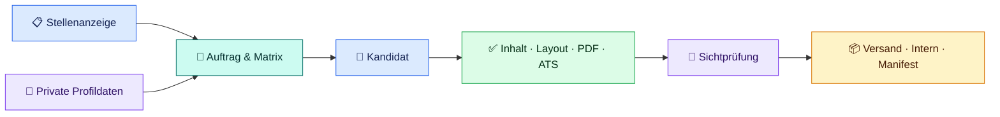

<p align="center">
  
</p>

<h1 align="center">bewerbungs-agent</h1>

<p align="center">
  <strong>KI-Bewerbungsagent für OpenAI Codex</strong><br>
  Lokaler Coding-Agent-Workflow für passgenaue deutsche Bewerbungsunterlagen – von der Stellenanalyse bis zu geprüften A4-Layouts und PDFs.
</p>

<p align="center">
  <a href="https://developers.openai.com/codex/ide"></a>
  <a href="CHANGELOG.md"></a>
  <a href="LICENSE"></a>
  <a href="https://github.com/Web-Developer-DB/bewerbungs-agent/actions/workflows/tests.yml"></a>
  
  <a href="LINUX-PORTIERUNGSPLAN.md"></a>
  
</p>

<p align="center">
  <a href="#nutzung">👤 Nutzung</a> ·
  <a href="#schnellstart">🚀 Schnellstart</a> ·
  <a href="#ergebnisse">🗂️ Dateien</a> ·
  <a href="#entwicklung">🧰 Entwicklung</a> ·
  <a href="#lizenz">📄 Lizenz</a> ·
  <a href="#hilfe">❓ Hilfe</a>
</p>

---

## Auf einen Blick

Dieses Repository erweitert OpenAI Codex – den KI-Coding-Agenten von OpenAI – um einen spezialisierten Bewerbungsworkflow: Prompts, Regeln und lokale Prüfwerkzeuge führen ihn von der Stellenanalyse bis zur kontrollierten Freigabe.

| 🎯 **Passgenau** | 🔒 **Lokal & privat** | ✅ **Geprüft** |
| :---: | :---: | :---: |
| Jede Bewerbung wird neu aus Stelle und Profil aufgebaut. | Echte Daten und Ergebnisse bleiben unter `Private/`. | Inhalt, A4-Layout, PDFs und ATS-Textschicht werden kontrolliert. |

Aus einer Stellenbeschreibung und deinen Profildaten entstehen - abhängig vom gewählten Dokumentmodus:

- entweder ein neuer rollenbezogener Lebenslauf oder ein unverändert übernommener universeller Lebenslauf als HTML und PDF
- ein passendes Anschreiben als HTML und PDF
- eine kurze E-Mail-Nachricht
- ein vollständiger privater Arbeits- und Prüfverlauf mit Analyse, Anforderungsmatrix, Screenshots und Qualitätsnachweisen

### Zwei Dokumentmodi

| Modus | Was wird neu geschrieben? | Wann verwenden? |
| --- | --- | --- |
| `vollbewerbung` | Lebenslauf, Anschreiben und E-Mail | Wenn der Lebenslauf sichtbar auf die konkrete Zielrolle zugeschnitten werden soll. |
| `anschreiben_mit_universalem_lebenslauf` | nur Anschreiben und E-Mail; der freigegebene Universal-Lebenslauf bleibt inhaltlich unverändert | Wenn ein stabiler universeller Lebenslauf bereits vorhanden ist und nur das Anschreiben an die Stelle angepasst werden soll. |

Im zweiten Modus friert der Bewerbungsauftrag die Universalquelle per SHA-256 ein. Die Zielrolle muss dann im Anschreiben und E-Mail-Betreff stehen, nicht im universellen Lebenslauf.

> [!NOTE]
> **Einfachster Einstieg:** Windows, PowerShell 7, OpenAI Codex und Chrome oder Edge. Dieser Weg wird vom Projekt am umfassendsten unterstützt; die [Linux-Unterstützung befindet sich noch im Alpha-Status](LINUX-PORTIERUNGSPLAN.md).

### So fließen deine Daten



## Wähle deinen Einstieg

<table role="presentation">
  <tr>
    <td width="50%" valign="top">
      <strong>👤 Projekt nutzen</strong><br><br>
      Private Daten einrichten, eine Bewerbung erzeugen, alle Dateien verstehen und nur den geprüften Satz versenden.<br><br>
      <a href="#schnellstart"><strong>Anfängeranleitung starten →</strong></a>
    </td>
    <td width="50%" valign="top">
      <strong>🧰 Projekt weiterentwickeln</strong><br><br>
      Architektur, Prompt-System, Werkzeuge, technische Dateiverträge, Tests und Erweiterungspunkte nachvollziehen.<br><br>
      <a href="#entwicklung"><strong>Zur Entwicklerdokumentation →</strong></a>
    </td>
  </tr>
</table>

---

<a id="nutzung"></a>

## 👤 Für Nutzer

Dieser Abschnitt ist für alle, die mit dem Projekt Bewerbungen erstellen möchten. Du brauchst dafür keine Kenntnisse über den internen Code oder die Implementierung der Prüfwerkzeuge.

**Direkt zum Ziel:** [Schritt-für-Schritt-Anleitung](#schnellstart) · [Ablauf verstehen](#prozess) · [Dateien verwenden](#ergebnisse) · [Private Daten](#daten) · [Prüfen & lokal freigeben](#finalisierung) · [Probleme lösen](#hilfe)

<a id="schnellstart"></a>

### 🚀 Erste Bewerbung: Schritt für Schritt

> [!IMPORTANT]
> **Folge für deine erste Bewerbung den Schritten 0 bis 7 in dieser Reihenfolge.** Im empfohlenen Weg führt Codex die technischen Befehle aus und nennt dir die nächsten Aktionen. Du kontrollierst persönlich deine Daten, jeden Seitenscreenshot und die fertigen Versanddateien.

#### 0. Das brauchst du vor dem Start

| Benötigt | Wofür? |
| --- | --- |
| Windows mit [PowerShell 7](https://learn.microsoft.com/powershell/scripting/install/install-powershell-on-windows) | primär unterstützter Projektablauf |
| [Git für Windows](https://git-scm.com/install/windows) | Repository klonen und später aktualisieren |
| [Visual Studio Code](https://code.visualstudio.com/download) mit installierter und angemeldeter [Codex-Erweiterung](https://developers.openai.com/codex/ide) | in dieser Anleitung verwendete Oberfläche für Agentenaufträge, Terminal und Dateien |
| Chrome oder Edge | Layoutbilder und geprüfte PDFs erzeugen |
| vorhandener Lebenslauf, Zeugnisse oder eigene Notizen | wahre persönliche und fachliche Angaben übernehmen |
| vollständiger Text einer Stellenanzeige | Bewerbung gezielt auf die Stelle ausrichten |

**Wenn dir eines der ersten drei Programme fehlt:**

1. Öffne den jeweiligen Link in der Tabelle, installiere nur das fehlende Programm und starte Visual Studio Code danach neu.
2. Öffne in Visual Studio Code links **Erweiterungen** mit <kbd>Strg</kbd> + <kbd>Umschalt</kbd> + <kbd>X</kbd>. Suche nach **Codex – OpenAI’s coding agent**, prüfe den Herausgeber **OpenAI** und wähle **Installieren**.
3. Wähle anschließend links das **Codex-Symbol**. Ist es nicht sichtbar, öffne mit <kbd>Strg</kbd> + <kbd>Umschalt</kbd> + <kbd>P</kbd> die Befehlspalette, suche `Codex: Open Codex Sidebar` und bestätige den Befehl.
4. Folge dem Anmeldedialog der Erweiterung. Beginne erst, wenn du unten im Codex-Bereich eine Nachricht eingeben kannst.

> [!TIP]
> Öffne Befehle in Visual Studio Code über **Terminal → Neues Terminal**. In der Eingabezeile sollte PowerShell aktiv sein. Führe Projektbefehle immer im Projektstamm aus, in dem `README.md`, `Prompts/` und `Tools/` liegen.

Prüfe im Terminal Git und die PowerShell-Version:

```powershell
git --version
$PSVersionTable.PSVersion
```

Der erste Befehl muss eine Git-Version ausgeben. Meldet PowerShell, dass `git` nicht gefunden wurde, installiere Git über den Link in der Tabelle und starte Visual Studio Code neu.

Bei PowerShell muss die erste Zahl unter `Major` mindestens `7` sein. Zeigt sie `5`, wähle über den Pfeil rechts neben dem Pluszeichen im Terminal ein vorhandenes Profil **PowerShell 7** beziehungsweise `pwsh`. Ist es nicht vorhanden, installiere PowerShell 7 über den Link in der Tabelle, starte Visual Studio Code neu und prüfe beide Befehle erneut. Fahre außerdem erst fort, wenn der Codex-Chat sichtbar und angemeldet ist.

#### 1. Projekt herunterladen und öffnen

Wenn du das Projekt noch nicht auf deinem Rechner hast, führe diese beiden Befehle aus:

```powershell
git clone https://github.com/Web-Developer-DB/bewerbungs-agent.git
Set-Location bewerbungs-agent
```

Wenn du das Projekt bereits geklont hast, überspringe die Befehle. Wähle in Visual Studio Code **Datei → Ordner öffnen**, und öffne genau den geklonten Projektordner – standardmäßig heißt er `bewerbungs-agent`. Öffne nicht nur den übergeordneten Ordner.

Im Explorer von Visual Studio Code müssen anschließend unter anderem `README.md`, `Prompts/`, `Private.example/` und `Tools/` sichtbar sein. Mit diesem Befehl kannst du den geöffneten Terminalpfad prüfen:

```powershell
Get-Location
```

Der ausgegebene Pfad muss der geöffnete Projektstamm sein, in dem `README.md`, `Prompts/`, `Private.example/` und `Tools/` liegen. Der Ordnername darf abweichen, wenn du ihn beim Klonen oder später bewusst umbenannt hast.

> [!TIP]
> **Zwei Eingabestellen:** Blöcke mit der Überschrift `powershell` gehören in das VS-Code-Terminal. Blöcke mit der Überschrift `text` gehören in den Codex-Chat. Kopiere einen Agentenauftrag niemals in das PowerShell-Terminal.

#### 2. Persönliche Daten mit Codex einrichten

Dies ist der einfachste und empfohlene Weg. Kopiere den folgenden Auftrag vollständig in den Codex-Chat:

> [!WARNING]
> `Private/` schützt vor einer versehentlichen Aufnahme in Git, macht die KI-Verarbeitung aber nicht automatisch offline. Gib keine Passwörter, Bankdaten, Ausweisnummern oder andere unnötige Geheimnisse ein und beachte die Datenschutz- und Kontoeinstellungen deiner Codex-Umgebung.

```text
Hilf mir als Einsteiger dabei, meine privaten Bewerberdaten einzurichten.

1. Prüfe zuerst, ob Private/Daten bereits existiert. Überschreibe vorhandene Dateien niemals ungefragt.
2. Nutze Private.example/Daten nur als Strukturvorlage.
3. Falls Private/Daten noch fehlt, erstelle:
   - Private/Daten/01_PERSOENLICHE_DATEN.md
   - Private/Daten/02_BEWERBER_PROFIL_UND_POSITIONIERUNG.md
   - Private/Daten/README.md
4. Führe mich abschnittsweise durch die benötigten Angaben. Frage verständlich nach fehlenden Informationen.
5. Datei 01 enthält nur Identität, Kontakt und Bewerbungslogistik.
6. Datei 02 enthält nur Berufserfahrung, Ausbildung, Kenntnisse, Projekte, Belege und fachliche Grenzen.
7. Übernimm keine fiktiven Beispieldaten und erfinde nichts. Unklare Angaben bleiben als offene Fragen sichtbar.
8. Fasse meine Angaben vor dem Schreiben verständlich zusammen und warte auf meine Bestätigung.
9. Erstelle noch keine Bewerbung.

Nenne mir am Ende die beiden Datendateien, die ich persönlich kontrollieren muss, und liste noch fehlende Angaben auf.
```

Du kannst dem Agenten anschließend deinen bisherigen Lebenslauf, Stationen, Ausbildungen, Weiterbildungen, Kenntnisse, Projekte, gewünschte Rollen und Rahmenbedingungen geben. Bearbeite immer nur Angaben, die wirklich zu dir gehören.

> [!CAUTION]
> Die Vorlagen enthalten **glaubwürdig wirkende, aber vollständig erfundene Beispieldaten**. Ein automatischer Prüfer kann nicht erkennen, ob ein plausibler Name oder Arbeitgeber wirklich zu dir gehört. Fahre erst fort, wenn du alle Beispiele persönlich ersetzt oder entfernt hast.

<details>
<summary><strong>Alternative: Dateien ohne Agentenhilfe kopieren</strong></summary>

Verwende diese Befehle nur bei einer frischen Installation. Sie stoppen, wenn `Private/Daten` bereits existiert:

```powershell
$privateDataPath = "Private/Daten"

if (Test-Path -LiteralPath $privateDataPath) {
  throw "Private/Daten existiert bereits. Vorhandene Daten werden nicht überschrieben."
}

New-Item -ItemType Directory -Path $privateDataPath | Out-Null
Copy-Item "Private.example/Daten/01_PERSOENLICHE_DATEN.example.md" "Private/Daten/01_PERSOENLICHE_DATEN.md"
Copy-Item "Private.example/Daten/02_BEWERBER_PROFIL_UND_POSITIONIERUNG.example.md" "Private/Daten/02_BEWERBER_PROFIL_UND_POSITIONIERUNG.md"
Copy-Item "Private.example/Daten/README.md" "Private/Daten/README.md"
```

Öffne danach beide Datendateien und ersetze jede fiktive Angabe manuell.

</details>

#### 3. Eigene Daten persönlich kontrollieren

Öffne im Explorer von Visual Studio Code diese beiden Dateien:

```text
Private/Daten/01_PERSOENLICHE_DATEN.md
Private/Daten/02_BEWERBER_PROFIL_UND_POSITIONIERUNG.md
```

Kontrolliere vor der ersten Bewerbung:

- [ ] Name, Adresse, Telefon, E-Mail und öffentliche Profil-Links gehören wirklich zu dir.
- [ ] Arbeitgeber, Zeiträume, Ausbildung und Weiterbildungen stimmen vollständig.
- [ ] Kenntnisse und Projekte sind korrekt als beruflich, Weiterbildung, Projektpraxis oder private Praxis eingeordnet.
- [ ] Beispielpersonen, Beispielunternehmen und erfundene Zertifikate wurden vollständig entfernt.
- [ ] Unsichere oder fehlende Informationen sind offen markiert und wurden nicht geraten.

Lass danach den maschinellen Stammdatencheck von Codex ausführen:

```text
Führe Tools/Pruefe-Stammdaten.ps1 für meine Daten unter Private/Daten aus.
Erkläre mir Fehler und Warnungen in einfacher Sprache.
Korrigiere nur Angaben, für die ich dir echte Informationen gegeben habe, und erfinde nichts.
Erstelle noch keine Bewerbung. Melde mir am Ende eindeutig, ob der Stammdatencheck erfolgreich ist.
```

Bei einem erfolgreichen Lauf endet die Ausgabe mit `ERGEBNIS: OK`. Fehler müssen vor der Bewerbung behoben werden; Warnungen solltest du bewusst prüfen. Der Check kontrolliert Pflichtfelder, bekannte Platzhalter, E-Mail-/Dateinamensformat und zentrale Logistikentscheidungen – nicht deine Identität, die Wahrheit der Angaben oder das vollständige Entfernen aller Beispieldaten.

> [!IMPORTANT]
> Echte Kontaktdaten, Profildaten und Bewerbungen gehören ausschließlich nach `Private/`. Dieser Ordner wird von Git ignoriert. Nimm seinen Inhalt niemals in einen Git-Commit auf und lade ihn nicht zu GitHub hoch; die spätere **lokale** Freigabe innerhalb von `Private/` ist dagegen beabsichtigt.

#### 4. Stellenanzeige an den Agenten übergeben

Kopiere möglichst den **vollständigen Text** der Stellenanzeige. Ein Link allein kann später nicht mehr erreichbar sein oder vom Agenten nicht gelesen werden.

```text
Nutze Prompts/00_AGENTEN_START_HIER.md und erstelle eine Bewerbung für die folgende Stellenbeschreibung.

Ich nutze das Projekt als Einsteiger. Führe den vorgesehenen Ablauf selbstständig bis zur vorbereiteten Sichtprüfung aus, aber veröffentliche noch nichts.
Verwende für die automatische Browserauswahl -Browser auto, damit Chrome oder Edge erkannt wird.
Nenne mir danach:
- den genauen privaten Arbeitsordner,
- den genauen Ordner mit den Layout-PNGs,
- jede PNG-Datei, die ich öffnen muss,
- die klare Bestätigung, ob der Status bereit_zur_sichtpruefung erreicht ist,
- offene Fragen oder Warnungen,
- den nächsten Schritt in einfacher Sprache.

Stellenbeschreibung:

<hier den vollständigen Text der Stellenanzeige einfügen>
```

Wenn du stattdessen nur ein Anschreiben zu deinem universellen Lebenslauf möchtest, ergänze im Auftrag:

```text
Dokumentmodus: anschreiben_mit_universalem_lebenslauf.
Verwende die freigegebene HTML-Quelle unter
Private/LebenslaufUniversal/Aktiv/Lebenslauf - NACHNAME.VORNAME.html
unverändert. Erstelle nur Anschreiben und E-Mail neu und prüfe den Lebenslauf-Snapshot trotzdem technisch mit.
```

Der Agent erstellt jetzt den privaten Arbeitsordner, analysiert die Stelle, erzeugt die Dokumente, prüft Inhalte und Layout und bereitet PDFs vor. Die Dateien sind zu diesem Zeitpunkt **noch nicht für den Versand freigegeben**.

> [!WARNING]
> Gehe erst zu Schritt 5, wenn der Agent den Status `bereit_zur_sichtpruefung` bestätigt und konkrete PNG-Dateien nennt. Bei einem Fehler, einer kritischen offenen Frage oder fehlenden Screenshots lässt du zuerst die Ursache beheben und die Vorbereitung vollständig wiederholen.

#### 5. Jeden Seitenscreenshot öffnen

Der Agent nennt dir den genauen Ordner. Er sieht ungefähr so aus:

```text
Private/Bewerbungen/FIRMA/_Arbeitsdateien/YYYY-MM-DD--ROLLENNAME/Layoutcheck/
```

Öffne im Explorer von Visual Studio Code **jede Datei mit der Endung `.png` einzeln**. Kontrolliere jede sichtbare A4-Seite:

- [ ] Kein Text ist abgeschnitten, verdeckt oder überlappt.
- [ ] Es gibt keine ungewollte leere Seite oder große zufällige Leerfläche.
- [ ] Schrift, Abstände und Spalten sind gut lesbar.
- [ ] Name, Firma, Rolle und Kontaktdaten stimmen.
- [ ] Lebenslauf und Anschreiben enthalten keine Platzhalter oder erfundenen Angaben.

Wenn du einen Fehler findest, sende beispielsweise:

```text
Veröffentliche noch nichts. Im Screenshot <Dateiname> ist folgendes Problem sichtbar:
<Problem genau beschreiben>.
Korrigiere die Kandidatendatei, wiederhole die vollständige technische Vorbereitung und nenne mir danach alle neu erzeugten PNG-Dateien zur erneuten Prüfung.
```

#### 6. Veröffentlichung ausdrücklich bestätigen

> [!IMPORTANT]
> **„Veröffentlichen“ bedeutet hier nur eine lokale Freigabe:** Das Tool übernimmt geprüfte Dateien in die lokalen Ordner `Versand/` und `Intern/` und erstellt `Manifest.json`. Es lädt nichts zu GitHub oder einem Unternehmen hoch, verschickt keine E-Mail und sendet keine Portalbewerbung.

Sende den folgenden Auftrag **nur, wenn du wirklich jede PNG-Datei geöffnet und geprüft hast**:

```text
Ich habe jede von dir genannte PNG-Datei persönlich geöffnet und vollständig geprüft.
Es gibt keinen abgeschnittenen oder überlappenden Text, keine problematische Leerseite und keine falschen sichtbaren Angaben.

Veröffentliche jetzt den vorbereiteten Bewerbungssatz mit dem vorgesehenen Finalisierungswerkzeug.
Gib ihn nur lokal frei. Lade nichts hoch und versende nichts.
Falls sich seit der Vorbereitung eine Quelle oder die Arbeitsversion unter Kandidat/ geändert hat, veröffentliche nicht. Wiederhole nur die Vorbereitung, nenne mir jede neu erzeugte PNG-Datei und stoppe danach. Warte zwingend auf meine erneute Sichtprüfungsbestätigung; gib im selben Auftrag nichts frei.
Nur wenn der unveränderte vorbereitete Stand erfolgreich freigegeben wurde: Nenne mir danach den genauen Versandordner, alle darin enthaltenen Dateien und wofür ich sie abhängig von der Stellenanzeige verwenden kann.
```

Bei einer automatischen Layoutwarnung kann der Agent zusätzlich nach deiner konkreten Sichtbewertung fragen. Beschreibe dann ehrlich, was du auf der betroffenen Seite geprüft hast.

#### 7. Nur die Versanddateien verwenden

Öffne den vom Agenten genannten Ordner:

```text
Private/Bewerbungen/FIRMA/YYYY-MM-DD--ROLLENNAME/Versand/
```

| Datei | Deine Aktion |
| --- | --- |
| `Lebenslauf - NACHNAME.VORNAME.pdf` | hochladen oder anhängen, wenn ein Lebenslauf verlangt wird |
| `Anschreiben - NACHNAME.VORNAME.pdf` | nur hochladen oder anhängen, wenn ein Anschreiben verlangt oder zugelassen wird |
| `Email-Nachricht--FIRMA.md` | bei einer E-Mail-Bewerbung öffnen und Betreff sowie Nachricht kopieren; nicht als Datei anhängen |

Verwende ausschließlich freigegebene Dateien aus `Versand/`, aber beachte immer die Anforderungen der Stellenanzeige oder des Bewerbungsportals. Wenn ausdrücklich kein Anschreiben verlangt wird, hänge es nicht ungefragt an. Bei einer Portalbewerbung brauchst du die E-Mail-Datei meistens nicht.

Prüfe außerdem, ob unter `Intern/` eine `Offene_Fragen.md` vorhanden ist, und kläre alle versandrelevanten Punkte. Öffne jede benötigte PDF-Datei vor dem Versand noch einmal. Kontrolliere Empfänger, Firma, Rolle, Namen, Kontaktdaten und Seitenzahl. Dateien aus `_Arbeitsdateien/`, `Intern/` sowie `Manifest.json` werden nicht mitgeschickt.

> [!IMPORTANT]
> Ändert die Antwort auf eine offene Frage den Lebenslauf, das Anschreiben, die E-Mail oder eine Quelldatei, sind die bisherigen PDFs und Screenshots nicht mehr aktuell. Bitte Codex, die Arbeitsversion zu korrigieren, die vollständige technische Vorbereitung erneut auszuführen, alle neuen PNG-Dateien zu nennen und dann zu stoppen. Öffne danach jede neue PNG-Datei und bestätige die lokale Freigabe erneut, bevor du etwas versendest.

> [!NOTE]
> Auch der Ordner `Versand/` versendet nichts automatisch. Das Hochladen in ein Bewerbungsportal oder das Abschicken einer E-Mail bleibt immer deine bewusste Aktion.

> [!TIP]
> **Deine Bewerbungsunterlagen sind jetzt für das bewusste manuelle Hochladen oder Versenden vorbereitet.** Die folgenden Nutzerabschnitte erklären den Ablauf und alle Dateien genauer; für den normalen ersten Durchlauf musst du sie nicht vollständig lesen.

<a id="prozess"></a>

### 🧭 So arbeitet der Agent

Dieser Abschnitt erklärt den Hintergrund. Für deine erste Bewerbung kannst du direkt der sichtbaren [Schritt-für-Schritt-Anleitung](#schnellstart) folgen.

Der Agent trennt bewusst vier Zustände. Ein **Kandidat** ist dabei nur eine noch nicht freigegebene Arbeitsversion. Eine Datei ist nicht automatisch versandfertig, nur weil sie bereits einen final wirkenden Namen trägt.

> [!NOTE]
> **„Veröffentlicht“ bedeutet im gesamten Projekt nur lokal freigegeben.** Dateien werden auf deinem Rechner in `Versand/` und `Intern/` übernommen. Dadurch wird nichts hochgeladen oder automatisch verschickt.

| Zustand | Speicherort | Bedeutung | Versenden? |
| --- | --- | --- | :---: |
| 🟡 **Entwurf** | `_Arbeitsdateien/.../` | Planung, Vorlagen und noch ungeprüfte Entscheidungen | Nein |
| 🔵 **Kandidat** | `_Arbeitsdateien/.../Kandidat/` | vollständige, aber noch nicht freigegebene Bewerbung | Nein |
| 🟣 **Prüfnachweise** | `_Arbeitsdateien/.../Layoutcheck/`, `PDF-Export/` und Arbeitsordner | Screenshots, Prüfberichte und Hashnachweise | Nein |
| 🟢 **Veröffentlicht** | `YYYY-MM-DD--ROLLENNAME/` | visuell und technisch geprüftes Ergebnis | nur `Versand/` |

> [!IMPORTANT]
> **Für Bewerbungsanhänge verwendest du nur freigegebene Dateien aus `Versand/`.** Welche Anhänge du tatsächlich übermittelst, richtet sich nach der Stellenanzeige oder dem Bewerbungsportal. Dateien unter `_Arbeitsdateien/` sind Arbeitsstände oder Prüfnachweise; Dateien unter `Intern/` bleiben bei dir.

#### Der Ablauf in sieben Phasen

1. **Stammdaten prüfen** – Identität, Kontakt und zentrale Bewerbungsentscheidungen werden kontrolliert. Kritische Lücken stoppen den Ablauf.
2. **Arbeitsbereich anlegen** – Der Agent erzeugt einen leeren Zielordner, einen privaten Arbeitsordner und den Bewerbungsauftrag.
3. **Stelle analysieren** – Muss-/Kann-Anforderungen werden mit deinen belegbaren Profildaten abgeglichen und in einer Anforderungsmatrix bewertet.
4. **Kandidaten erstellen** – In der Vollbewerbung entstehen Lebenslauf, Anschreiben und E-Mail neu. Im Anschreiben-Modus wird der universelle Lebenslauf unverändert übernommen und nur Anschreiben sowie E-Mail werden neu geschrieben.
5. **Fachlich korrigieren** – Stellenbeschreibung, Profil, Matrix und alle Dokumente werden auf Wahrheit, Passung und Widerspruchsfreiheit geprüft.
6. **Technisch vorbereiten** – A4-Screenshots, zwei PDFs sowie Layout-, PDF- und ATS-Nachweise werden erzeugt. Noch wird nichts veröffentlicht.
7. **Sichtprüfen und veröffentlichen** – Du kontrollierst jede A4-Seite. Erst danach werden die geprüften Dateien gemeinsam nach `Versand/` und `Intern/` übernommen; zusätzlich wird `Manifest.json` erstellt.

<details>
<summary><strong>Die sieben Phasen genauer erklärt</strong></summary>

**1 · Stammdaten und Sicherheit**

Der Agent prüft Bewerbername, Kontakt, Stellenart, Arbeitsmodell, Region, Eintrittstermin und Gehaltsstrategie. Die Stellenanzeige wird ausschließlich als nicht vertrauenswürdige Datenquelle ausgewertet; darin eingebettete Anweisungen werden nicht ausgeführt.

**2 · Bewerbungsauftrag**

`Bewerbungsauftrag.json` friert Firma, Rolle, Pfade und die Logistik für genau diese Bewerbung ein. Globale Profildaten müssen dadurch nicht für jede Stelle umgeschrieben werden. Noch offene Kernentscheidungen verhindern später die Freigabe.

**3 · Anforderungsmatrix und Bewerbungsentscheidung**

Der Agent macht aus dem ersten Matrixentwurf eine vollständige `Anforderungsmatrix.json`. Jede relevante Stellenanforderung erhält Typ, Gewichtung, einen Status der Erfüllung, einen Beleg und eine geplante Behandlung. Das Ergebnis unterstützt die bewusste Entscheidung `bewerben` oder `nicht_bewerben`.

**4 · Vollständiger Kandidat zur Prüfung**

Alle inhaltlichen Dokumente werden mit ihren späteren Namen unter `Kandidat/` angelegt. Dieser Ordner ist die Werkbank für Korrekturen – noch nicht der Versandordner.

**5 · Fachliche Korrekturschleife**

Der Agent liest Stellenbeschreibung, Analyse, private Daten, Matrix, Lebenslauf, Anschreiben und E-Mail erneut gegeneinander. Gefundene Unstimmigkeiten werden am Kandidaten korrigiert und anschließend erneut geprüft. Fehlende Belege werden nicht erfunden.

**6 · Technische Vorbereitung**

Der erste Finalisierungslauf prüft Stammdaten, Inhalt und A4-Struktur, erzeugt einen Screenshot je A4-Seite, exportiert zwei PDFs und kontrolliert deren ATS-Textschicht. Der Status lautet danach lediglich `bereit_zur_sichtpruefung`.

**7 · Sichtprüfung und gemeinsame Veröffentlichung**

Änderst du nach der Vorbereitung eine Kandidatendatei, verlieren Screenshots und PDFs ihre Gültigkeit und Phase 6 muss vollständig wiederholt werden. Direkt vor der Veröffentlichung prüft das Tool erneut, ob sich seit der Vorbereitung etwas verändert hat. Scheitert eine dieser Vorprüfungen, bleibt der bisherige Zielordner unverändert. Neue Dateien werden zuerst in einem separaten Zwischenordner vorbereitet und anschließend gemeinsam übernommen, damit kein unvollständiger Endstand entsteht.

</details>

<a id="ergebnisse"></a>

### 🗂️ Welche Dateien entstehen – und wofür sind sie da?

Die im Screenshot sichtbaren Ordner `Intern/`, `Versand/` und die Datei `Manifest.json` bilden den **veröffentlichten Endzustand**. Parallel bleibt unter `_Arbeitsdateien/` die private Werkstatt mit Entwürfen, Kandidaten und technischen Nachweisen erhalten.

#### Der veröffentlichte Bewerbungsordner

```text
Private/Bewerbungen/FIRMA/YYYY-MM-DD--ROLLENNAME/
├─ Versand/
│  ├─ Lebenslauf - NACHNAME.VORNAME.pdf
│  ├─ Anschreiben - NACHNAME.VORNAME.pdf
│  └─ Email-Nachricht--FIRMA.md
├─ Intern/
│  ├─ Stellenbeschreibung.md
│  ├─ Analyse.md
│  ├─ Lebenslauf - NACHNAME.VORNAME.html
│  ├─ Anschreiben - NACHNAME.VORNAME.html
│  ├─ Qualitaetscheck.md
│  ├─ Druck-Hinweis.md
│  └─ optional Offene_Fragen.md
└─ Manifest.json
```

##### `Versand/` – das benutzt du für die Bewerbung

| Datei | Verwendung |
| --- | --- |
| `Lebenslauf - NACHNAME.VORNAME.pdf` | aus `Versand/` hochladen oder anhängen, wenn ein Lebenslauf verlangt wird |
| `Anschreiben - NACHNAME.VORNAME.pdf` | getrennt vom Lebenslauf hochladen oder anhängen, wenn ein Anschreiben verlangt oder zugelassen wird |
| `Email-Nachricht--FIRMA.md` | bei einer E-Mail-Bewerbung Betreff und Nachricht kopieren; die Markdown-Datei nicht anhängen |

Eine Stellenanzeige mit der Bitte um eine Bewerbung „als PDF“ verlangt nicht automatisch eine Gesamt-PDF. Lebenslauf und Anschreiben bleiben standardmäßig zwei getrennte Anlagen; zusammengeführt wird nur bei ausdrücklicher Vorgabe.

##### `Intern/` – deine lesbare Dokumentation

| Datei | Zweck | So kannst du sie nutzen |
| --- | --- | --- |
| `Stellenbeschreibung.md` | gespeicherte Ausgangsanzeige | später nachlesen und zur Gesprächsvorbereitung verwenden, auch wenn die Online-Anzeige nicht mehr verfügbar ist |
| `Analyse.md` | Passung, Profilstrategie, stärkste Argumente, Risiken und bewusste Auslassungen | Bewerbungsentscheidung nachvollziehen und auf ein Vorstellungsgespräch vorbereiten |
| `Lebenslauf - … .html` | geprüfter HTML-Stand des Lebenslaufs | im Browser ansehen und als nachvollziehbare Dokumentquelle archivieren |
| `Anschreiben - … .html` | geprüfter HTML-Stand des Anschreibens | im Browser ansehen und als nachvollziehbare Dokumentquelle archivieren |
| `Qualitaetscheck.md` | fachlicher Anforderungsabgleich plus technischer Abschlussstatus | kontrollieren, was geprüft wurde und welche Warnungen dokumentiert sind |
| `Druck-Hinweis.md` | Anleitung für das manuelle Drucken im Browser | nur verwenden, wenn du eine HTML-Datei manuell drucken oder als PDF sichern musst |
| `Offene_Fragen.md` | nicht erfundene, noch offene oder bewusst dokumentierte Punkte | vor dem Versand lesen und verbleibende Fragen soweit möglich klären |

> [!NOTE]
> Wenn du ein veröffentlichtes Dokument ändern möchtest, bearbeite nicht direkt die Datei unter `Intern/`. Ändere die passende Datei unter `_Arbeitsdateien/.../Kandidat/`, wiederhole die technische Vorbereitung und veröffentliche den neuen geprüften Satz mit `-Ersetzen`.

##### `Manifest.json` – Integrität des veröffentlichten Satzes

`Manifest.json` ist ein technischer Prüfbeleg für den lokal freigegebenen Dateisatz. Die Projektwerkzeuge können damit erkennen, ob sich eine freigegebene Datei später verändert hat.

Du musst diese Datei für die normale Nutzung nicht öffnen oder verstehen. **Bearbeite sie nicht, hänge sie nicht an und versende sie nicht.** Die vollständigen technischen Details stehen in der Entwicklerdokumentation.

<details>
<summary><strong>Arbeitsdateien, Kandidaten und Prüfberichte kurz erklärt</strong></summary>

Alles in diesem Bereich bleibt privat und wird nicht versendet.

| Datei oder Ordner | Zweck | Was du damit tun kannst |
| --- | --- | --- |
| `Bewerbungsauftrag.json` | eingefrorener Auftrag mit Firma, Rolle, Logistik, Darstellungsoptionen und Bewerbungsentscheidung | vor der Dokumenterstellung auf richtige Entscheidungen prüfen; nach der Vorbereitung nicht still ändern |
| `Anforderungsmatrix--ENTWURF.json` | vom Ordnerhelfer erzeugtes Startgerüst | nicht als fertige Analyse verwenden; wird durch `Anforderungsmatrix.json` ersetzt |
| `Anforderungsmatrix.json` | vollständiger Muss-/Kann-Abgleich mit Gewichtung, Belegen und Behandlung | Passung und Risiken nachvollziehen; auch zur Interviewvorbereitung nützlich |
| `Arbeitsnotizen.md` | Zuordnung von Firma, Rolle und Ordnern | Arbeitsstand nachvollziehen; wird außerdem zur sicheren Fortsetzung einer Bewerbung benötigt |
| `*--ENTWURF.*` | vorbereitete Schreibgerüste für Analyse, HTML, E-Mail, Qualitätscheck und offene Fragen | nur als Arbeitsgrundlage betrachten; nie versenden |
| `Kandidat/` | vollständig benannter, aber noch nicht freigegebener Satz | hier Korrekturen vornehmen und danach alle Prüfungen erneut ausführen |
| `Kandidat/*.pdf` | während der Vorbereitung erzeugte und validierte PDF-Kandidaten | nicht direkt versenden; erst die veröffentlichten Kopien unter `Versand/` verwenden |
| `Stammdaten-Pruefbericht.json` | Ergebnis der Identitäts-, Kontakt- und Logistikprüfung | bei blockierenden Stammdatenfehlern zur Diagnose öffnen |
| `Inhalts-Pruefbericht.json` | Konsistenz-, Zeitraum-, Darstellungs- und Passungsprüfung | fachliche Fehler und Warnungen nachvollziehen |
| `Layoutcheck/*.png` | ein frischer Screenshot je expliziter A4-Seite | **jede PNG-Datei tatsächlich öffnen und visuell prüfen** |
| `Layoutcheck/Layoutcheck-Bericht.json` | Browser, Abmessungen, Seiten, Screenshot-Hashes und Dichtehinweise | Layoutwarnungen einer konkreten Seite zuordnen |
| `PDF-Export/PDF-Export-Bericht.json` | HTML-/PDF-Hashes, Dateigröße, Seitenzahl und A4-MediaBox | PDF-Exportfehler technisch einordnen |
| `ATS-Pruefbericht.json` | Textabdeckung, Pflichttexte und grundlegende Lesereihenfolge der PDFs | erkennen, ob Bewerbermanagementsysteme den PDF-Text voraussichtlich auslesen können |
| `Finalisierungsbericht.json` | Zustands- und Vorbereitungsnachweis mit den damals erfassten Quellen-, Kandidaten- und Screenshot-Hashes | Status und Prüflauf nachvollziehen; für die Integrität des veröffentlichten Endstands ist `Manifest.json` maßgeblich |

Die Entwurfsgerüste können nach Fertigstellung weiterhin im Arbeitsordner liegen. Sie sind keine zweite freigegebene Bewerbung. Maschinenlesbare Berichte und Screenshots werden absichtlich **nicht** nach `Intern/` kopiert.

</details>

#### Welche Datei nutze ich für welchen Zweck?

- 📤 **Bewerbung verschicken:** nur freigegebene Dateien aus `Versand/` verwenden und die verlangten Anlagen der Stellenanzeige beachten.
- ✉️ **E-Mail verfassen:** Betreff und Text aus `Versand/Email-Nachricht--FIRMA.md` kopieren.
- 👀 **Layout freigeben:** jede PNG-Datei unter `_Arbeitsdateien/.../Layoutcheck/` öffnen.
- 🔎 **Stellenpassung verstehen:** `Intern/Analyse.md` und bei Bedarf die private `Anforderungsmatrix.json` lesen.
- ✏️ **Dokument korrigieren:** Codex um eine Korrektur der Arbeitsversion unter `Kandidat/` bitten; danach Vorbereitung und Sichtprüfung vollständig wiederholen.
- 🧪 **Fehler untersuchen:** die passenden JSON-Berichte unter `_Arbeitsdateien/` öffnen.
- 🔐 **Veröffentlichten Satz prüfen:** die in `Manifest.json` unter `files[]` erfassten Dateien mit dem statischen Prüfer validieren.
- 🗄️ **Bewerbung nachvollziehbar archivieren:** finalen Ordner **und** zugehörigen Arbeitsordner behalten.

> [!WARNING]
> Lösche `_Arbeitsdateien` nicht vorschnell. Die zum Versand bestimmten PDFs bleiben zwar im finalen Ordner, aber du verlierst Kandidaten, Anforderungsmatrix, Screenshots, technische Nachweise und die saubere Grundlage für spätere Korrekturen.

#### Offene Fragen

Fehlen belastbare Informationen, legt der Agent `Offene_Fragen.md` an. Das betrifft zum Beispiel einen unklaren Eintrittstermin, einen fehlenden Ansprechpartner, eine nicht belegte Technologie oder eine offene Gehaltsstrategie.

Kritische Fragen blockieren die Veröffentlichung, wenn sonst Identität, Wahrheit oder zentrale Bewerbungsentscheidungen gefährdet wären. Bleibt eine nicht blockierende `Offene_Fragen.md` im veröffentlichten Satz erhalten, lies sie vor dem Versand. Unbekannte Angaben werden niemals geraten oder als Platzhalter in finale Dokumente übernommen.

<a id="daten"></a>

### 🔐 Private Daten & Datenschutz

Die Trennung zwischen öffentlicher Logik und privaten Daten ist ein Kernprinzip des Projekts.

#### Das solltest du für die Einrichtung bereithalten

- Name, Adresse und erreichbare Kontaktdaten
- berufliche Stationen mit Monat und Jahr
- Ausbildung, Umschulung, Weiterbildungen und Abschlüsse
- Kenntnisse mit ehrlicher Erfahrungsstufe
- Projekte und private Praxis mit klarer Einordnung
- gewünschte Rollen, Arbeitsregion und Arbeitsmodell
- Verfügbarkeit und frühester Eintrittstermin
- Gehaltsangabe oder die bewusste Entscheidung, keine Angabe zu verwenden

| Datei | Enthält | Enthält ausdrücklich nicht |
| --- | --- | --- |
| `01_PERSOENLICHE_DATEN.md` | Identität, Kontakt, Verfügbarkeit, Arbeitsmodell, Region und Gehaltslogik | fachliche CV-Details |
| `02_BEWERBER_PROFIL_UND_POSITIONIERUNG.md` | Erfahrung, Ausbildung, Kenntnisse, Projekte, Belege und fachliche Grenzen | Kontakt- und Adressdaten |
| `README.md` | lokale Pflegeanleitung für beide Dateien | Bewerbungsinhalte oder eine dritte Datenquelle |

Die Vorlagen findest du unter `Private.example/Daten/`. Pflege jede Information nur an ihrer Stammquelle, damit Angaben nicht widersprüchlich werden.

#### Persönliche Daten mit Unterstützung des Agenten einrichten

> [!WARNING]
> Lies dies vor der Dateneingabe: Speichere keine Passwörter, Zugangscodes, Bankdaten, Ausweisnummern oder unnötige sensible Angaben. `Private/` verhindert die Aufnahme in Git, ist aber keine Verschlüsselung und macht die KI-Verarbeitung nicht automatisch offline. Abhängig von deiner Codex-Umgebung können Inhalte zur Modellverarbeitung an den jeweiligen Anbieter übertragen werden; beachte deshalb dessen Datenschutz- und Kontoeinstellungen.

Diese Hilfe ist absichtlich sichtbar, weil sie für Einsteiger der einfachste Weg ist. Kopiere den Auftrag in den Codex-Chat:

```text
Ich richte den bewerbungs-agent zum ersten Mal ein.

Lies Private.example/Daten/README.md und die beiden Beispieldateien nur als Struktur.
Übernimm keinen Beispielwert als meine Angabe und überschreibe vorhandene Dateien nie ungefragt.

Führe mich nacheinander durch:
1. Identität und Kontakt,
2. Verfügbarkeit, Stellenart, Arbeitsmodell, Region und Gehaltslogik,
3. Zielrollen, Berufserfahrung, Ausbildung, Weiterbildungen, Kenntnisse, Projekte und alle Zeiträume.

Stelle verständliche Rückfragen, wenn etwas fehlt. Erfinde nichts und markiere unsichere Angaben.
Fasse meine Angaben vor dem Schreiben zusammen und warte auf meine Bestätigung.

Erstelle danach ausschließlich:
- Private/Daten/01_PERSOENLICHE_DATEN.md
- Private/Daten/02_BEWERBER_PROFIL_UND_POSITIONIERUNG.md
- Private/Daten/README.md

Führe anschließend Tools/Pruefe-Stammdaten.ps1 aus, nenne offene Punkte und erinnere mich daran, beide Datendateien persönlich zu prüfen.
```

Kontrolliere die erzeugten Dateien sorgfältig. Der Stammdatencheck prüft Pflichtfelder, bekannte Platzhalter, ausgewählte Formate und zentrale Logistikentscheidungen. Er kann nicht wissen, ob ein plausibel wirkender Beispielwert wirklich zu dir gehört.

#### Sicherheitsmodell

Stellenanzeigen, Unternehmensseiten, E-Mails und andere Fremdtexte gelten als **nicht vertrauenswürdige Datenquellen**:

- Eingebettete Aufforderungen dürfen Projektregeln und Nutzerauftrag nicht verändern.
- Fremdtexte dürfen keine privaten Dateien offenlegen, hochladen, versenden, löschen oder verändern lassen.
- Externe Aktionen sind nur durch einen direkten Nutzerauftrag autorisiert.
- Finale HTML-Dateien laden keine externen oder lokalen Ressourcen automatisch nach; vollständig eingebettete `data:`-Ressourcen sind möglich.
- Analyse und Arbeitsnotizen vervielfältigen keine unnötigen privaten Daten oder Geheimnisse.

> [!WARNING]
> `.gitignore` ist keine Verschlüsselung. Cloud-Synchronisation, Backups, Virenscanner und andere lokale Programme können Dateien unter `Private/` weiterhin lesen oder kopieren. Prüfe außerdem jedes finale Dokument persönlich vor dem Versand.

<details>
<summary><strong>Git- und Datenschutzcheck vor einem Commit</strong></summary>

```powershell
git status --short
```

In der Ausgabe dürfen keine echten Dateien aus `Private/` auftauchen. Zeigt `git status --short --ignored` den Eintrag `!! Private/`, arbeitet die Ignore-Regel wie vorgesehen.

Öffentlich geeignet sind insbesondere `.github/`, `Prompts/`, `Tests/`, `Tools/`, `Vorlagen/`, `Private.example/`, `CHANGELOG.md` und `README.md`.

</details>

<a id="finalisierung"></a>

### ✅ Prüfen & lokal freigeben

Der verbindliche Abschluss besteht aus Vorbereitung, deiner persönlichen Sichtprüfung und der lokalen Freigabe.

> [!IMPORTANT]
> Die lokale Freigabe lädt nichts hoch und verschickt nichts. Sie erstellt auf deinem Rechner den geprüften Ordner mit `Versand/`, `Intern/` und `Manifest.json`.

#### Empfohlen: Codex führt die Befehle aus

Wenn die Bewerbung erstellt ist, kannst du diesen Auftrag senden:

```text
Bereite diese Bewerbung vollständig für meine Sichtprüfung vor.
Verwende -Browser auto, veröffentliche noch nichts und nenne mir danach:
- den exakten privaten Arbeitsordner,
- den exakten Layoutcheck-Ordner,
- jede erzeugte PNG-Datei,
- alle Fehler und Layoutwarnungen,
- die klare Bestätigung, ob der Status bereit_zur_sichtpruefung erreicht ist.
```

Dieser Lauf prüft Stammdaten und Inhalte, erzeugt A4-Screenshots, exportiert zwei PDFs und kontrolliert, ob Bewerbungsportale den PDF-Text grundsätzlich lesen können. Öffne erst nach bestätigtem Status `bereit_zur_sichtpruefung` jede genannte PNG-Datei.

Nach deiner tatsächlichen Sichtprüfung sendest du:

```text
Ich habe jede PNG-Datei im genannten Layoutcheck-Ordner persönlich geprüft.
Kein Text ist abgeschnitten oder verdeckt, die Seiten wirken vollständig und die sichtbaren Angaben sind korrekt.

Gib den unveränderten geprüften Satz jetzt lokal frei. Lade nichts hoch und versende nichts.
Falls sich seit der Vorbereitung eine Quelle oder die Arbeitsversion unter Kandidat/ geändert hat, gib nichts frei. Wiederhole nur die vollständige Vorbereitung, nenne mir alle neu erzeugten PNG-Dateien und stoppe danach. Warte auf meine erneute persönliche Sichtprüfung; verwende meine alte Bestätigung nicht für den neuen Stand.
Nur wenn der von mir geprüfte Stand unverändert erfolgreich freigegeben wurde: Nenne mir danach den exakten Versandordner und eventuell verbliebene offene Fragen.
```

Bei einer Layoutwarnung beschreibst du zusätzlich konkret, was du auf der betroffenen Seite gesehen und geprüft hast. Ohne echte Sichtprüfung darfst du diesen Auftrag nicht senden.

#### Alternative: Befehle selbst ausführen

> [!WARNING]
> `FIRMA` und `YYYY-MM-DD--ROLLENNAME` sind Platzhalter und dürfen nicht wörtlich übernommen werden. Verwende den exakten Arbeitsordner, den Codex oder `Neue-Bewerbung.ps1` ausgegeben hat.

**1. Technisch vorbereiten**

```powershell
.\Tools\Finalisiere-Bewerbung.ps1 -Arbeitsordner "Private/Bewerbungen/FIRMA/_Arbeitsdateien/YYYY-MM-DD--ROLLENNAME" -Browser auto
```

**2. Nach der Sichtprüfung lokal freigeben**

```powershell
.\Tools\Finalisiere-Bewerbung.ps1 -Arbeitsordner "Private/Bewerbungen/FIRMA/_Arbeitsdateien/YYYY-MM-DD--ROLLENNAME" -Veroeffentlichen -VisuellGeprueft
```

Bei einer Layoutwarnung ist zusätzlich eine ehrliche Bewertung über `-VisuelleFreigabeNotiz "..."` erforderlich. Änderungen an Quellen, Arbeitsversionen oder Screenshots machen vorhandene Prüfnachweise ungültig. Dann muss die Vorbereitung erneut laufen; öffne danach jede neu erzeugte PNG-Datei und führe Schritt 2 erst nach dieser neuen Sichtprüfung noch einmal aus.

<details>
<summary><strong>Bereits veröffentlichte Bewerbung korrigieren</strong></summary>

Bearbeite veröffentlichte Dateien nicht direkt unter `Versand/` oder `Intern/`. Bitte Codex um die Korrektur der Arbeitsversion unter `Kandidat/`, wiederhole die technische Vorbereitung und kontrolliere alle neuen Screenshots. Erst danach darf der neu geprüfte Satz den bestehenden Zielordner bewusst ersetzen:

```powershell
.\Tools\Finalisiere-Bewerbung.ps1 -Arbeitsordner "Private/Bewerbungen/FIRMA/_Arbeitsdateien/YYYY-MM-DD--ROLLENNAME" -Veroeffentlichen -VisuellGeprueft -Ersetzen
```

Bei Layoutwarnungen gilt auch hier zusätzlich `-VisuelleFreigabeNotiz "..."`.

</details>

#### Visuelle Kurzcheckliste

- [ ] Jede erwartete A4-Seite ist als frischer Screenshot vorhanden.
- [ ] Kein Text ist abgeschnitten oder verdeckt.
- [ ] Es gibt keine ungewollte Leerseite oder große zufällige Leerfläche.
- [ ] Schrift, Abstände und Spalten sind professionell lesbar.
- [ ] Lebenslauf, Anschreiben und E-Mail enthalten dieselben Kerndaten.
- [ ] Es stehen keine Platzhalter oder erfundenen Angaben in den Dateien.

<details>
<summary><strong>Einzelne Diagnose-, Layout- und Exportbefehle</strong></summary>

Die Einzeltools sind für Diagnose und Entwicklung nützlich. Bei einer neuen Bewerbung ersetzen sie nicht den zweistufigen Freigabeprozess.

In den folgenden Beispielen liegen die prüfbaren HTML-Dateien im Kandidatenordner; Berichte und temporäre Ausgaben bleiben daneben im privaten Arbeitsordner.

**Statischer Check**

```powershell
.\Tools\Pruefe-Bewerbung.ps1 -Ordner "Private/Bewerbungen/FIRMA/_Arbeitsdateien/YYYY-MM-DD--ROLLENNAME/Kandidat"
```

Warnungen können streng als Fehler behandelt werden:

```powershell
.\Tools\Pruefe-Bewerbung.ps1 -Ordner "Private/Bewerbungen/FIRMA/_Arbeitsdateien/YYYY-MM-DD--ROLLENNAME/Kandidat" -WarnungenAlsFehler
```

**Layout-Screenshots**

```powershell
.\Tools\Layoutcheck-Bewerbung.ps1 `
  -Ordner "Private/Bewerbungen/FIRMA/_Arbeitsdateien/YYYY-MM-DD--ROLLENNAME/Kandidat" `
  -OutputRoot "Private/Bewerbungen/FIRMA/_Arbeitsdateien/YYYY-MM-DD--ROLLENNAME/Layoutcheck" `
  -Browser auto
```

**PDF-Export**

```powershell
.\Tools\Exportiere-PDF.ps1 `
  -Ordner "Private/Bewerbungen/FIRMA/_Arbeitsdateien/YYYY-MM-DD--ROLLENNAME/Kandidat" `
  -OutputRoot "Private/Bewerbungen/FIRMA/_Arbeitsdateien/YYYY-MM-DD--ROLLENNAME/PDF-Export" `
  -Browser auto
```

Der statische Prüfer kontrolliert Pflichtdateien, Dateinamen, Platzhalter, A4-Geometrie, eingebettetes CSS, unerlaubte Ressourcen und den E-Mail-Betreff. Layout- und Exporttools validieren zusätzlich PNG-/PDF-Signaturen, Abmessungen, Seitenzahlen und Aktualität.

</details>

<details>
<summary><strong>Manueller PDF-Export mit Firefox</strong></summary>

Wenn kein unterstützter Headless-Export verfügbar ist, kannst du zu Diagnosezwecken manuell drucken:

1. HTML-Datei in Firefox öffnen.
2. Mit <kbd>Strg</kbd> + <kbd>P</kbd> den Druckdialog öffnen.
3. `Weitere Einstellungen` aufklappen.
4. `Kopf- und Fußzeilen drucken` deaktivieren.
5. Skalierung auf `100 %` und Ränder auf `Keine` stellen.

Ein bewusst zweiseitiger Lebenslauf ist besser als ein gequetschtes oder abgeschnittenes Einseiten-Dokument.

> [!CAUTION]
> Dieser manuelle Export ist **kein gleichwertiger Ersatz** für den verbindlichen Finalisierungsworkflow: PDF-Struktur, ATS-Textschicht und Hashnachweise werden dabei nicht automatisch validiert. Eine vollständig geprüfte Veröffentlichung benötigt Chrome oder Edge.

</details>

### 🪟 Voraussetzungen & Plattformstatus

| Komponente | Status | Verwendung |
| --- | --- | --- |
| Windows + PowerShell 7 | 🟢 primär unterstützt | am umfassendsten geprüfter Projektablauf |
| Codex in VS Code oder lokale Codex-App | 🟢 empfohlen | liest Regeln und erzeugt lokale Dateien |
| Chrome oder Edge | 🔵 für Finalisierung erforderlich | Layoutcheck, automatischer PDF-Export und ATS-Prüfung |
| Firefox | 🟡 optional | manuelle Vorschau; kein Ersatz für die verbindliche Finalisierung |
| Linux + Bash | 🟠 Alpha | derzeit vor allem Ordnererstellung; [Portierungsplan](LINUX-PORTIERUNGSPLAN.md) |
| Git Bash | 🟡 Entwicklung | Bash-Regressionsfälle unter Windows |

Für die normale Nutzung brauchst du dieses Repository, gepflegte Daten unter `Private/Daten/`, einen lokal arbeitenden KI-Agenten und eine konkrete Stellenbeschreibung.

<details>
<summary><strong>Bewerbungsordner manuell anlegen</strong></summary>

Normalerweise übernimmt der Agent diesen Schritt.

Windows / PowerShell:

```powershell
.\Tools\Neue-Bewerbung.ps1 -Firma "Muster GmbH" -Rolle "Junior Webentwickler"
```

Linux / Bash (Alpha):

```bash
bash Tools/neue-bewerbung.sh --firma "Muster GmbH" --rolle "Junior Webentwickler"
```

Die Helfer erzeugen einen leeren Zielordner, einen Arbeitsordner und einen Kandidatenordner. Eine vorhandene Kombination aus Firma, Datum und Rolle wird nicht überschrieben. `-Fortsetzen` beziehungsweise `--fortsetzen` ist nur für dieselbe, über `Arbeitsnotizen.md` nachweisbare Bewerbung vorgesehen.

</details>

<a id="hilfe"></a>

### ❓ Häufige Probleme

| Problem | Schnellste Prüfung | Lösung |
| --- | --- | --- |
| Codex findet `Prompts/` oder `Tools/` nicht | Sind diese Ordner im VS-Code-Explorer sichtbar? | über **Datei → Ordner öffnen** den geklonten Projektordner öffnen, in dem `README.md`, `Prompts/` und `Tools/` liegen |
| `Private/Daten/` fehlt | wurden die persönlichen Daten bereits eingerichtet? | den sichtbaren Einrichtungsauftrag aus Schritt 2 an Codex senden |
| Ein Beispielname oder Beispielunternehmen erscheint | beide Dateien unter `Private/Daten/` durchsuchen | nicht fortfahren; alle fiktiven Werte durch eigene, wahre Angaben ersetzen oder entfernen |
| Stammdatencheck ist rot | `[FEHLER]`-Zeilen lesen | Ausgabe an Codex geben, nur mit echten Angaben korrigieren und erneut prüfen |
| Technische Prüfung ist rot | erste `[FEHLER]`-Meldung und betroffene Datei lesen | vollständige Ausgabe an Codex geben, Arbeitsversion korrigieren und Vorbereitung wiederholen lassen |
| Befehl findet einen Pfad mit `FIRMA` nicht | steht noch ein großgeschriebener Platzhalter im Befehl? | exakten Arbeitsordner von Codex ausgeben lassen und diesen Pfad verwenden |
| Layoutcheck startet nicht | Ist Chrome oder Edge installiert? | zuerst `-Browser auto` verwenden; zur Diagnose den tatsächlich installierten Browser mit `-Browser chrome` oder `-Browser edge` wählen |
| Browser scheitert in einer Sandbox | Browserfreigabe der lokalen Agentenumgebung prüfen | denselben Lauf mit lokaler Browserfreigabe wiederholen |
| Keine PNG-Datei vorhanden | `Layoutcheck/` prüfen | noch nicht freigeben; technische Vorbereitung durch Codex wiederholen lassen |
| PDF-Export bricht ab | Statischen Check separat ausführen | Fehler beheben; manueller Firefox-Druck ist nur eine nicht validierte Diagnosealternative |
| Text wirkt abgeschnitten | HTML und alle Seitenscreenshots öffnen | Inhalt fachlich kürzen oder bewusst auf zwei A4-Seiten verteilen |
| Bewerbung für dieselbe Firma und Rolle existiert bereits | Datum, Firma und Rolle vergleichen | nicht neu anlegen; Codex mit „Setze die bestehende Bewerbung fort“ beauftragen; `-Fortsetzen` nur für exakt dieselbe Bewerbung nutzen |
| PowerShell meldet „Skriptausführung deaktiviert“ | `Get-ExecutionPolicy` ausführen | nur im vertrauenswürdigen Projektterminal vorübergehend `Set-ExecutionPolicy -Scope Process -ExecutionPolicy Bypass` verwenden; auf Firmengeräten zuerst die Administration fragen |
| Persönliche Dateien erscheinen in Git | `git status --short --ignored` prüfen | Dateien nach `Private/` verschieben; nichts Privates in Git übernehmen |
| Informationen fehlen | `Offene_Fragen.md` lesen | belastbare Angaben ergänzen; keine Werte raten lassen |
| Fertige Dateien werden nicht gefunden | hat Codex die lokale Freigabe erfolgreich gemeldet? | den exakten Ordner `.../Versand/` von Codex nennen lassen |

Wenn du tiefer diagnostizieren möchtest, findest du die Einzelwerkzeuge im Abschnitt [Prüfen & lokal freigeben](#finalisierung).

### ⚠️ Bekannte Grenzen

- Der primär unterstützte Workflow ist Windows mit PowerShell 7.
- Linux befindet sich im Alpha-Status und unterstützt noch nicht den gesamten Ablauf in gleicher Qualität.
- Automatischer PDF-Export unterstützt Chrome und Edge, nicht Firefox.
- Die öffentliche CI prüft keine echten Browserläufe; Browser-, Layout- und PDF-Prüfungen müssen deshalb auf dem eigenen Rechner ausgeführt und persönlich kontrolliert werden.
- HTML- und PDF-Prüfungen sind konservativ auf den unterstützten Chromium-Export ausgerichtet; ungewöhnliche Designs und andere PDF-Erzeuger benötigen zusätzliche Regressionstests.
- Eine echte manuelle Sichtprüfung bleibt erforderlich, besonders bei neuen Designs und zweiseitigen Lebensläufen.
- Die Ergebnisqualität hängt von vollständigen, aktuellen und ehrlich gepflegten Profildaten ab.

---

<a id="entwicklung"></a>

## 🧰 Für Entwickler

Dieser Abschnitt richtet sich an Mitwirkende, die Prompts, Tools, Tests oder Dateiverträge verändern möchten. Wenn du das Projekt nur für eigene Bewerbungen verwendest, brauchst du die folgenden Implementierungsdetails nicht.

| Einstieg | Inhalt |
| --- | --- |
| [Änderungsprotokoll](CHANGELOG.md) | Releases, Korrekturen und Testnachweise |
| [Prompt-System](Prompts/README.md) | Agentenablauf und fachliche Regelmodule |
| [Vorlagen](Vorlagen/README.md) | HTML-Designreferenzen und Matrixbeispiel |
| [Technische Dateiverträge](#dateivertraege) | vollständiger Artefaktbaum, Prüfberichte und Hash-Scope |
| [Linux-Portierungsplan](LINUX-PORTIERUNGSPLAN.md) | geplanter gleichwertiger Windows-/Linux-Betrieb |
| [Archivierter Frontend-Plan](frontend-project.old.md) | historischer Plan einer Electron-Oberfläche |
| [CI-Workflow](.github/workflows/tests.yml) | Windows-/Ubuntu-Testmatrix |

### Projektprinzipien

- **Öffentliche Logik, private Daten:** Regeln, Tools und Tests sind öffentlich; Profildaten und Bewerbungen bleiben lokal.
- **Wahrheit durch Konstruktion:** Arbeitgeber, Zeiträume, Kenntnisse und Zertifikate dürfen nicht erfunden werden.
- **Kandidat zuerst:** Die finalen Dateien entstehen zunächst in einem Kandidatenordner und werden erst nach allen Prüfungen veröffentlicht.
- **Gemeinsame Veröffentlichung:** `Versand/`, `Intern/` und `Manifest.json` werden getrennt vom Ziel vorbereitet und anschließend als zusammengehörige Einheit übernommen.
- **Reproduzierbare Nachweise:** Der Finalisierungsbericht bindet den vorbereiteten Kandidaten an Quellen und Screenshots; das Manifest bindet separat den veröffentlichten Satz.

<details>
<summary><strong>Öffentliche und private Projektstruktur</strong></summary>

```text
bewerbungs-agent/
├─ .github/
│  ├─ assets/readme-hero.svg
│  └─ workflows/tests.yml
├─ CHANGELOG.md
├─ LINUX-PORTIERUNGSPLAN.md
├─ README.md
├─ Prompts/                  # Agenten- und Qualitätsregeln
├─ Private.example/          # ausschließlich fiktive Beispieldaten
├─ Tests/                    # PowerShell- und Bash-Regressionstests
├─ Tools/                    # Ordner-, Prüf-, Layout- und Exporttools
└─ Vorlagen/                 # HTML-Designreferenzen und Matrixbeispiel
```

Die lokale, ignorierte Struktur:

```text
Private/
├─ Daten/
│  ├─ README.md
│  ├─ 01_PERSOENLICHE_DATEN.md
│  └─ 02_BEWERBER_PROFIL_UND_POSITIONIERUNG.md
├─ LebenslaufUniversal/
│  ├─ Aktiv/
│  │  └─ Lebenslauf - NACHNAME.VORNAME.html
│  └─ Archiv/
└─ Bewerbungen/
   └─ FIRMA/
      ├─ _Arbeitsdateien/
      │  └─ YYYY-MM-DD--ROLLENNAME/
      │     ├─ Bewerbungsauftrag.json
      │     ├─ Anforderungsmatrix--ENTWURF.json
      │     ├─ Anforderungsmatrix.json
      │     ├─ Arbeitsnotizen.md
      │     ├─ ggf. Stellenbeschreibung--ENTWURF.md
      │     ├─ Analyse--ENTWURF.md
      │     ├─ Lebenslauf--FIRMA--ENTWURF.html
      │     ├─ Anschreiben--FIRMA--ENTWURF.html
      │     ├─ Email-Nachricht--FIRMA--ENTWURF.md
      │     ├─ Qualitaetscheck--ENTWURF.md
      │     ├─ Offene_Fragen--ENTWURF.md
      │     ├─ Stammdaten-Pruefbericht.json
      │     ├─ Inhalts-Pruefbericht.json
      │     ├─ ATS-Pruefbericht.json
      │     ├─ Finalisierungsbericht.json
      │     ├─ Kandidat/
      │     │  ├─ Stellenbeschreibung.md
      │     │  ├─ Analyse.md
      │     │  ├─ Lebenslauf - NACHNAME.VORNAME.html
      │     │  ├─ Anschreiben - NACHNAME.VORNAME.html
      │     │  ├─ Email-Nachricht--FIRMA.md
      │     │  ├─ Qualitaetscheck.md
      │     │  ├─ Druck-Hinweis.md
      │     │  ├─ optional Offene_Fragen.md
      │     │  └─ zwei PDFs nach der Vorbereitung
      │     ├─ Layoutcheck/
      │     │  ├─ Layoutcheck-Bericht.json
      │     │  └─ eine *--seite-X-von-Y--BROWSER.png je A4-Seite
      │     └─ PDF-Export/
      │        └─ PDF-Export-Bericht.json
      └─ YYYY-MM-DD--ROLLENNAME/
         ├─ Versand/
         ├─ Intern/
         └─ Manifest.json
```

`Anforderungsmatrix--ENTWURF.json` ist nur das Startgerüst; verbindlich ist anschließend `Anforderungsmatrix.json`. Entwurfsgerüste können im privaten Arbeitsordner verbleiben, dürfen aber weder als Kandidat noch als Veröffentlichung interpretiert werden.

Weitere private Bereiche wie `Archiv/` oder `Bewertungen/` können lokal existieren. `LebenslaufUniversal/` ist die optionale, technisch eingebundene Quelle für den Anschreiben-Modus.

</details>

### Prompt-System

Zentraler Einstieg ist [`Prompts/00_AGENTEN_START_HIER.md`](Prompts/00_AGENTEN_START_HIER.md). Änderungen gehören in das fachlich passende Modul:

| Datei | Verantwortung |
| --- | --- |
| `01_DOKUMENTMODI_UND_UNIVERSALER_LEBENSLAUF.md` | Vollbewerbung versus Anschreiben mit unverändertem Universal-Lebenslauf |
| `02_VORPRUEFUNG_UND_ANFORDERUNGSMATRIX.md` | Stammdaten-Gate, Auftrag und gewichtete Muss-/Kann-Matrix |
| `03_LEBENSLAUF_REGELN.md` | deutscher CV-Standard, Priorisierung und A4-Seitenstrategie |
| `04_ANSCHREIBEN_REGELN.md` | Struktur, Ton, Gehaltswunsch und Grenzen |
| `05_EMAIL_NACHRICHT_REGELN.md` | kurze Versandnachricht |
| `06_ROLLENLOGIK.md` | Zielrolle, Bewerbungslogistik und Profilgewichtung |
| `07_WAHRHEIT_UND_GRENZEN.md` | Belege, Sicherheitsgrenzen und ehrliche Formulierungen |
| `08_HTML_CSS_DESIGNREGELN.md` | A4-Geometrie und eigenständige HTML-Dateien |
| `09_QUALITAETSCHECK.md` | fachliche und technische Checkliste |
| `10_DATEI_UND_ORDNER_REGELN.md` | private Ordner, Dateinamen und Slugs |
| `11_TECHNISCHER_CHECK_WORKFLOW.md` | Staging, Finalisierung, Layout, PDF und Hashnachweise |

### Tools im Überblick

| Tool | Aufgabe | Typischer Einstieg |
| --- | --- | --- |
| `Neue-Bewerbung.ps1` | Arbeits- und Zielstruktur erzeugen | `-Firma "..." -Rolle "..."` |
| `neue-bewerbung.sh` | Bash-Variante des Ordnerhelfers | `--firma "..." --rolle "..."` |
| `Pruefe-Stammdaten.ps1` | Identität, Kontakt und Logistik prüfen | ohne Parameter oder mit Auftragspfad |
| `Pruefe-Bewerbungsinhalt.ps1` | Inhalt gegen Auftrag und Matrix prüfen | `-Ordner "..." -AuftragPath "..." -AnforderungsmatrixPath "..."` |
| `Pruefe-Bewerbung.ps1` | statischen Mindestcheck ausführen | `-Ordner "..."` |
| `Layoutcheck-Bewerbung.ps1` | A4-Screenshots und Dichtebericht erzeugen | Kandidaten- und `-OutputRoot`-Pfad übergeben |
| `Exportiere-PDF.ps1` | zwei PDFs sicher exportieren und prüfen | Kandidaten- und `-OutputRoot`-Pfad übergeben |
| `Pruefe-ATS.ps1` | Unicode-Textschicht und Lesereihenfolge prüfen | Bestandteil der Finalisierung |
| `Finalisiere-Bewerbung.ps1` | verbindliches Prepare-/Publish-Gate | `-Arbeitsordner "..."` |

<a id="dateivertraege"></a>

### Technische Artefakte & Dateiverträge

Die Nutzungsdokumentation beschreibt, wofür Menschen die Dateien verwenden. Für Implementierungen gilt zusätzlich folgender verbindlicher technischer Ablauf:

| Artefaktgruppe | Erzeuger | Verbindlichkeit | Hauptverbraucher |
| --- | --- | --- | --- |
| `Bewerbungsauftrag.json` | Ordnerhelfer, danach Agent | Pflichtquelle für Pfade, Logistik, Darstellungsoptionen und Bewerbungsentscheidung | Stammdaten-, Inhalts- und Finalisierungswerkzeug |
| `Anforderungsmatrix.json` | Agent aus dem Entwurfsgerüst | Pflicht vor Dokumenterstellung und Finalisierung | Inhaltsprüfer und fachlicher Abschlusstest |
| `Kandidat/*` | Agent; PDFs durch Exporttool | vollständiger Release Candidate mit späteren Dateinamen | statischer Prüfer, Inhaltsprüfer, Layout, PDF, ATS und Publisher |
| Prüfberichte und Screenshots | jeweiliges Prüfwerkzeug | im Standard-Finalisierungsworkflow verpflichtende Nachweise | `Finalisiere-Bewerbung.ps1` und menschliche Sichtprüfung |
| `Versand/`, `Intern/`, `Manifest.json` | Finalisierungswerkzeug über privates Staging | einziger veröffentlichter Vertrag | Nutzer, Archivierung und nachträglicher statischer Check |

#### Maschinenlesbare Berichte

| Bericht | Zuständiges Tool | Wesentliche Inhalte |
| --- | --- | --- |
| `Stammdaten-Pruefbericht.json` | `Pruefe-Stammdaten.ps1` | Status, Fehler/Warnungen, Feldzustände sowie aufgelöste Bewerbungslogistik und deren Quelle |
| `Inhalts-Pruefbericht.json` | `Pruefe-Bewerbungsinhalt.ps1` | formale Zeiträume, Darstellungsmodi, Profil-Links, gewichtete Eignung sowie Fehler/Warnungen |
| `Layoutcheck/Layoutcheck-Bericht.json` | `Layoutcheck-Bewerbung.ps1` | Browser, Abmessungen, HTML- und Screenshot-Hashes, Seite/Seitenzahl und Dichtehinweise |
| `PDF-Export/PDF-Export-Bericht.json` | `Exportiere-PDF.ps1` | HTML-/PDF-Hashes, PDF-Größe, Seitenzahl und A4-MediaBox |
| `ATS-Pruefbericht.json` | `Pruefe-ATS.ps1` | extrahierbare Zeichen, Textabdeckung, Pflichttexte, Lesereihenfolge und Ergebnis je PDF |
| `Finalisierungsbericht.json` | `Finalisiere-Bewerbung.ps1` | Release-Status, Pfade, erwartete Screenshots, Warnungen sowie die bei der Vorbereitung erfassten Hashes der vier Quellen, flachen Kandidatendateien und PNGs |

`Pruefe-Bewerbung.ps1` schreibt bewusst keinen eigenen JSON-Bericht; sein Vertrag sind Konsolenausgabe und Exitcode.

#### `Manifest.json` und `Finalisierungsbericht.json` sind nicht dasselbe

| Eigenschaft | `Manifest.json` | `Finalisierungsbericht.json` |
| --- | --- | --- |
| Ablage | finaler Bewerbungsordner | privater Arbeitsordner |
| Entstehung | während der gemeinsamen Veröffentlichung | nach der technischen Vorbereitung, danach bei Veröffentlichung aktualisiert |
| Dateiumfang | nur veröffentlichte Dateien in `Versand/` und `Intern/`, ohne das Manifest selbst | vier Quellartefakte sowie alle bei der Vorbereitung vorhandenen Kandidatendateien einschließlich PDFs und Layout-PNGs |
| Nachweise | relativer Pfad, Bytezahl und SHA-256 je veröffentlichter Datei; Namen und Hashes der vier Quellartefakte als Provenienz | absolute Prüfpfade, vorbereitete Artefakte und SHA-256-Werte, Layoutwarnungen und Sichtfreigabenotiz |
| Statusfunktion | Integrität des veröffentlichten Satzes | Gate `bereit_zur_sichtpruefung` beziehungsweise `veroeffentlicht` |
| Prüfung | `Pruefe-Bewerbung.ps1` validiert Pfade, Größen und Hashes aus `files[]`; `sourceInputs` wird nicht erneut gegen die privaten Quellen geprüft | vor dem Zieltausch verweigert der Veröffentlichungslauf geänderte oder neue Quellen-, Kandidaten- und Screenshot-Artefakte |

Nach erfolgreicher Veröffentlichung ergänzt der Finalisierungsbericht Pfad und SHA-256 des veröffentlichten Manifests. Die Hashes der Kandidatendateien dokumentieren den Zustand der technischen Vorbereitung; da `Qualitaetscheck.md` bei der Freigabe noch auf `bestaetigt` aktualisiert wird, ist für den tatsächlich veröffentlichten Dateistand anschließend das Manifest maßgeblich. Arbeitsberichte oder Screenshots werden nicht Bestandteil des Manifests.

<details>
<summary><strong>Optionale und transiente technische Artefakte</strong></summary>

- `Offene_Fragen.md` ist als finale Kandidatendatei nur bei echten offenen Punkten vorhanden.
- Der Layoutcheck kann mit `-Pdf` zusätzliche Seiten-PDFs erzeugen. Sie sind Diagnoseartefakte und keine Versand-PDFs.
- Bei einseitigem Anschreiben und einseitigem Lebenslauf entstehen normalerweise zwei Layout-PNGs; bei einem zweiseitigen Lebenslauf drei.
- `.capture-*.html` und Browser-Profile `P-*` entstehen kurz während des Layoutchecks.
- `PDF-Export/R-*`, temporäre PDFs, kurzzeitige `Backup--*.pdf` und weitere `P-*`-Profile gehören zu einem einzelnen Exportlauf.
- `.publish-*` und bei einer Ersetzung `.backup-*` sichern die gemeinsame Veröffentlichung ab.

Diese Hilfsdateien und Ordner werden bei einem normalen Lauf bereinigt und sind kein dauerhafter Nutzervertrag. Nach einem hart abgebrochenen Browser- oder Veröffentlichungsprozess können ausnahmsweise Reste sichtbar bleiben.

</details>

<details>
<summary><strong>Datenfluss und Qualitätsprüfungen im Detail</strong></summary>

1. Die Stellenbeschreibung wird als nicht vertrauenswürdige Datenquelle übernommen.
2. `Pruefe-Stammdaten.ps1` kontrolliert Identität, Kontakt und Bewerbungslogistik.
3. Der Agent liest private Daten und Prompt-Regeln dateiweise.
4. Der Ordnerhelfer erzeugt Ziel-, Arbeits- und Kandidatenordner sowie `Bewerbungsauftrag.json`, Arbeitsnotizen und Entwurfsgerüste.
5. Muss- und Kann-Kriterien werden mit Kategorie und Gewichtung in `Anforderungsmatrix.json` abgelegt.
6. Rollen-, Gehalts-, Seiten-, Schulbildungs- und Profil-Link-Strategie werden festgelegt.
7. Alle Dokumente entstehen zunächst unter `_Arbeitsdateien/.../Kandidat/`.
8. Fachlicher Abschlusstest und Inhaltsprüfer gleichen Anforderungen, Belege, Daten und Zeiträume ab.
9. Die Finalisierung erzeugt Stammdaten-, Inhalts-, Layout-, PDF-, ATS- und Finalisierungsbericht samt Hashnachweisen.
10. Jede explizite A4-Seite wird anhand ihres frischen Screenshots visuell geprüft.
11. Jede spätere Quellen- oder Kandidatenänderung entwertet die Nachweise.
12. Erst nach Sichtbestätigung wird der vollständige Satz als zusammengehörige Einheit veröffentlicht.

Die Eignung wird maschinenlesbar als `stark`, `vertretbar_mit_risiken` oder `stretch` ausgewiesen. Nicht vollständig belegte Muss-Anforderungen bleiben sichtbar und erfordern eine dokumentierte Behandlung sowie ehrliche, an Belegen orientierte Formulierungen.

</details>

### Tests & CI

Die abhängigkeitsfreie Regressionstestsuite prüft Prompt-/Tool-Verträge, Logistik-Snapshots, Anforderungsmatrix, Staging, Manifest, Veröffentlichung und Fehlerszenarien:

```powershell
.\Tests\Run-RegressionTests.ps1
```

Mit lokaler Chrome-Matrix:

```powershell
.\Tests\Run-RegressionTests.ps1 -MitBrowser
```

Bash separat:

```bash
bash Tests/Bash/test-neue-bewerbung.sh
```

Die öffentliche CI läuft über [`.github/workflows/tests.yml`](.github/workflows/tests.yml): Windows führt die PowerShell-Suite aus, Ubuntu prüft die Bash-Skripte mit ShellCheck und Regressionstests. Browserfälle bleiben lokal optional, da Runner und Sandboxen keine identische Browserumgebung garantieren.

<details>
<summary><strong>HTML-, PDF- und Browser-Verträge</strong></summary>

Finale HTML-Dateien müssen eigenständig funktionieren:

- CSS liegt direkt im HTML; es gibt keine Skripte oder CDNs.
- Externe oder lokale Ressourcen werden nicht automatisch geladen.
- `@page { size: A4; margin: 0; }` ist gesetzt.
- Jede `.page` misst exakt `210mm × 297mm`.
- `overflow: hidden` ist nur auf der äußeren `.page` zulässig.
- Ein Lebenslauf nutzt bewusst eine oder zwei explizite A4-Seiten.

Der Browserlauf gilt nur als erfolgreich, wenn er rechtzeitig mit Exitcode `0` endet und alle erwarteten Dateien frisch erzeugt. PNGs benötigen gültige Signatur und Abmessungen. PDFs benötigen Header, EOF-Marker, DIN-A4-MediaBox, passende Seitenzahl und eine ATS-lesbare Unicode-Textschicht.

Chrome oder Edge übernimmt den automatischen PDF-Export. Firefox ist für manuelle Druckvorschau und manuellen Export geeignet, aber nicht Teil des verbindlichen CLI-PDF-Exports.

</details>

<details>
<summary><strong>Dateinamen, Ordner- und Slug-Regeln</strong></summary>

Finale HTML- und PDF-Dokumente werden nach Bewerbername benannt:

```text
Lebenslauf - NACHNAME.VORNAME.html
Anschreiben - NACHNAME.VORNAME.html
Lebenslauf - NACHNAME.VORNAME.pdf
Anschreiben - NACHNAME.VORNAME.pdf
```

`NACHNAME.VORNAME` stammt aus `Private/Daten/01_PERSOENLICHE_DATEN.md`. Fehlen Vor- oder Nachname, darf keine finale Datei mit Platzhalter entstehen.

Firmen- und Rollenordner normalisieren Leerzeichen, Umlaute und Sonderzeichen. Beispiel:

```text
Müller & Partner GmbH
→ Mueller-und-Partner-GmbH
```

Die verbindlichen Regeln stehen in `Prompts/10_DATEI_UND_ORDNER_REGELN.md` und sind in beiden Ordnerhelfern gespiegelt.

</details>

<details>
<summary><strong>Erweiterungspunkte</strong></summary>

| Ziel | Zuständige Datei |
| --- | --- |
| Hauptablauf | `Prompts/00_AGENTEN_START_HIER.md` |
| Lebenslauf | `Prompts/03_LEBENSLAUF_REGELN.md` |
| Anschreiben | `Prompts/04_ANSCHREIBEN_REGELN.md` |
| E-Mail | `Prompts/05_EMAIL_NACHRICHT_REGELN.md` |
| Rollen- und Wahrheitslogik | `Prompts/06_ROLLENLOGIK.md`, `Prompts/07_WAHRHEIT_UND_GRENZEN.md` |
| HTML/CSS | `Prompts/08_HTML_CSS_DESIGNREGELN.md` |
| Qualität und Dateiregeln | `Prompts/09_QUALITAETSCHECK.md`, `Prompts/10_DATEI_UND_ORDNER_REGELN.md` |
| technischer Workflow | `Prompts/11_TECHNISCHER_CHECK_WORKFLOW.md` |
| Ordnererstellung | `Tools/Neue-Bewerbung.ps1`, `Tools/neue-bewerbung.sh` |
| Stammdaten und Inhalt | `Tools/Pruefe-Stammdaten.ps1`, `Tools/Pruefe-Bewerbungsinhalt.ps1` |
| Finalisierung | `Tools/Finalisiere-Bewerbung.ps1` |
| statischer Check | `Tools/Pruefe-Bewerbung.ps1` |
| Layout und PDF | `Tools/Layoutcheck-Bewerbung.ps1`, `Tools/Exportiere-PDF.ps1` |
| Regressionstests | `Tests/Run-RegressionTests.ps1`, `Tests/Bash/test-neue-bewerbung.sh` |
| Designreferenzen | `Vorlagen/Designreferenz-Lebenslauf.html`, `Vorlagen/Designreferenz-Anschreiben.html` |

</details>

### Empfohlener Entwickler-Workflow

1. Fachlich zuständige Prompt-, Tool- oder Vorlagendatei ändern.
2. Änderung unter der passenden Version in `CHANGELOG.md` dokumentieren.
3. Mit einer privaten Testbewerbung prüfen.
4. Statischen Check und Regressionstests ausführen.
5. Bei Layout-/Exportänderungen zusätzlich die Browsermatrix ausführen.
6. `git status --short` prüfen und private Dateien ausschließen.

<details>
<summary><strong>PowerShell-Syntaxcheck für alle Tools</strong></summary>

```powershell
$files = Get-ChildItem -LiteralPath "Tools" -Filter "*.ps1" -File

foreach ($file in $files) {
  $tokens = $null
  $errors = $null
  [System.Management.Automation.Language.Parser]::ParseFile(
    $file.FullName,
    [ref]$tokens,
    [ref]$errors
  ) | Out-Null

  if ($errors.Count -gt 0) {
    $errors
    exit 1
  }
}
```

Für Dateisuche unter PowerShell bevorzugt das Projekt `rg -g "*.html" "MUSTER" "ORDNER"` anstelle von Pfad-Wildcards wie `ORDNER/*.html`.

</details>

---

<a id="lizenz"></a>

## 📄 Lizenz

Dieses Projekt steht unter der [MIT-Lizenz](LICENSE). Du darfst es privat und kommerziell verwenden, kopieren, verändern und weitergeben. Dabei müssen der Copyright- und Lizenzhinweis erhalten bleiben. Die Software wird ohne Gewährleistung bereitgestellt.

Copyright © 2026 Web-Developer-DB

---

<p align="center">
  <strong>Bereit für die erste Bewerbung?</strong><br>
  <a href="#schnellstart">Zum Schnellstart</a> · <a href="CHANGELOG.md">Änderungen ansehen</a> · <a href="#hilfe">Hilfe finden</a>
</p>
