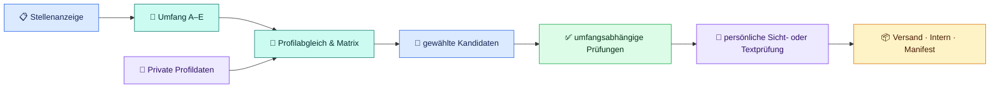

<p align="center">
  
</p>

<h1 align="center">apply-foundry</h1>

<p align="center">
  <strong>Agentenunabhängiger, lokaler Workflow für deutsche Bewerbungsunterlagen</strong><br>
  Für AGENTS-kompatible Coding-Agenten – von der Stellenanalyse bis zur persönlich geprüften lokalen Freigabe.
</p>

<p align="center">
  
  <a href="AGENTS.md"></a>
  <a href="CHANGELOG.md"></a>
  <a href="LICENSE"></a>
  <a href="https://github.com/Web-Developer-DB/apply-foundry/actions/workflows/tests.yml"></a>
  
</p>

<p align="center">
  <a href="#nutzung">👤 Nutzung</a> ·
  <a href="#schnellstart">🚀 Schnellstart</a> ·
  <a href="#interaktiver-dialog">💬 Dialog</a> ·
  <a href="#ergebnisse">🗂️ Dateien</a> ·
  <a href="#entwicklung">🧰 Entwicklung</a> ·
  <a href="#lizenz">📄 Lizenz</a> ·
  <a href="#hilfe">❓ Hilfe</a>
</p>

---

## Auf einen Blick

Dieses Repository gibt unterschiedlichen Coding-Agenten denselben sicheren Bewerbungsworkflow. [`AGENTS.md`](AGENTS.md) ordnet den Auftrag ein, [`Prompts/00_AGENTEN_START_HIER.md`](Prompts/00_AGENTEN_START_HIER.md) steuert den kanonischen Ablauf und der Python-Kern erzeugt und prüft die gewählten Unterlagen lokal.

| 🎯 **Passgenau** | 🔒 **Lokal & privat** | ✅ **Prüfbar** |
| :---: | :---: | :---: |
| Jede Bewerbung wird aus Stelle und belegten Profildaten aufgebaut. | Echte Daten und Arbeitsergebnisse liegen ausschließlich unter `Private/`. | Struktur, Inhalt, Layout, PDF und ATS werden nur als bestanden gemeldet, wenn der aktuelle Lauf sie wirklich geprüft hat. |

Aus einer Stellenbeschreibung und deinen privaten Daten entstehen nur die ausdrücklich gewählten Bestandteile: ein individueller Lebenslauf, ein unverändert übernommener Universal-Lebenslauf, ein Anschreiben und/oder eine E-Mail-Nachricht. Screenshots, PDFs und ATS-Nachweise werden nur erzeugt, wenn der gewählte Umfang HTML-Dokumente enthält. Versand an Unternehmen findet nie automatisch statt.

> [!NOTE]
> **Entwicklungsstand:** Der aktuelle technische Vertrag steht unter [`CHANGELOG.md`](CHANGELOG.md). Der Produktivkern nutzt ausschließlich Python 3.11+ und die Standardbibliothek; Browserprüfungen verwenden einen lokal vorhandenen Chrome-, Edge- oder Chromium-Browser.

### Fünf Auswahlen für den Dokumentumfang

| Auswahl | Ergebnis |
| --- | --- |
| **A – Komplette Bewerbung** | individueller Lebenslauf, Anschreiben und E-Mail-Nachricht |
| **B – Anschreiben mit Universal-Lebenslauf** | freigegebener Universal-Lebenslauf unverändert, neues Anschreiben und neue E-Mail-Nachricht |
| **C – Individueller Lebenslauf** | nur ein stellenbezogener Lebenslauf |
| **D – Nur Anschreiben** | nur ein Anschreiben, ohne still hinzugefügten Lebenslauf oder E-Mail-Text |
| **E – Eigene Zusammenstellung** | ausdrücklich gewählte Kombination aus Lebenslauf, Anschreiben und E-Mail-Nachricht |

Eine Stellenanzeige allein legt den Umfang nicht fest. Bei einem eindeutigen Wunsch wie „Lebenslauf und Anschreiben, aber keine E-Mail“ wird die Auswahl ohne zusätzliche Rückfrage übernommen. Eine reine E-Mail ohne Anlagen benötigt eine gesonderte Bestätigung.

### So fließen deine Daten



## Wähle deinen Einstieg

| Ich möchte … | Passender Start |
| --- | --- |
| eine neue Bewerbung erstellen | Stellenbeschreibung und gewünschten Dokumentumfang an den Agenten geben |
| meine Daten einrichten oder prüfen | zuerst `Private/Daten/` prüfen lassen; `Private.example/` ist nur eine Strukturvorlage |
| einen Universal-Lebenslauf erstellen oder aktualisieren | den eigenen Universalprozess unter `Private/Bewerbungen/_Universal-Lebenslauf/` starten |
| eine bestehende Bewerbung fortsetzen | den Status des privaten Arbeitsordners prüfen lassen |
| das Projekt weiterentwickeln | Architektur, Prompts, Tools und Tests im Entwicklerabschnitt verwenden |

### Automatischer Projekteinstieg für Coding-Agenten

AGENTS-kompatible Agenten beginnen im Projektstamm mit [`AGENTS.md`](AGENTS.md). Für einen Bewerbungsauftrag lädt der Agent danach den vollständigen Ablauf aus [`Prompts/00_AGENTEN_START_HIER.md`](Prompts/00_AGENTEN_START_HIER.md) und nur die für den jeweiligen Schritt zuständigen Promptmodule. [`CLAUDE.md`](CLAUDE.md), [`GEMINI.md`](GEMINI.md) und [`opencode.json`](opencode.json) sind schlanke Umgebungsadapter; sie enthalten keinen zweiten Workflow.

Ein Agent darf keine Fakten erfinden, keine privaten Dateien außerhalb von `Private/` kopieren und keine Bewerbung versenden. Seine Werkzeuge müssen für den jeweiligen Schritt tatsächlich Dateien lesen und schreiben, Terminalbefehle ausführen sowie für visuelle HTML-Prüfungen PNGs auswerten können. Fehlt eine Fähigkeit, muss der Agent dies offen benennen und den Freigabeschritt sicher stoppen.

---

<a id="nutzung"></a>

## 👤 Für Nutzer

Dieser Abschnitt ist für Menschen, die mit einem Coding-Agenten deutsche Bewerbungsunterlagen erstellen möchten. Du brauchst keine Kenntnisse über den internen Python-Code. Wichtig sind vollständige, wahre Angaben und die persönliche Prüfung vor einer lokalen Veröffentlichung.

**Direkt zum Ziel:** [Schnellstart](#schnellstart) · [Dialog verstehen](#interaktiver-dialog) · [Ablauf verstehen](#prozess) · [Dateien verwenden](#ergebnisse) · [Private Daten](#private-daten--datenschutz) · [Prüfen und freigeben](#pruefen-und-lokal-freigeben) · [Hilfe](#hilfe)

<a id="schnellstart"></a>

### 🚀 Erste Bewerbung: Schritt für Schritt

> [!IMPORTANT]
> Folge bei deiner ersten Bewerbung den Schritten 0 bis 8. Der Agent führt technische Arbeiten aus und nennt fehlende Voraussetzungen; du kontrollierst die inhaltlichen Angaben und prüfst später jede erzeugte Seite persönlich.

#### 0. Das solltest du bereithalten

| Benötigt | Wofür? |
| --- | --- |
| eine eingerichtete Agentenumgebung, zum Beispiel die Codex-App | das Projekt öffnen und den Workflow ausführen |
| Lebenslauf, Zeugnisse oder eigene Notizen | nur wahre persönliche und fachliche Angaben übernehmen |
| vollständiger Text der Stellenanzeige | Unterlagen gezielt auf die Stelle ausrichten |

Für den normalen Start musst du weder Python noch Browser oder Systemschrift einzeln prüfen. Der Agent klärt technische Voraussetzungen erst dann, wenn sie für den konkreten Arbeitsschritt relevant sind. Falls etwas fehlt, steht die Lösung unter [Häufige Probleme](#hilfe).

#### 1. Projekt herunterladen und öffnen

Wenn das Projekt noch nicht auf deinem Rechner liegt:

```bash
git clone https://github.com/Web-Developer-DB/apply-foundry.git
cd apply-foundry
```

Öffne den Projektstamm, nicht nur den übergeordneten Ordner. Dort müssen mindestens `AGENTS.md`, `README.md`, `Prompts/`, `Tools/` und `Private.example/` sichtbar sein. Git ist für das Klonen und Aktualisieren nützlich, aber nicht Teil der Bewerbungsprüfung selbst.

#### 2. Codex-App oder andere Agentenumgebung im Projektstamm starten

**Codex-App unter Windows oder Linux:** Öffne den Ordner `apply-foundry` als lokalen Arbeitsbereich und starte darin einen neuen Codex-Task. Gib dem Agenten anschließend deinen konkreten Auftrag, etwa das Einrichten deiner Daten oder das Erstellen einer Bewerbung. Der Agent liest die Projektregeln aus `AGENTS.md` im geöffneten Ordner.

Für andere eingerichtete Coding-Agenten gilt derselbe Grundsatz: Starte die Agentensitzung im Projektordner. Entscheidend ist nicht der Name der App, sondern dass der Agent `AGENTS.md` lesen sowie Dateien und Terminalbefehle im lokalen Arbeitsbereich verwenden kann.

Du musst keine Befehle ausführen, um eine Bewerbung zu starten. Der folgende Befehl ist nur für Nutzer gedacht, die den technischen Überblick selbst ansehen möchten:

```bash
python3 Tools/bewerbung.py --help
```

Die gemeinsamen Subcommands sind für Agenten und fortgeschrittene Nutzer verfügbar; der normale Bewerbungsdialog benötigt sie nicht als manuellen Zwischenschritt.

#### 3. Private Daten mit dem Agenten einrichten

Sende zum Beispiel diesen Auftrag an den Agenten:

```text
Hilf mir dabei, meine privaten Bewerberdaten einzurichten.

1. Prüfe zuerst, ob Private/Daten bereits existiert. Überschreibe nichts ungefragt.
2. Nutze Private.example/Daten nur als Strukturvorlage.
3. Trenne persönliche Stammdaten von Berufserfahrung, Kenntnissen und Belegen.
4. Übernimm keine Beispieldaten und erfinde keine Fakten.
5. Fasse die Angaben vor dem Schreiben verständlich zusammen und warte auf meine Bestätigung.
```

Die vorgesehene Struktur ist:

```text
Private/
└── Daten/
    ├── 01_PERSOENLICHE_DATEN.md
    ├── 02_BEWERBER_PROFIL_UND_POSITIONIERUNG.md
    └── README.md
```

`01_PERSOENLICHE_DATEN.md` enthält nur Identität, Kontakt und Bewerbungslogistik. Berufserfahrung, Ausbildung, Weiterbildung, Projekte, private Praxis, Kenntnisse und Formulierungsgrenzen gehören in `02_BEWERBER_PROFIL_UND_POSITIONIERUNG.md`.

#### 4. Eigene Daten persönlich kontrollieren

Prüfe die privaten Dateien selbst, bevor daraus Unterlagen entstehen. Korrigiere insbesondere Namen, Zeiträume, Arbeitgeber, Bildungsstationen, Kontaktdaten, Sprachniveaus und die Trennung zwischen beruflich belegter Erfahrung, Weiterbildung, Projektpraxis und privater Praxis.

> [!WARNING]
> Gib keine Passwörter, Bankdaten, Ausweisnummern oder andere nicht benötigte Geheimnisse ein. `Private/` schützt vor einer Aufnahme in Git, ersetzt aber keine Prüfung der Datenschutz- und Kontoeinstellungen deiner Agentenumgebung.

#### 5. Stellenanzeige an den Agenten übergeben

Übermittle den vollständigen Text der Stellenanzeige und formuliere deinen Dokumentwunsch. Eine geeignete Nachricht ist zum Beispiel:

```text
Erstelle eine vollständige Bewerbung für diese Stelle. Ich wähle Umfang A.
Bitte arbeite nur mit meinen privaten Daten, erfinde keine Erfahrung und halte vor einer Veröffentlichung für meine persönliche Sichtprüfung an.

[vollständiger Text der Stellenanzeige]
```

Der Agent klärt nur tatsächlich fehlende, bewerbungsrelevante Angaben. Neue Angaben gelten zunächst nur für diese Bewerbung. Eine dauerhafte Änderung der privaten Stammdaten braucht eine transparente Begründung und deine eindeutige Zustimmung.

#### 6. Jede erzeugte Vorschau persönlich prüfen

Bei HTML-Unterlagen erzeugt die technische Vorbereitung eine PNG-Datei pro A4-Seite. Öffne jede genannte Datei und prüfe Inhalt, Namen, Daten, Lesbarkeit, Seitenaufteilung und vollständige Darstellung. Änderungen am Kandidaten oder an seinen Quellen entwerten frühere PNG-, PDF-, ATS- und Sichtnachweise; danach muss der Agent alles erneut vorbereiten.

Bei einem zweiseitigen Lebenslauf gilt zusätzlich:

- Seite 1 zeigt die stärksten belegten Auswahlkriterien für die Zielrolle.
- Seite 2 ist ein geschlossener fachlicher Block und keine Restseite.
- Beide Seiten haben einen markierten Seitenkopf, eindeutige Abschnittskennungen und einen festen `page-footer`.
- Eine ungewöhnlich große freie Fläche im nutzbaren Inhaltsbereich sperrt die Sichtfreigabe. Inhalte werden dabei nicht erfunden oder künstlich zusammengedrückt.

In seltenen Fällen kann der Agent nur mit einer konkreten, im Finalisierungsbericht gespeicherten Begründung eine Dichteausnahme vorbereiten:

```bash
python3 Tools/bewerbung.py finalisieren \
  --arbeitsordner "Private/Bewerbungen/FIRMA/_Arbeitsdateien/YYYY-MM-DD--ROLLE" \
  --dichteausnahme-begruendung "Seite: ... Beleglage: ... Einseiter: ..."
```

Diese Ausnahme ersetzt nie deine persönliche Sichtprüfung.

#### 7. Lokale Freigabe ausdrücklich bestätigen

Nach einem erfolgreichen Vorbereitungslauf stoppt der Agent bei `bereit_zur_sichtpruefung`. Erst nach deiner eindeutigen Bestätigung speichert er die hashgebundene Sichtfreigabe und darf anschließend lokal veröffentlichen:

```bash
python3 Tools/bewerbung.py freigabe \
  --arbeitsordner "Private/Bewerbungen/FIRMA/_Arbeitsdateien/YYYY-MM-DD--ROLLE" \
  --freigabe-id FR-XXXXXXXXXXXX \
  --bestaetigt \
  --notiz "Alle finalen Seiten persönlich geprüft."

python3 Tools/bewerbung.py finalisieren \
  --arbeitsordner "Private/Bewerbungen/FIRMA/_Arbeitsdateien/YYYY-MM-DD--ROLLE" \
  --veroeffentlichen
```

Die Veröffentlichung ist ausschließlich eine lokale Freigabe in deinem privaten Bewerbungsordner. Der Workflow lädt nichts hoch und sendet keine E-Mail an ein Unternehmen.

#### 8. Nur die Versanddateien verwenden

Versende oder lade später nur die Dateien aus dem lokalen Ordner `Versand/` hoch. Screenshots, Prüfberichte, Arbeitsnotizen, HTML-Quellen, `Tokenverbrauch.json` und interne Nachweise sind nicht versandfertig.

---

<a id="interaktiver-dialog"></a>

### 💬 Interaktiver Bewerbungsdialog

Der Agent arbeitet nicht wie ein Formular, sondern rekonstruiert anhand der privaten Daten, der Stellenanzeige und des bestätigten Umfangs einen sicheren Arbeitsstand. Er soll fehlende Tatsachen gezielt fragen, aber keine Bewerbung aus Platzhaltern oder Vermutungen bauen.

| Situation | Erwartetes Verhalten |
| --- | --- |
| Nur Stellenanzeige vorhanden | Der Agent fragt nach Auswahl A–E. |
| Umfang ist eindeutig genannt | Der Agent übernimmt ihn ohne erneute Auswahlfrage. |
| Erfahrung oder Zeitraum fehlt | Der Agent dokumentiert die Lücke statt sie zu erfinden. |
| Neue persönliche Angabe | Sie gilt zunächst nur für den aktuellen Auftrag. |
| Kandidat oder Quelle wird geändert | Der Agent erzeugt die technischen Nachweise vollständig neu. |
| Sichtprüfung bestätigt | Der Agent darf die gebundene Freigabe speichern und lokal veröffentlichen. |

<a id="prozess"></a>

### 🧭 So arbeitet der Agent

Der Workflow trennt bewusst Arbeitsversion, technische Vorbereitung und veröffentlichte Unterlagen. Ein Dokument mit endgültig klingendem Namen ist noch nicht automatisch versandfertig.

1. Umfang, Firma, Rolle und offene Tatsachen klären.
2. Privaten Auftrag unter `Private/Bewerbungen/` anlegen oder fortsetzen.
3. Stellenanzeige, Profilabgleich, Anforderungsmatrix und Evidenz vorbereiten.
4. Aus belegten Angaben nur die gewählten Kandidatendateien erstellen.
5. Dialog, Stammdaten, Inhalt und statische A4-Struktur prüfen.
6. Layoutbilder, PDFs und ATS-Nachweise über den vollständigen Finalisierungslauf erzeugen.
7. Die genannten PNGs oder bei reiner E-Mail die Textdatei persönlich prüfen.
8. Sichtfreigabe an den unveränderten Artefaktsatz binden.
9. Den freigegebenen Satz ausschließlich lokal nach `Versand/` und `Intern/` veröffentlichen.

Die operative Referenz bleibt [`Prompts/00_AGENTEN_START_HIER.md`](Prompts/00_AGENTEN_START_HIER.md). Sie ist verbindlicher als diese Übersicht.

---

<a id="ergebnisse"></a>

### 🗂️ Welche Dateien entstehen – und wofür sind sie da?

Während der Bearbeitung liegen Quellen, Kandidaten und Prüfnachweise ausschließlich unter einem privaten Arbeitsordner:

```text
Private/Bewerbungen/
└── FIRMA/
    └── _Arbeitsdateien/
        └── YYYY-MM-DD--ROLLE/
            ├── Bewerbungsauftrag.json
            ├── Anforderungsmatrix.json
            ├── Kandidat/
            ├── Layoutcheck/
            ├── PDF-Export/
            ├── ATS-Pruefbericht.json
            ├── Finalisierungsbericht.json
            └── Sichtfreigabe.json
```

Nach der lokalen Veröffentlichung entsteht ein getrennter Zielordner:

```text
Private/Bewerbungen/FIRMA/YYYY-MM-DD--ROLLE/
├── Versand/
├── Intern/
└── Manifest.json
```

#### Der veröffentlichte Bewerbungsordner

| Bereich | Zweck |
| --- | --- |
| `Versand/` | Nur die ausgewählten PDF-Anlagen und gegebenenfalls die E-Mail-Nachricht. Diesen Ordner nutzt du für einen späteren Versand. |
| `Intern/` | HTML-Quellen und interne Nachweise zur eigenen Dokumentation. Nicht mitsenden. |
| `Manifest.json` | Hashgebundene Liste der veröffentlichten Dateien und ihres Dokumentumfangs. |

#### Welche Datei nutze ich für welchen Zweck?

| Datei | Verwendung |
| --- | --- |
| `Lebenslauf - NACHNAME.VORNAME.pdf` | Versand, wenn ein individueller oder universeller Lebenslauf ausgewählt wurde |
| `Anschreiben - NACHNAME.VORNAME.pdf` | Versand, wenn ein Anschreiben ausgewählt wurde |
| `Email-Nachricht--FIRMEN-SLUG.md` | Vorlage für eine manuelle E-Mail, wenn sie ausgewählt wurde |
| `Finalisierungsbericht.json` | technischer Nachweis des aktuellen Vorbereitungsstands, nicht versenden |
| `Sichtfreigabe.json` | persönlicher Freigabenachweis, nicht versenden |
| `Tokenverbrauch.json` | optionaler privater Diagnosebericht, nicht versenden |

#### Offene Fragen

Unklare, aber für eine Bewerbung wichtige Angaben stehen im Arbeitsstand. Der Agent darf offene Fragen nicht durch plausible Formulierungen ersetzen. Kläre sie, bevor du die Kandidatendateien freigibst.

---

<a id="private-daten--datenschutz"></a>

### 🔐 Private Daten & Datenschutz

Echte Bewerberdaten gehören nur nach `Private/`. `Private.example/` enthält ausschließlich eine sichere Strukturvorlage und darf nie mit echten Angaben überschrieben werden. Private Daten werden nicht in öffentliche Tests, Logs oder Git aufgenommen.

Das Sicherheitsmodell ist bewusst einfach:

- Der Agent verarbeitet nur die Daten, die du in den privaten Bereich einbringst.
- Der Workflow erfindet keine Identitäts-, Berufs-, Projekt- oder Qualifikationsangaben.
- Nur eine aktuelle persönliche Sichtprüfung ermöglicht die lokale Freigabe.
- Der Workflow lädt keine Unterlagen hoch und kontaktiert keine Arbeitgeber.
- Eine externe Übermittlung entscheidest und führst ausschließlich du außerhalb dieses Repositories aus.

> [!TIP]
> Für einen Test des Projekts verwende ausschließlich die synthetischen Fixtures unter `Tests/`. Sie enthalten keine privaten Bewerber- oder Arbeitgeberdaten.

<a id="pruefen-und-lokal-freigeben"></a>

### ✅ Prüfen und lokal freigeben

Der verbindliche technische Abschluss verwendet immer den vollständigen Dispatcher:

```bash
python3 Tools/bewerbung.py finalisieren \
  --arbeitsordner "Private/Bewerbungen/FIRMA/_Arbeitsdateien/YYYY-MM-DD--ROLLE" \
  --browser auto
```

Er prüft Dialog und Stammdaten, statische Kandidatenstruktur, Inhalt, Browserlayout, PDF-Export und ATS-Textschicht in fester Reihenfolge. Bei ausgewählten HTML-Dokumenten gehören frische PNG-Screenshots und PDFs zum Ergebnis. Bei einer ausgewählten reinen E-Mail werden Browser-, PDF- und ATS-Schritte korrekt als nicht erforderlich dokumentiert.

Nach der technischen Vorbereitung gilt:

- `bereit_zur_sichtpruefung`: Öffne jede genannte PNG-Datei und bestätige erst danach die Freigabe.
- `layout_ueberarbeitung_erforderlich`: Der zweiseitige Lebenslauf hat eine unzulässige freie Fläche; verteile belegte, relevante Inhalte neu oder dokumentiere eine zulässige Ausnahme.
- Fehler oder geänderte Quellen: Unterlagen überarbeiten und den vollständigen Lauf erneut ausführen.

Die Freigabe-ID und alle geprüften Artefakthashes müssen beim späteren Veröffentlichen noch aktuell sein. Ein veralteter Screenshot oder ein geänderter Kandidat kann nicht weiterverwendet werden.

<a id="plattformstatus"></a>

### 🪟 Voraussetzungen und Plattformstatus

Der Python-Kern ist für Desktop-Windows, -Linux und -macOS auf x64 und ARM64 ausgelegt. Die öffentliche CI prüft Python-Verträge auf diesen Plattformfamilien und enthält eine separate Browser-Smoke-Matrix für Chromium-Druck, A4-Geometrie und ATS. Zusätzlich deckt die Linux-Kompatibilitätsprüfung mehrere Distributionen ab.

| Plattform | erlaubter Paketweg bei fehlender Voraussetzung | Referenzschrift für den vollständigen Layout-/PDF-Workflow |
| --- | --- | --- |
| Windows | `winget` | Arial |
| Linux | APT, DNF/YUM, Pacman oder Zypper | Liberation Sans |
| macOS | Homebrew | Arial oder Liberation Sans |

Diese Angaben sind keine Checkliste für den ersten Start. Sie betreffen den vollständigen technisch geprüften HTML-/PDF-Workflow. Der Setupplan zeigt ausschließlich diese Wege, wenn eine tatsächlich benötigte Voraussetzung fehlt. Ein unbekannter Paketmanager, Ubuntu ohne zulässigen nativen Browserweg oder macOS ohne Homebrew führt zu einer klaren manuellen Voraussetzung statt zu einer Umgehung.

<a id="hilfe"></a>

### ❓ Häufige Probleme

| Beobachtung | Was tun? |
| --- | --- |
| Ich möchte nur starten und kenne die technischen Voraussetzungen nicht | Repository klonen, in der Codex-App als lokalen Arbeitsbereich öffnen und einen konkreten Auftrag geben. Der Agent prüft fehlende Voraussetzungen erst bei Bedarf. |
| `python3` fehlt oder ist zu alt | Den read-only Setupplan ausführen und die angezeigte System-Python-Voraussetzung installieren. |
| Browserlauf schlägt fehl | Prüfen, ob Chrome, Edge oder Chromium verfügbar ist; keinen anderen Browser als verbindlichen PDF-Ersatz verwenden. |
| Die Referenzschrift fehlt | Nur für den vollständigen HTML-/PDF-Workflow relevant. Zuerst den read-only Plan `python3 Tools/setup.py --all --dry-run --format json` ausführen; der Agent soll keine Installation ohne deine Zustimmung starten. |
| Screenshots sind vorhanden, aber die Sichtprüfung fehlt | Nicht veröffentlichen. Jede genannte Seite selbst öffnen und eindeutig bestätigen. |
| Layout-Gate sperrt den Lebenslauf | Zuerst die fachliche Seitenverteilung prüfen; keine irrelevanten Inhalte ergänzen oder Schrift künstlich verkleinern. |
| Nach einer Änderung verweigert die Freigabe das Veröffentlichen | Erwartetes Verhalten: vollständige technische Vorbereitung und neue Sichtprüfung ausführen. |
| Unklare Erfahrung oder fehlendes Zertifikat | Nicht behaupten. In den offenen Fragen dokumentieren oder vor der Bewerbung klären. |

### ⚠️ Bekannte Grenzen

Unterstützt sind Desktop-Windows, -Linux und -macOS; mobile Plattformen und BSD-Systeme gehören nicht zum Projektvertrag. Die technische Prüfung kann keine fachliche Wahrheit, keine Rechtsberatung und keine individuelle Karriereberatung ersetzen. Eine optisch oder technisch bestandene Datei wird nie automatisch versendet.

---

<a id="entwicklung"></a>

## 🧰 Für Entwickler

### Projektprinzipien

- Ein Python-3.11+-Kern aus Standardbibliothek statt plattformgetrennter Workflowimplementierungen.
- Ein kanonischer Bewerbungsworkflow in `AGENTS.md` und `Prompts/`, keine doppelten Agentenanweisungen.
- Private Daten nur unter `Private/`; öffentliche Tests verwenden ausschließlich synthetische Fixtures.
- Fail-closed bei unsicheren Pfaden, fehlenden Fähigkeiten, nicht aktuellen Artefakten und ungeklärter Sichtfreigabe.
- Keine versteckte Installation oder externe Übermittlung im Bewerbungsworkflow.

### Architektur

| Bereich | Aufgabe |
| --- | --- |
| [`AGENTS.md`](AGENTS.md) | Routing, Sicherheitsgrenzen und Arbeitsregeln für Agenten |
| [`Prompts/README.md`](Prompts/README.md) | kanonischer Bewerbungsworkflow und schrittbezogene Regeln |
| [`Tools/bewerbung.py`](Tools/bewerbung.py) | plattformneutraler CLI-Dispatcher |
| `Tools/apply_foundry/` | Python-Kern für Aufträge, Verträge, Browser, PDF, ATS und Finalisierung |
| [`Tools/setup.py`](Tools/setup.py) | read-only Setupplanung und bestätigte Systeminstallation |
| `Tests/` | synthetische Vertrags-, Browser-, Setup- und Promptregressionen |
| [`Private.example/README.md`](Private.example/README.md) | private Strukturvorlage ohne Nutzerdaten |

### Prompt-System und Dateiverträge

[`Prompts/00_AGENTEN_START_HIER.md`](Prompts/00_AGENTEN_START_HIER.md) ist der Einstieg für Bewerbungsaufträge. Die Module `01` bis `11` werden erst bei ihrem jeweiligen Arbeitsschritt geladen. Technische Verträge betreffen unter anderem:

- feste A4-HTML-Seiten und kontrollierte Chromium-Druckvorprüfung,
- strukturierte, hashgebundene private Aufträge, Matrix- und Evidenzdateien,
- Layout-, PDF-, ATS- und Finalisierungsberichte,
- persönliche Sichtfreigabe mit aktuellem Artefaktsatz,
- strikte Trennung zwischen privatem Arbeitsordner, `Versand/` und `Intern/`.

Bei zweiseitigen Lebensläufen erzwingt der statische Prüfer pro Seite einen `data-cv-page-header`, pro fachlicher Rubrik eine dokumentweit eindeutige `data-cv-section`-Kennung und einen `<footer class="page-footer">`. Die Dichtemessung schließt den Footerbereich aus und blockiert ungewöhnlich große freie Inhaltsflächen vor der Sichtfreigabe.

### Tests und CI

Die schnelle browserfreie Prüfung:

```bash
python3 -m unittest discover -s Tests/Python -p 'test_*.py'
python3 Tools/bewerbung.py tests --suite vollstaendig
```

Die vollständige synthetische Regression einschließlich Browser, PDF und ATS:

```bash
python3 Tools/bewerbung.py tests --mit-browser
```

Die CI-Workflows, etwa [`tests.yml`](.github/workflows/tests.yml), prüfen Python-Verträge auf Windows, Linux und macOS, die Python-3.11-Mindestversion, die Browser-Smokes sowie die Linux-Distributionskompatibilität. Promptregressionen bleiben von den erforderlichen Zugangsdaten abhängig und verwenden bereinigte synthetische Arbeitskopien.

### Empfohlener Entwickler-Workflow

1. Vor Tests oder Reparaturen `python3 Tools/setup.py --all --dry-run --format json` ausführen.
2. Nur betroffene Prompts, Tools und Tests lesen und ändern.
3. Keine privaten Daten nachverfolgen, in Logs schreiben oder als Testfixture verwenden.
4. Bei funktionalen Änderungen [`CHANGELOG.md`](CHANGELOG.md) aktualisieren.
5. Passende browserfreie Tests und bei Browseränderungen die vollständige Browserregression ausführen.

---

<a id="lizenz"></a>

## 📄 Lizenz

Dieses Projekt steht unter der [MIT-Lizenz](LICENSE).
