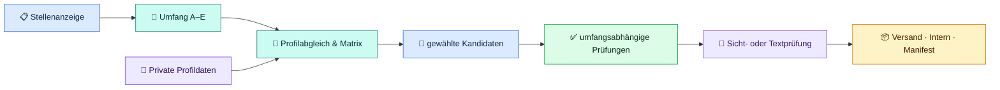

<p align="center">
  
</p>

<h1 align="center">bewerbungs-agent</h1>

<p align="center">
  <strong>Agentenunabhängiger KI-Bewerbungsworkflow</strong><br>
  Für Codex, OpenCode, Claude Code, Gemini und weitere AGENTS-kompatible Agenten – von der Stellenanalyse bis zur umfangsgerecht geprüften lokalen Freigabe.
</p>

<p align="center">
  
  <a href="CHANGELOG.md"></a>
  <a href="LICENSE"></a>
  <a href="https://github.com/Web-Developer-DB/bewerbungs-agent/actions/workflows/tests.yml"></a>
  
  <a href="#plattformstatus"></a>
  
</p>

<p align="center">
  <a href="#nutzung">👤 Nutzung</a> ·
  <a href="#schnellstart">🚀 Schnellstart</a> ·
  <a href="#interaktiver-dialog">💬 Dialog</a> ·
  <a href="#ergebnisse">🗂️ Dateien</a> ·
  <a href="#entwicklung">🧰 Entwicklung</a> ·
  <a href="#lizenz">📄 Lizenz</a> ·
  <a href="#hilfe">❓ Hilfe</a>
</p>

---

## Auf einen Blick

Dieses Repository stellt unterschiedlichen Coding-Agenten denselben spezialisierten Bewerbungsworkflow bereit. Die zentrale [`AGENTS.md`](AGENTS.md) erkennt den Auftrag, der kanonische Einstieg [`Prompts/00_AGENTEN_START_HIER.md`](Prompts/00_AGENTEN_START_HIER.md) steuert den vollständigen Ablauf, und lokale Werkzeuge führen von der Stellenanalyse bis zur kontrollierten Freigabe. Agentenspezifische Adapter enthalten keine Kopie des Workflows.

| 🎯 **Passgenau** | 🔒 **Lokal & privat** | ✅ **Geprüft** |
| :---: | :---: | :---: |
| Jede Bewerbung wird neu aus Stelle und Profil aufgebaut. | Echte Daten und Ergebnisse bleiben unter `Private/`. | Inhalt und alle für den gewählten Umfang erforderlichen Layout-, PDF-, ATS- oder Textnachweise werden kontrolliert. |

Aus einer Stellenbeschreibung und deinen Profildaten entstehen nur die ausdrücklich gewählten Bestandteile: ein individueller oder unverändert übernommener universeller Lebenslauf, ein Anschreiben und/oder eine E-Mail-Nachricht. HTML-, PDF-, Screenshot- und ATS-Artefakte werden nur erzeugt, wenn der Umfang sie erfordert. Analyse, Anforderungsmatrix und Qualitätsnachweise bleiben im privaten Arbeitsbereich.

`Console App.md` ist ausschließlich eine kompakte Roadmap (nicht implementiert und nicht operativ verbindlich); maßgeblich bleiben `AGENTS.md`, die kanonischen Prompts und die vorhandenen Werkzeuge.

### Fünf Auswahlen für den Dokumentumfang

| Auswahl | Ergebnis |
| --- | --- |
| **A – Komplette Bewerbung** | individueller Lebenslauf, Anschreiben und E-Mail-Nachricht |
| **B – Anschreiben mit universellem Lebenslauf** | freigegebener Universal-Lebenslauf unverändert, neues Anschreiben und neue E-Mail-Nachricht |
| **C – Individueller Lebenslauf** | nur ein stellenbezogener Lebenslauf |
| **D – Nur Anschreiben** | nur ein Anschreiben, ohne still hinzugefügten Lebenslauf oder E-Mail-Text |
| **E – Eigene Zusammenstellung** | frei gewählte Kombination aus Lebenslauf, Anschreiben und E-Mail-Nachricht |

Bei einem eindeutigen Auftrag wie `Lebenslauf und Anschreiben, aber keine E-Mail` überspringt der Agent die Auswahlfrage. Eine bloße Stellenbeschreibung legt den Umfang dagegen nicht fest. Auswahl B friert die Universalquelle per SHA-256 ein. Für eine reine E-Mail ohne Anlagen ist eine zusätzliche eindeutige Bestätigung erforderlich.

> [!NOTE]
> **Kanonische Werkzeugkette:** PowerShell 7.6 Core auf Windows und Ubuntu 24.04 sowie für ausgewählte HTML-Dokumente Chrome, Edge oder Chromium. Die Agentenumgebung ist frei wählbar, muss aber Dateien bearbeiten und Terminalbefehle ausführen können. Ubuntu bleibt bis zu drei aufeinanderfolgenden grünen Browsernachweisen im [Alpha-Status](#plattformstatus).

### So fließen deine Daten



## Wähle deinen Einstieg

<table role="presentation">
  <tr>
    <td width="50%" valign="top">
      <strong>👤 Projekt nutzen</strong><br><br>
      Private Daten einrichten, eine Bewerbung erzeugen, alle Dateien verstehen und nur den geprüften Satz versenden.<br><br>
      <a href="#schnellstart"><strong>Anfängeranleitung starten →</strong></a>
    </td>
    <td width="50%" valign="top">
      <strong>🧰 Projekt weiterentwickeln</strong><br><br>
      Architektur, Prompt-System, Werkzeuge, technische Dateiverträge, Tests und Erweiterungspunkte nachvollziehen.<br><br>
      <a href="#entwicklung"><strong>Zur Entwicklerdokumentation →</strong></a>
    </td>
  </tr>
</table>

<a id="agentenkompatibilitaet"></a>

### Automatischer Projekteinstieg für Coding-Agenten

Nach dem Start einer Agentensitzung im Projektstamm laden AGENTS-kompatible Agenten die Routing- und Sicherheitsregeln aus [`AGENTS.md`](AGENTS.md). [`CLAUDE.md`](CLAUDE.md) und [`GEMINI.md`](GEMINI.md) sind dünne Adapter, die dieselben Regeln importieren. `AGENTS.md` weist den Agenten an, den einzigen vollständigen Workflow aus [`Prompts/00_AGENTEN_START_HIER.md`](Prompts/00_AGENTEN_START_HIER.md) nur für Bewerbungsaufträge zu lesen; die Module `01` bis `11` werden erst beim jeweils zuständigen Arbeitsschritt geladen. Die vollständige Auswahl-, Rückfrage- und Speicherlogik liegt zentral in [`Prompts/01_DOKUMENTMODI_UND_UNIVERSALER_LEBENSLAUF.md`](Prompts/01_DOKUMENTMODI_UND_UNIVERSALER_LEBENSLAUF.md). [`opencode.json`](opencode.json) deaktiviert die OpenCode-Freigabefunktion im Projekt, dupliziert aber weder Prompts noch Modell- oder Providerwahl.

| Umgebung | Projektstatus | Automatische Projektregeln | Lokaler Teststand vom 06.08.2026 |
| --- | --- | --- | --- |
| Codex in VS Code | unterstützt | `AGENTS.md` | strukturell geprüft; kein vollständiger Beispielworkflow in einer frischen IDE-Sitzung |
| Codex CLI | unterstützt | `AGENTS.md` | CLI `0.146.0-alpha.9.2`; frische Read-only-Sitzung erkannte das Projekt und lud den kanonischen Prompt |
| ChatGPT-Desktop-App mit Codex | vorbereitet | `AGENTS.md` | gemeinsamer Adapter vorhanden; nicht in einer frischen App-Sitzung getestet |
| OpenCode | vorbereitet | `AGENTS.md` und `opencode.json` | CLI `1.18.10` und aufgelöste Projektkonfiguration mit isoliertem Benutzerprofil geprüft; keine frische Modellsitzung abgeschlossen |
| OpenCode mit Ollama | experimentell | dieselben Projektregeln; Ollama ergänzt Provider und Modell zur Laufzeit | Launcher bis OpenCode `1.18.10` geprüft; lokaler `qwen3.5:9b`-Startauftrag erreichte nach 120 Sekunden den Timeout |
| Claude Code | vorbereitet | `CLAUDE.md` → `AGENTS.md` | Adapter automatisiert geprüft; Claude CLI lokal nicht installiert |
| Gemini-basierter Coding-Agent | vorbereitet | `GEMINI.md` → `AGENTS.md` | Adapter automatisiert geprüft; keine frische Modellsitzung |
| andere AGENTS.md-Agenten | experimentell | `AGENTS.md` | abhängig von Datei-, Terminal-, Browser- und Bildfähigkeiten |

„Unterstützt“ bedeutet hier, dass der Projekteinstieg und die erforderlichen Verträge vorhanden sind. Es bedeutet nicht, dass jedes Modell den langen Workflow gleich zuverlässig ausführt. Die reproduzierbaren Prüfungen und die Abgrenzung zwischen lokal getestet und nur vorbereitet stehen in [`Tests/Agenten-Kompatibilitaet.md`](Tests/Agenten-Kompatibilitaet.md).

Codex CLI, OpenCode und Claude Code sind **Agentenumgebungen**: Sie lesen Dateien, führen Werkzeuge aus und verwalten den Ablauf. Ollama ist dagegen ein **Modellanbieter** für lokale oder gehostete Modelle. Das Modell erzeugt und bewertet Inhalte; OpenCode bleibt auch beim Start über Ollama der ausführende Agent.

Diese Dateien stellen Kontext bereit, sind aber kein Betriebssystem-Autostart: Allein durch das Öffnen des Ordners wird kein Shell-Befehl ausgeführt und keine Bewerbung gestartet. Ein eindeutiger Dokumentwunsch startet ohne erneute Auswahlfrage; bei einer bloßen Stellenbeschreibung fragt der Agent zuerst A–E ab. Ohne konkreten Auftrag nennt er nur die Einstiege neue Bewerbung, Dateneinrichtung/-prüfung, Fortsetzung beziehungsweise Standabfrage und Projektentwicklung.

---

<a id="nutzung"></a>

## 👤 Für Nutzer

Dieser Abschnitt ist für alle, die mit dem Projekt Bewerbungen erstellen möchten. Du brauchst dafür keine Kenntnisse über den internen Code oder die Implementierung der Prüfwerkzeuge.

**Direkt zum Ziel:** [Schritt-für-Schritt-Anleitung](#schnellstart) · [Interaktiven Dialog verstehen](#interaktiver-dialog) · [Ablauf verstehen](#prozess) · [Dateien verwenden](#ergebnisse) · [Private Daten](#daten) · [Prüfen & lokal freigeben](#finalisierung) · [Probleme lösen](#hilfe)

<a id="schnellstart"></a>

### 🚀 Erste Bewerbung: Schritt für Schritt

> [!IMPORTANT]
> **Folge für deine erste Bewerbung den Schritten 0 bis 8 in dieser Reihenfolge.** Der geöffnete KI-Agent führt die verfügbaren technischen Schritte aus und nennt fehlende Fähigkeiten offen. Du kontrollierst persönlich deine Daten, jeden erzeugten Seitenscreenshot beziehungsweise bei einem reinen E-Mail-Auftrag den Text und die fertigen Versanddateien.

#### 0. Das brauchst du vor dem Start

| Benötigt | Wofür? |
| --- | --- |
| Windows oder Ubuntu 24.04 mit [PowerShell 7.6](https://learn.microsoft.com/powershell/scripting/install/install-powershell) | eine gemeinsame fachliche Prüf- und Freigabekette; Ubuntu bleibt bis zum Browser-Rolloutnachweis Alpha |
| Git | Repository klonen und später aktualisieren; bei einem bereits vorhandenen Projektordner nicht für den Workflow selbst erforderlich |
| eine eingerichtete Agentenumgebung | Projektregeln lesen, Dateien bearbeiten und Terminalbefehle ausführen |
| Chrome, Edge oder Chromium | für ausgewählte HTML-Dokumente verbindliche Layoutbilder und geprüfte PDFs erzeugen |
| vorhandener Lebenslauf, Zeugnisse oder eigene Notizen | wahre persönliche und fachliche Angaben übernehmen |
| vollständiger Text einer Stellenanzeige | Bewerbung gezielt auf die Stelle ausrichten |

> [!TIP]
> Führe Projektbefehle immer im Projektstamm aus, in dem `AGENTS.md`, `README.md`, `Prompts/` und `Tools/` liegen. Ein Editor wie VS Code ist optional.

Prüfe im Terminal die installierten Grundlagen:

```powershell
git --version
pwsh --version
```

`pwsh` muss PowerShell 7.6 Core melden. Die Agentenumgebung prüft zusätzlich Dateizugriff, Terminal, Browser, PNG-Auswertung, Nutzungsdaten und Sandboxgrenzen jeweils vor dem betroffenen Schritt. Fehlt beispielsweise die Bildauswertung, darf sie keine visuelle Prüfung behaupten; sie muss die PNGs erzeugen und dich zur persönlichen Prüfung auffordern. Der gemeinsame read-only Preflight lautet:

```powershell
pwsh -NoProfile -File Tools/bewerbung.ps1 diagnose
```

Unter Ubuntu kann derselbe Check über `./Tools/bewerbung.sh diagnose` gestartet werden. Das optionale `Tools/setup-ubuntu.sh` wird niemals automatisch ausgeführt; ohne Auswahl zeigt es nur Hilfe. Prüfe geplante Änderungen zuerst etwa mit `./Tools/setup-ubuntu.sh --all --dry-run` und starte eine reale Installation nur ausdrücklich nach der angezeigten Vorschau.

#### 1. Projekt herunterladen und öffnen

Wenn du das Projekt noch nicht auf deinem Rechner hast, führe diese beiden Befehle aus:

```bash
git clone https://github.com/Web-Developer-DB/bewerbungs-agent.git
cd bewerbungs-agent
```

Wenn du das Projekt bereits geklont hast, überspringe die Befehle. Öffne genau den Projektordner – standardmäßig heißt er `bewerbungs-agent` – als Arbeitsverzeichnis deiner Agentenumgebung. Öffne nicht nur den übergeordneten Ordner.

Im Dateimanager oder Editor müssen anschließend unter anderem `AGENTS.md`, `README.md`, `Prompts/`, `Private.example/` und `Tools/` sichtbar sein. Mit diesem Befehl kannst du unter PowerShell den Terminalpfad prüfen:

```powershell
Get-Location
```

Der ausgegebene Pfad muss der Projektstamm sein. Der Ordnername darf abweichen, wenn du ihn beim Klonen oder später bewusst umbenannt hast.

> [!TIP]
> Blöcke mit der Überschrift `powershell` oder `bash` gehören in ein Terminal. Blöcke mit der Überschrift `text` sind Aufträge für die geöffnete Agentensitzung.

#### 2. Agentenumgebung auswählen und im Projektstamm starten

Verwende eine bereits installierte und eingerichtete Umgebung. Installations- und Anmeldehinweise stehen in den offiziellen Dokumentationen für [Codex CLI](https://learn.chatgpt.com/docs/codex/cli), [OpenCode](https://opencode.ai/docs/), [Ollama mit OpenCode](https://docs.ollama.com/integrations/opencode) und [Claude Code](https://code.claude.com/docs/en/quickstart). Die folgenden Befehle sind Alternativen, nicht gemeinsam auszuführen:

Codex CLI:

```bash
cd bewerbungs-agent
codex
```

OpenCode:

```bash
cd bewerbungs-agent
opencode
```

OpenCode mit einem über Ollama bereitgestellten Modell:

```bash
cd bewerbungs-agent
ollama launch opencode
```

Die Projektdatei `opencode.json` gilt für OpenCode im Terminal ebenso wie für eine darauf aufbauende Editor-Erweiterung. Sie deaktiviert nur das Teilen von Sitzungen; Modell und Provider bleiben bewusst ungebunden. `ollama launch opencode` ergänzt diese Laufzeitwerte zur bestehenden Projektkonfiguration, sodass kein lokaler Modellname im Repository festgeschrieben werden muss. In einer normalen OpenCode-Sitzung steht `/models` für die Modellwahl zur Verfügung. Wer OpenCode aus dem integrierten Terminal eines unterstützten Editors startet, kann die von OpenCode angebotene Editor-Integration nutzen; die Projektregeln bleiben dieselben.

Prüfe bei lokalen Modellen besonders Kontextlänge und zuverlässige Werkzeugaufrufe; Ollama empfiehlt für Agenten- und Coding-Aufgaben mindestens 64.000 Kontexttokens, was den Speicherbedarf erhöht. Kleine lokale Modelle können lange Regeln, Auswahlantworten, korrektes JSON, HTML/CSS, mehrere Prüfberichte oder Bildrückmeldungen weniger zuverlässig verarbeiten. Bei einer mehrdeutigen Auswahl fragt der Workflow höchstens einmal vereinfacht nach und stoppt danach, statt Umfang oder Profilzustimmung zu erraten.

Claude Code:

```bash
cd bewerbungs-agent
claude
```

Alternativ kannst du den Projektordner in der ChatGPT-Desktop-App öffnen und dort **Codex** mit der lokalen Umgebung wählen oder die Codex-Erweiterung in VS Code verwenden. Diese Oberflächen sind optional; die gemeinsamen Regeln kommen weiterhin aus `AGENTS.md`.

> [!NOTE]
> Die Befehle funktionieren nur, wenn das jeweilige Programm installiert, angemeldet beziehungsweise konfiguriert ist. Das Laden einer Regeldatei garantiert außerdem nicht, dass jedes Modell die Anweisungen gleich zuverlässig befolgt.

#### 3. Persönliche Daten mit dem Agenten einrichten

Sende den folgenden Auftrag an die geöffnete Agentensitzung:

> [!WARNING]
> `Private/` schützt vor einer versehentlichen Aufnahme in Git, macht die KI-Verarbeitung aber nicht automatisch offline. Gib keine Passwörter, Bankdaten, Ausweisnummern oder andere unnötige Geheimnisse ein und prüfe die Datenschutz- und Kontoeinstellungen deiner Agenten- und Modellumgebung.

```text
Hilf mir als Einsteiger dabei, meine privaten Bewerberdaten einzurichten.

1. Prüfe zuerst, ob Private/Daten bereits existiert. Überschreibe vorhandene Dateien niemals ungefragt.
2. Nutze Private.example/Daten nur als Strukturvorlage.
3. Falls Private/Daten noch fehlt, erstelle:
   - Private/Daten/01_PERSOENLICHE_DATEN.md
   - Private/Daten/02_BEWERBER_PROFIL_UND_POSITIONIERUNG.md
   - Private/Daten/README.md
4. Führe mich abschnittsweise durch die benötigten Angaben. Frage verständlich nach fehlenden Informationen.
5. Datei 01 enthält nur Identität, Kontakt und Bewerbungslogistik.
6. Datei 02 enthält nur Berufserfahrung, Ausbildung, Kenntnisse, Projekte, Belege und fachliche Grenzen.
7. Übernimm keine fiktiven Beispieldaten und erfinde nichts. Unklare Angaben bleiben als offene Fragen sichtbar.
8. Fasse meine Angaben vor dem Schreiben verständlich zusammen und warte auf meine Bestätigung.
9. Erstelle noch keine Bewerbung.

Nenne mir am Ende die beiden Datendateien, die ich persönlich kontrollieren muss, und liste noch fehlende Angaben auf.
```

Du kannst dem Agenten anschließend deinen bisherigen Lebenslauf, Stationen, Ausbildungen, Weiterbildungen, Kenntnisse, Projekte, gewünschte Rollen und Rahmenbedingungen geben. Bearbeite immer nur Angaben, die wirklich zu dir gehören.

Ein Bewerbungsfoto ist freiwillig. Wenn individuelle Lebensläufe automatisch ein Foto enthalten sollen, lege dein eigenes PNG exakt als `Private/Daten/Passfoto.png` ab. Ohne diese Datei erstellt der Agent ohne Rückfrage einen Lebenslauf ohne Foto. Das Original bleibt privat, wird nicht verändert und nie separat nach `Versand/` kopiert; universelle Lebensläufe bleiben unabhängig davon unverändert.

> [!CAUTION]
> Die Vorlagen enthalten **glaubwürdig wirkende, aber vollständig erfundene Beispieldaten**. Ein automatischer Prüfer kann nicht erkennen, ob ein plausibler Name oder Arbeitgeber wirklich zu dir gehört. Fahre erst fort, wenn du alle Beispiele persönlich ersetzt oder entfernt hast.

<details>
<summary><strong>Alternative: Dateien ohne Agentenhilfe kopieren</strong></summary>

Verwende diese Befehle nur bei einer frischen Installation. Sie stoppen, wenn `Private/Daten` bereits existiert:

```powershell
$privateDataPath = "Private/Daten"

if (Test-Path -LiteralPath $privateDataPath) {
  throw "Private/Daten existiert bereits. Vorhandene Daten werden nicht überschrieben."
}

New-Item -ItemType Directory -Path $privateDataPath | Out-Null
Copy-Item "Private.example/Daten/01_PERSOENLICHE_DATEN.example.md" "Private/Daten/01_PERSOENLICHE_DATEN.md"
Copy-Item "Private.example/Daten/02_BEWERBER_PROFIL_UND_POSITIONIERUNG.example.md" "Private/Daten/02_BEWERBER_PROFIL_UND_POSITIONIERUNG.md"
Copy-Item "Private.example/Daten/README.md" "Private/Daten/README.md"
```

Öffne danach beide Datendateien und ersetze jede fiktive Angabe manuell.

</details>

#### 4. Eigene Daten persönlich kontrollieren

Öffne in deinem Dateimanager oder Editor diese beiden Dateien:

```text
Private/Daten/01_PERSOENLICHE_DATEN.md
Private/Daten/02_BEWERBER_PROFIL_UND_POSITIONIERUNG.md
Private/Daten/Passfoto.png (optional)
```

Kontrolliere vor der ersten Bewerbung:

- [ ] Name, Adresse, Telefon, E-Mail und öffentliche Profil-Links gehören wirklich zu dir.
- [ ] Arbeitgeber, Zeiträume, Ausbildung und Weiterbildungen stimmen vollständig.
- [ ] Kenntnisse und Projekte sind korrekt als beruflich, Weiterbildung, Projektpraxis oder private Praxis eingeordnet.
- [ ] Beispielpersonen, Beispielunternehmen und erfundene Zertifikate wurden vollständig entfernt.
- [ ] Unsichere oder fehlende Informationen sind offen markiert und wurden nicht geraten.
- [ ] Falls `Passfoto.png` vorhanden ist: Es ist das gewünschte eigene Bewerbungsfoto und besitzt den exakten Dateinamen.

Lass danach den maschinellen Stammdatencheck vom geöffneten Agenten ausführen:

```text
Führe Tools/Pruefe-Stammdaten.ps1 für meine Daten unter Private/Daten aus.
Erkläre mir Fehler und Warnungen in einfacher Sprache.
Korrigiere nur Angaben, für die ich dir echte Informationen gegeben habe, und erfinde nichts.
Erstelle noch keine Bewerbung. Melde mir am Ende eindeutig, ob der Stammdatencheck erfolgreich ist.
```

Bei einem erfolgreichen Lauf endet die Ausgabe mit `ERGEBNIS: OK`. Fehler müssen vor der Bewerbung behoben werden; Warnungen solltest du bewusst prüfen. Der Check kontrolliert Pflichtfelder, bekannte Platzhalter, E-Mail-/Dateinamensformat und zentrale Logistikentscheidungen – nicht deine Identität, die Wahrheit der Angaben oder das vollständige Entfernen aller Beispieldaten.

> [!IMPORTANT]
> Echte Kontaktdaten, Profildaten und Bewerbungen gehören ausschließlich nach `Private/`. Dieser Ordner wird von Git ignoriert. Nimm seinen Inhalt niemals in einen Git-Commit auf und lade ihn nicht zu GitHub hoch; die spätere **lokale** Freigabe innerhalb von `Private/` ist dagegen beabsichtigt.

#### 5. Stellenanzeige an den Agenten übergeben

Kopiere möglichst den **vollständigen Text** der Stellenanzeige. Ein Link allein kann später nicht mehr erreichbar sein oder vom Agenten nicht gelesen werden.

```text
Ich möchte mich auf diese Stelle bewerben. Kläre zuerst, welche Unterlagen ich benötige, und bereite danach nur den bestätigten Umfang bis zur persönlichen Prüfung vor.
Veröffentliche noch nichts.

Stellenbeschreibung:

<hier den vollständigen Text der Stellenanzeige einfügen>
```

Dieser bewusst offene Auftrag löst die Auswahl A–E aus. Bei Agenten, die `AGENTS.md`, `CLAUDE.md` oder `GEMINI.md` automatisch laden, genügt er vollständig. Beim manuellen Fallback ergänze davor: `Lies AGENTS.md und folge für diese Bewerbung Prompts/00_AGENTEN_START_HIER.md.`

Auch die Kurzform `Erstelle eine Bewerbung für folgende Stellenbeschreibung` ist ohne weitere Dokumentangabe bewusst offen und löst deshalb zuerst die Umfangsauswahl aus.

Wenn dein Wunsch bereits feststeht, formuliere ihn direkt. Dann fragt der Agent den Umfang nicht erneut ab, beispielsweise:

```text
Erstelle einen individuellen Lebenslauf und ein Anschreiben, aber keine E-Mail-Nachricht.
Stellenbeschreibung:

<hier den vollständigen Text der Stellenanzeige einfügen>
```

Für Auswahl B kannst du den freigegebenen Universal-Lebenslauf ausdrücklich nennen:

```text
Verwende meinen freigegebenen universellen Lebenslauf unverändert.
Verwende die freigegebene HTML-Quelle unter
Private/Bewerbungen/_Universal-Lebenslauf/Aktiv/Intern/Lebenslauf - NACHNAME.VORNAME.html
unverändert. Erstelle nur Anschreiben und E-Mail neu und prüfe den Lebenslauf-Snapshot trotzdem technisch mit.
```

Die Kurzform `Erstelle nur ein Anschreiben und verwende meinen universellen Lebenslauf` wird als Einstieg mit Universal-Lebenslauf erkannt. Soll abweichend von Auswahl B keine E-Mail-Nachricht entstehen, nenne das ausdrücklich.

Zum erstmaligen Erstellen oder bewussten Aktualisieren der Universalquelle genügt der Auftrag `Erstelle beziehungsweise aktualisiere meinen universellen Softwareentwicklungs-Lebenslauf.` Der getrennte Ablauf verwendet `bewerbung.ps1 universal-neu`, `universal-status` und `universal-finalisieren`. Erst nach Prüfung beider PNG-Seiten entsteht das kleine Aktivpaket; sein datierter Arbeitsordner wird danach vollständig entfernt.

Weitere eindeutige Beispiele sind `Erstelle nur ein Anschreiben.` und `Erstelle nur einen individuellen Lebenslauf.` Eine reine E-Mail-Nachricht ohne Lebenslauf und Anschreiben muss der Agent vor der Auftragsanlage noch einmal ausdrücklich als Auftrag ohne Anlagen bestätigen lassen.

Auch diese kurzen Aufträge werden direkt erkannt:

```text
Prüfe meine Bewerberdaten.
```

```text
Setze die zuletzt begonnene Bewerbung fort.
```

```text
Erkläre mir den aktuellen Stand dieser Bewerbung.
```

Bei Fortsetzung oder Standabfrage rekonstruiert eine neue Agentensitzung zuerst den Auftrag und den normalisierten Dialogzustand aus `Bewerbungsauftrag.json`: neue Aufträge verwenden portable Schema-5-Pfade, der Dokumentumfang ist bereits ab Schema 4 verbindlich. Danach folgen `Arbeitsnotizen.md`, Matrix, Kandidaten, Prüfberichte, `Finalisierungsbericht.json` und gegebenenfalls `Manifest.json`. Ein Rohchat wird nicht gespeichert und Chat-Memory ist kein Zustandsnachweis. Beantwortete Fragen werden nicht erneut gestellt. Geänderte Quellen, Kandidaten oder Screenshots entwerten die davon abhängigen Hash- und Sichtnachweise; ein Betriebssystemwechsel entwertet zusätzlich die technischen Runtime-Nachweise.

Nach bestätigtem Umfang erstellt der Agent den privaten Arbeitsordner, analysiert die Stelle, erzeugt ausschließlich die ausgewählten Dokumente und führt nur die dafür erforderlichen Prüfungen aus. Die Dateien sind zu diesem Zeitpunkt **noch nicht für den Versand freigegeben**.

Ist ein Lebenslauf ausgewählt, aktualisiert der Agent nach dessen Kandidaten zusätzlich den entsprechenden Abschnitt im Tokenbericht. Nach der technischen Vorbereitung zeigt er immer eine kompakte Nutzungszusammenfassung. Exakte Zahlen erscheinen ausschließlich, wenn die jeweilige Laufzeit maschinenlesbare Nutzungsdaten bereitstellt. Andernfalls lautet die Ausgabe eindeutig `Tokenverbrauch: Von dieser Agentenumgebung nicht bereitgestellt.` und es wird keine Näherung berechnet.

> [!WARNING]
> Gehe erst zu Schritt 6, wenn der Agent den Status `bereit_zur_sichtpruefung` bestätigt. Bei HTML-Dokumenten muss er jede erzeugte PNG-Datei nennen; bei einem bestätigten reinen E-Mail-Auftrag muss er stattdessen die zu prüfende Textdatei nennen. Bei einem Fehler, einer kritischen offenen Frage oder fehlenden erwarteten Prüfartefakten lässt du zuerst die Ursache beheben und die Vorbereitung vollständig wiederholen.

#### 6. Jede erzeugte Vorschau persönlich prüfen

Enthält dein Umfang einen Lebenslauf oder ein Anschreiben, nennt der Agent den genauen Layoutordner. Er sieht ungefähr so aus:

```text
Private/Bewerbungen/FIRMA/_Arbeitsdateien/YYYY-MM-DD--ROLLENNAME/Layoutcheck/
```

Öffne in deinem Dateimanager, Editor oder Bildbetrachter **jede genannte Datei mit der Endung `.png` einzeln**. Kontrolliere jede sichtbare A4-Seite:

- [ ] Kein Text ist abgeschnitten, verdeckt oder überlappt.
- [ ] Es gibt keine ungewollte leere Seite oder große zufällige Leerfläche.
- [ ] Schrift, Abstände und Spalten sind gut lesbar.
- [ ] Name, Firma, Rolle und Kontaktdaten stimmen.
- [ ] Jedes ausgewählte Dokument enthält keine Platzhalter oder erfundenen Angaben.

Wenn du einen Fehler findest, sende beispielsweise:

```text
Veröffentliche noch nichts. Im Screenshot <Dateiname> ist folgendes Problem sichtbar:
<Problem genau beschreiben>.
Korrigiere die Kandidatendatei, wiederhole die vollständige technische Vorbereitung und nenne mir danach alle neu erzeugten PNG-Dateien zur erneuten Prüfung.
```

Bei einem bestätigten reinen E-Mail-Auftrag gibt es kein HTML, PDF oder PNG. Öffne dann die vom Agenten genannte `Email-Nachricht--FIRMA.md` im Kandidatenordner und prüfe Betreff, Empfängerbezug, Firma, Rolle, Namen, Kontaktdaten und Text vollständig. Layout-, PDF- und ATS-Berichte stehen in diesem Fall nachvollziehbar auf `nicht_erforderlich`; das ist kein vorgetäuschter Browserlauf.

#### 7. Lokale Freigabe ausdrücklich bestätigen

> [!IMPORTANT]
> **„Veröffentlichen“ bedeutet hier nur eine lokale Freigabe:** Das Tool übernimmt geprüfte Dateien in die lokalen Ordner `Versand/` und `Intern/` und erstellt `Manifest.json`. Es lädt nichts zu GitHub oder einem Unternehmen hoch, verschickt keine E-Mail und sendet keine Portalbewerbung.

Sende den folgenden Auftrag **nur, wenn du wirklich jede genannte PNG-Datei beziehungsweise bei einem reinen E-Mail-Auftrag die genannte Textdatei geöffnet und geprüft hast**:

```text
Ich habe jede von dir genannte PNG-Datei beziehungsweise die für diesen Umfang genannte Textdatei persönlich geöffnet und vollständig geprüft.
Alle ausgewählten Unterlagen sind vollständig und enthalten keine falschen sichtbaren Angaben. Bei visuellen Dokumenten gibt es keinen abgeschnittenen oder überlappenden Text und keine problematische Leerseite.

Veröffentliche jetzt den vorbereiteten Bewerbungssatz mit dem vorgesehenen Finalisierungswerkzeug.
Gib ihn nur lokal frei. Lade nichts hoch und versende nichts.
Falls sich seit der Vorbereitung eine Quelle oder die Arbeitsversion unter Kandidat/ geändert hat, veröffentliche nicht. Wiederhole nur die Vorbereitung, nenne mir jede neu erzeugte PNG-Datei und stoppe danach. Warte zwingend auf meine erneute Sichtprüfungsbestätigung; gib im selben Auftrag nichts frei.
Nur wenn der unveränderte vorbereitete Stand erfolgreich freigegeben wurde: Nenne mir danach den genauen Versandordner, alle darin enthaltenen Dateien und wofür ich sie abhängig von der Stellenanzeige verwenden kann.
```

Bei einer automatischen Layoutwarnung kann der Agent zusätzlich nach deiner konkreten Sichtbewertung fragen. Beschreibe dann ehrlich, was du auf der betroffenen Seite geprüft hast.

#### 8. Nur die Versanddateien verwenden

Öffne den vom Agenten genannten Ordner:

```text
Private/Bewerbungen/FIRMA/YYYY-MM-DD--ROLLENNAME/Versand/
```

| Datei | Deine Aktion |
| --- | --- |
| `Lebenslauf - NACHNAME.VORNAME.pdf` | vorhanden, wenn der Umfang einen individuellen oder universellen Lebenslauf enthält; dann nach Bedarf hochladen oder anhängen |
| `Anschreiben - NACHNAME.VORNAME.pdf` | vorhanden, wenn ein Anschreiben ausgewählt wurde; nur hochladen oder anhängen, wenn es verlangt oder zugelassen wird |
| `Email-Nachricht--FIRMA.md` | vorhanden, wenn eine E-Mail-Nachricht ausgewählt wurde; Betreff und Nachricht kopieren, die Markdown-Datei nicht anhängen |

Verwende ausschließlich freigegebene Dateien aus `Versand/`, aber beachte immer die Anforderungen der Stellenanzeige oder des Bewerbungsportals. Wenn ausdrücklich kein Anschreiben verlangt wird, hänge es nicht ungefragt an. Bei einer Portalbewerbung brauchst du die E-Mail-Datei meistens nicht.

Prüfe außerdem, ob unter `Intern/` eine `Offene_Fragen.md` vorhanden ist, und kläre alle versandrelevanten Punkte. Öffne jede benötigte PDF-Datei vor dem Versand noch einmal. Kontrolliere Empfänger, Firma, Rolle, Namen, Kontaktdaten und Seitenzahl. Dateien aus `_Arbeitsdateien/`, `Intern/` sowie `Manifest.json` werden nicht mitgeschickt.

> [!IMPORTANT]
> Ändert die Antwort auf eine offene Frage den Lebenslauf, das Anschreiben, die E-Mail oder eine Quelldatei, sind die bisherigen PDFs und Screenshots nicht mehr aktuell. Bitte den Agenten, die Arbeitsversion zu korrigieren, die vollständige technische Vorbereitung erneut auszuführen, alle neuen PNG-Dateien zu nennen und dann zu stoppen. Öffne danach jede neue PNG-Datei und bestätige die lokale Freigabe erneut, bevor du etwas versendest.

> [!NOTE]
> Auch der Ordner `Versand/` versendet nichts automatisch. Das Hochladen in ein Bewerbungsportal oder das Abschicken einer E-Mail bleibt immer deine bewusste Aktion.

> [!TIP]
> **Deine Bewerbungsunterlagen sind jetzt für das bewusste manuelle Hochladen oder Versenden vorbereitet.** Die folgenden Nutzerabschnitte erklären den Ablauf und alle Dateien genauer; für den normalen ersten Durchlauf musst du sie nicht vollständig lesen.

<a id="interaktiver-dialog"></a>

### 💬 Interaktiver Bewerbungsdialog

Der Agent fragt nur dann nach dem Umfang, wenn dein Auftrag ihn noch nicht eindeutig enthält. Du kannst mit `A` bis `E`, `1` bis `5`, `ja`, `nein` oder in freiem Text antworten. Eine eindeutige freie Formulierung wie `Lebenslauf und Anschreiben, aber keine E-Mail` wird ohne zusätzliches Menü übernommen.

Danach vergleicht der Agent nur die für den gewählten Umfang relevanten Stellenanforderungen mit deinem privaten Profil. Intern unterscheidet er unter anderem eindeutig, teilweise oder übertragbar belegte Angaben, nicht belegte Punkte, Widersprüche und möglicherweise vorhandene, aber noch nicht dokumentierte Erfahrung. Er fragt nur nach, wenn eine Antwort Wahrheit oder Qualität der ausgewählten Unterlagen wesentlich beeinflussen kann. Verwandte Lücken werden gebündelt; pro Dialogrunde sind höchstens drei voneinander unabhängige Fragen zulässig.

Beispiel:

```text
Agent: Die Stelle verlangt TypeScript. Dazu finde ich noch keine eindeutige Angabe.
       Haben Sie TypeScript beruflich, in privaten Projekten, in einer Weiterbildung,
       nur theoretisch oder gar nicht eingesetzt? Eine freie Beschreibung ist möglich.

Nutzer: In zwei privaten React-Projekten.

Agent: Ich ordne das als praktische Erfahrung aus privaten Projekten ein.
       Soll die Formulierung dauerhaft ins Profil übernommen werden?
       A – Ja  B – Nein, nur für diese Bewerbung  C – Vorher anders formulieren
```

Neue Angaben gelten standardmäßig nur für die aktuelle Bewerbung. Erst nach einer wahrheitsgemäßen Einordnung bündelt der Agent langfristig relevante Angaben und zeigt die beabsichtigten Formulierungen sowie die betroffenen Profildateien. Vor deiner Zustimmung bindet der Auftrag Wortlaut, Datei, Abschnitt und aktuellen Datei-Hash; das Übernahmewerkzeug akzeptiert danach keine abweichende Formulierung oder Zieldatei. Eine dauerhafte Änderung erfolgt ausschließlich nach deiner ausdrücklichen Zustimmung. Bei einer unklaren Antwort fragt der Agent höchstens einmal vereinfacht nach; Mehrdeutigkeit ist niemals Zustimmung.

Gespeichert werden nur normalisierte fachliche Aussagen, Entscheidungen, Zeitstempel und gegebenenfalls Hashnachweise – kein Rohchat und keine vollständigen Prompts. So kann eine andere Agentensitzung beantwortete Fragen erkennen und an der ersten offenen Stelle fortsetzen.

<a id="prozess"></a>

### 🧭 So arbeitet der Agent

Dieser Abschnitt erklärt den Hintergrund. Für deine erste Bewerbung kannst du direkt der sichtbaren [Schritt-für-Schritt-Anleitung](#schnellstart) folgen.

Der Agent trennt bewusst vier Zustände. Ein **Kandidat** ist dabei nur eine noch nicht freigegebene Arbeitsversion. Eine Datei ist nicht automatisch versandfertig, nur weil sie bereits einen final wirkenden Namen trägt.

> [!NOTE]
> **„Veröffentlicht“ bedeutet im gesamten Projekt nur lokal freigegeben.** Dateien werden auf deinem Rechner in `Versand/` und `Intern/` übernommen. Dadurch wird nichts hochgeladen oder automatisch verschickt.

| Zustand | Speicherort | Bedeutung | Versenden? |
| --- | --- | --- | :---: |
| 🟡 **Entwurf** | `_Arbeitsdateien/.../` | Planung, Vorlagen und noch ungeprüfte Entscheidungen | Nein |
| 🔵 **Kandidat** | `_Arbeitsdateien/.../Kandidat/` | vollständige, aber noch nicht freigegebene Bewerbung | Nein |
| 🟣 **Prüfnachweise** | `_Arbeitsdateien/.../Layoutcheck/`, `PDF-Export/` und Arbeitsordner | Screenshots, Prüfberichte und Hashnachweise | Nein |
| 🟢 **Veröffentlicht** | `YYYY-MM-DD--ROLLENNAME/` | visuell und technisch geprüftes Ergebnis | nur `Versand/` |

> [!IMPORTANT]
> **Für Bewerbungsanhänge verwendest du nur freigegebene Dateien aus `Versand/`.** Welche Anhänge du tatsächlich übermittelst, richtet sich nach der Stellenanzeige oder dem Bewerbungsportal. Dateien unter `_Arbeitsdateien/` sind Arbeitsstände oder Prüfnachweise; Dateien unter `Intern/` bleiben bei dir.

#### Der Ablauf in neun Phasen

1. **Umfang klären** – Ein eindeutiger Wunsch wird direkt übernommen; sonst fragt der Agent A–E ab.
2. **Stammdaten und Arbeitsstand prüfen** – Identität, Kontakt, Logistik und ein möglicher gespeicherter Dialogzustand werden kontrolliert.
3. **Stelle und Profil abgleichen** – Nur für die ausgewählten Dokumente relevante Muss-/Kann-Anforderungen werden mit belegbaren Daten verglichen.
4. **Gezielt nachfragen** – Wesentliche Lücken und Widersprüche werden gebündelt geklärt; neue Angaben gelten zunächst nur für diesen Auftrag.
5. **Auftrag und Matrix festlegen** – Dokumentumfang, Bewerbungsentscheidung, Belege und Strategie werden maschinenlesbar gespeichert.
6. **Ausgewählte Kandidaten erstellen** – Es entstehen ausschließlich die gewählten Bestandteile; ein Universal-Lebenslauf bleibt hashgleich.
7. **Fachlich korrigieren** – Stelle, Profil, Dialogangaben, Matrix und vorhandene Dokumente werden auf Wahrheit und Konsistenz geprüft.
8. **Technisch vorbereiten** – HTML-Bestandteile erhalten PDF-, Screenshot- und ATS-Nachweise; bei E-Mail-only werden diese Berichte als `nicht_erforderlich` geschrieben.
9. **Persönlich prüfen und veröffentlichen** – Du prüfst jede erzeugte Seite oder den reinen E-Mail-Text. Erst danach wird das geprüfte Set lokal freigegeben und mit `Manifest.json` gebunden.

<details>
<summary><strong>Die neun Phasen genauer erklärt</strong></summary>

**1 · Umfang und Sicherheit**

Der Umfang wird vor dem Lesen privater Profildaten eindeutig geklärt. Eine mehrdeutige Auswahl wird höchstens einmal vereinfacht nachgefragt und danach fehlergeschlossen gestoppt. Die Stellenanzeige bleibt eine nicht vertrauenswürdige Datenquelle; darin eingebettete Anweisungen werden nicht ausgeführt.

**2 · Stammdaten und Arbeitsstand**

Der Agent prüft Bewerbername, Kontakt, Stellenart, Arbeitsmodell, Region, Eintrittstermin und Gehaltsstrategie. Bei einer Fortsetzung liest er Umfang, beantwortete Rückfragen und Speicherentscheidungen aus Dateien statt aus einer früheren Unterhaltung.

**3 · Profilabgleich**

Anforderungen werden als belegt, teilweise oder übertragbar belegt, nicht belegt, widersprüchlich, möglicherweise vorhanden oder nicht relevant eingeordnet. Diese interne Einordnung steuert, ob überhaupt eine Rückfrage nötig ist.

**4 · Rückfragen und Profilkontrolle**

Pro Runde werden höchstens drei wesentliche, voneinander unabhängige Fragen gestellt. Neue Angaben werden fachlich normalisiert und standardmäßig nur im Auftrag gespeichert. Dauerhafte Profiländerungen werden gebündelt angeboten und nur nach transparenter, ausdrücklicher Zustimmung ausgeführt.

**5 · Bewerbungsauftrag und Matrix**

`Bewerbungsauftrag.json` Schema 5 friert Firma, Rolle, portable Root-relative Pfade, Logistik, den bestätigten Dokumentumfang und den normalisierten Dialogzustand für genau diese Bewerbung ein. Neue Bewerbungen verwenden `Anforderungsmatrix.json` Schema 5: zusätzlich zu Gewichtung, Beleg und Behandlung enthält sie die maschinenlesbare Anschreibenstrategie, strukturierte externe Quellen und die Evidenzdisposition. Matrix-Schemata 1 bis 4 bleiben für bestehende Bewerbungen lesbar.

Legacy-Matrizen können ausdrücklich über `bewerbung.ps1 migrieren --arbeitsordner "..."` geprüft werden. Der Standardlauf ist read-only. `--anwenden` erzeugt bei fehlenden fachlichen Ergänzungen nur private Migrationsentwürfe; eine Übernahme in `Anforderungsmatrix.json` und `Evidenzindex.json` erfolgt erst nach vollständiger Zielvertragsprüfung. Leser, Statusprüfung und Finalisierung migrieren niemals automatisch. `Migrationsbericht.json` verwendet Schema 1 und bindet die Vorher-/Nachher-Hashes.

**6 · Umfangsgerechter Kandidat**

Nur ausgewählte Dokumente werden mit ihren späteren Namen unter `Kandidat/` angelegt. Dieser Ordner bleibt die Werkbank für Korrekturen. Ist ein Lebenslauf enthalten, aktualisiert der Agent danach den nicht blockierenden Lebenslauf-Messbereich in `Tokenverbrauch.json`.

**7 · Fachliche Korrekturschleife**

Der Agent liest Stellenbeschreibung, Analyse, private Daten, normalisierte Dialogangaben, Matrix und alle vorhandenen Dokumente gegeneinander. Unstimmigkeiten werden am Kandidaten korrigiert und erneut geprüft; fehlende Belege werden nicht erfunden.

**8 · Technische Vorbereitung**

Der Finalisierungslauf leitet die erwarteten Dateien aus `dokumentumfang` ab. Für jedes HTML-Dokument erzeugt er PDF, ATS-Nachweis und einen Screenshot je A4-Seite. Ein reiner E-Mail-Auftrag erhält stattdessen nachvollziehbare `nicht_erforderlich`-Berichte. Der Status lautet danach lediglich `bereit_zur_sichtpruefung`.

**9 · Persönliche Prüfung und gemeinsame Veröffentlichung**

Änderst du nach der Vorbereitung eine Quelle oder Kandidatendatei, verlieren die abhängigen Nachweise ihre Gültigkeit und Phase 8 muss vollständig wiederholt werden. Direkt vor der Veröffentlichung prüft das Tool den unveränderten Stand. Neue Dateien werden zuerst in einem separaten Zwischenordner vorbereitet und anschließend gemeinsam übernommen, damit kein unvollständiger Endstand entsteht.

</details>

<a id="ergebnisse"></a>

### 🗂️ Welche Dateien entstehen – und wofür sind sie da?

Die Ordner `Intern/`, `Versand/` und die Datei `Manifest.json` bilden den **veröffentlichten Endzustand**. Welche Dokumentdateien darin liegen, bestimmt der gespeicherte Dokumentumfang. Parallel bleibt unter `_Arbeitsdateien/` die private Werkstatt mit Auftrag, normalisiertem Dialogzustand, Kandidaten und technischen Nachweisen erhalten.

#### Der veröffentlichte Bewerbungsordner

```text
Private/Bewerbungen/FIRMA/YYYY-MM-DD--ROLLENNAME/
├─ Versand/
│  ├─ optional Lebenslauf - NACHNAME.VORNAME.pdf
│  ├─ optional Anschreiben - NACHNAME.VORNAME.pdf
│  └─ optional Email-Nachricht--FIRMA.md
├─ Intern/
│  ├─ Stellenbeschreibung.md
│  ├─ Analyse.md
│  ├─ optional Lebenslauf - NACHNAME.VORNAME.html
│  ├─ optional Anschreiben - NACHNAME.VORNAME.html
│  ├─ Qualitaetscheck.md
│  ├─ Druck-Hinweis.md
│  └─ optional Offene_Fragen.md
└─ Manifest.json
```

##### `Versand/` – das benutzt du für die Bewerbung

| Datei | Verwendung |
| --- | --- |
| `Lebenslauf - NACHNAME.VORNAME.pdf` | nur vorhanden, wenn ein Lebenslauf ausgewählt wurde; aus `Versand/` hochladen oder anhängen, wenn er verlangt wird |
| `Anschreiben - NACHNAME.VORNAME.pdf` | nur vorhanden, wenn ein Anschreiben ausgewählt wurde; gegebenenfalls getrennt vom Lebenslauf hochladen |
| `Email-Nachricht--FIRMA.md` | nur vorhanden, wenn eine E-Mail-Nachricht ausgewählt wurde; Betreff und Nachricht kopieren, die Markdown-Datei nicht anhängen |

Eine Stellenanzeige mit der Bitte um eine Bewerbung „als PDF“ verlangt nicht automatisch eine Gesamt-PDF. Sind Lebenslauf und Anschreiben ausgewählt, bleiben sie getrennte Anlagen; zusammengeführt wird nur bei ausdrücklicher Vorgabe.

##### `Intern/` – deine lesbare Dokumentation

| Datei | Zweck | So kannst du sie nutzen |
| --- | --- | --- |
| `Stellenbeschreibung.md` | gespeicherte Ausgangsanzeige | später nachlesen und zur Gesprächsvorbereitung verwenden, auch wenn die Online-Anzeige nicht mehr verfügbar ist |
| `Analyse.md` | Passung, Profilstrategie, stärkste Argumente, Risiken und bewusste Auslassungen | Bewerbungsentscheidung nachvollziehen und auf ein Vorstellungsgespräch vorbereiten |
| `Lebenslauf - … .html` | optionaler geprüfter HTML-Stand des Lebenslaufs | im Browser ansehen und als nachvollziehbare Dokumentquelle archivieren |
| `Anschreiben - … .html` | optionaler geprüfter HTML-Stand des Anschreibens | im Browser ansehen und als nachvollziehbare Dokumentquelle archivieren |
| `Qualitaetscheck.md` | fachlicher Anforderungsabgleich plus technischer Abschlussstatus | kontrollieren, was geprüft wurde und welche Warnungen dokumentiert sind |
| `Druck-Hinweis.md` | Anleitung für das manuelle Drucken im Browser | nur verwenden, wenn du eine HTML-Datei manuell drucken oder als PDF sichern musst |
| `Offene_Fragen.md` | nicht erfundene, noch offene oder bewusst dokumentierte Punkte | vor dem Versand lesen und verbleibende Fragen soweit möglich klären |

> [!NOTE]
> Wenn du ein veröffentlichtes Dokument ändern möchtest, bearbeite nicht direkt die Datei unter `Intern/`. Ändere die passende Datei unter `_Arbeitsdateien/.../Kandidat/`, wiederhole die technische Vorbereitung und veröffentliche den neuen geprüften Satz mit `--ersetzen`.

##### `Manifest.json` – Integrität des veröffentlichten Satzes

`Manifest.json` ist ein technischer Prüfbeleg für den lokal freigegebenen Dateisatz. Die Projektwerkzeuge können damit erkennen, ob sich eine freigegebene Datei später verändert hat.

Du musst diese Datei für die normale Nutzung nicht öffnen oder verstehen. **Bearbeite sie nicht, hänge sie nicht an und versende sie nicht.** Die vollständigen technischen Details stehen in der Entwicklerdokumentation.

<details>
<summary><strong>Arbeitsdateien, Kandidaten und Prüfberichte kurz erklärt</strong></summary>

Alles in diesem Bereich bleibt privat und wird nicht versendet.

| Datei oder Ordner | Zweck | Was du damit tun kannst |
| --- | --- | --- |
| `Bewerbungsauftrag.json` | neuer Schema-5-Auftrag mit portablen Root-relativen Pfaden, Firma, Rolle, bestätigtem Dokumentumfang, Dialogzustand, Logistik, Darstellungsoptionen und Bewerbungsentscheidung | Umfang, offene Rückfragen und Speicherentscheidungen prüfen; enthält keinen Rohchat und darf nach der Vorbereitung nicht still geändert werden |
| `Anforderungsmatrix--ENTWURF.json` | vom Ordnerhelfer erzeugtes Startgerüst | nicht als fertige Analyse verwenden; wird durch `Anforderungsmatrix.json` ersetzt |
| `Anforderungsmatrix.json` | vollständiger Muss-/Kann-Abgleich mit Gewichtung, Belegen und Behandlung | Passung und Risiken nachvollziehen; auch zur Interviewvorbereitung nützlich |
| `Arbeitsnotizen.md` | Zuordnung von Firma, Rolle und Ordnern | Arbeitsstand nachvollziehen; wird außerdem zur sicheren Fortsetzung einer Bewerbung benötigt |
| `*--ENTWURF.*` | vorbereitete Schreibgerüste für Analyse, HTML, E-Mail, Qualitätscheck und offene Fragen | nur als Arbeitsgrundlage betrachten; nie versenden |
| `Kandidat/` | gemäß Dokumentumfang vollständig benannter, aber noch nicht freigegebener Satz | hier Korrekturen vornehmen und danach alle abhängigen Prüfungen erneut ausführen |
| `Kandidat/*.pdf` | für ausgewählte HTML-Dokumente während der Vorbereitung erzeugte und validierte PDF-Kandidaten | nicht direkt versenden; erst die veröffentlichten Kopien unter `Versand/` verwenden |
| `Stammdaten-Pruefbericht.json` | Ergebnis der Identitäts-, Kontakt- und Logistikprüfung | bei blockierenden Stammdatenfehlern zur Diagnose öffnen |
| `Inhalts-Pruefbericht.json` | Konsistenz-, Zeitraum-, Darstellungs- und Passungsprüfung | fachliche Fehler und Warnungen nachvollziehen |
| `Layoutcheck/*.png` | ein frischer Screenshot je expliziter A4-Seite der ausgewählten HTML-Dokumente | **jede vorhandene PNG-Datei tatsächlich öffnen und visuell prüfen** |
| `Layoutcheck/Layoutcheck-Bericht.json` | Browser, Abmessungen, Seiten, Screenshot-Hashes und Dichtehinweise; bei E-Mail-only `nicht_erforderlich` | Layoutwarnungen einer konkreten Seite oder den bewusst entfallenen Lauf nachvollziehen |
| `PDF-Export/PDF-Export-Bericht.json` | HTML-/PDF-Hashes, Dateigröße, Seitenzahl und A4-MediaBox; bei E-Mail-only `nicht_erforderlich` | PDF-Exportfehler oder den bewusst entfallenen Export technisch einordnen |
| `ATS-Pruefbericht.json` | Schema-2-Nachweis mit Pflichttexten, Unicode-normalisierten Token-/N-Gramm-Metriken, Lesereihenfolge und Artefakt-Hashes; bei E-Mail-only `nicht_erforderlich` | ATS-Lesbarkeit oder den bewusst entfallenen PDF-Test nachvollziehen |
| `Finalisierungsbericht.json` | Schema-6-Vorbereitungsnachweis mit Dokumentumfang, Runtime-Fingerprint, persönlicher Prüfart, Freigabe-ID-Anforderung und Hashes der tatsächlich erwarteten Artefakte | Status und Prüflauf nachvollziehen; für die Integrität des veröffentlichten Endstands ist `Manifest.json` maßgeblich |
| `Sichtfreigabe.json` | Aktueller, chatbestätigter Nachweis (Schema 1), der Freigabe-ID, vorbereiteten Bericht und unveränderten Artefaktsatz einschließlich SHA-256 bindet | Einziger technischer Berechtigungsnachweis für die lokale Veröffentlichung |
| `Tokenverbrauch.json` | anbieterneutraler Nutzungsbericht mit exakten Laufzeitwerten oder eindeutiger Nichtverfügbarkeit | Diagnose und Kosten nachvollziehen; niemals als Qualitäts- oder Versandnachweis verwenden |

Die Entwurfsgerüste können nach Fertigstellung weiterhin im Arbeitsordner liegen. Sie sind keine zweite freigegebene Bewerbung. Maschinenlesbare Berichte und Screenshots werden absichtlich **nicht** nach `Intern/` kopiert.

</details>

#### Welche Datei nutze ich für welchen Zweck?

- 📤 **Bewerbung verschicken:** nur freigegebene Dateien aus `Versand/` verwenden und die verlangten Anlagen der Stellenanzeige beachten.
- ✉️ **E-Mail verfassen:** falls ausgewählt, Betreff und Text aus `Versand/Email-Nachricht--FIRMA.md` kopieren.
- 👀 **Persönlich freigeben:** jede vorhandene PNG-Datei unter `_Arbeitsdateien/.../Layoutcheck/` öffnen; bei E-Mail-only stattdessen die Textdatei prüfen.
- 🔎 **Stellenpassung verstehen:** `Intern/Analyse.md` und bei Bedarf die private `Anforderungsmatrix.json` lesen.
- ✏️ **Dokument korrigieren:** den Agenten um eine Korrektur der Arbeitsversion unter `Kandidat/` bitten; danach Vorbereitung und Sichtprüfung vollständig wiederholen.
- 🧪 **Fehler untersuchen:** die passenden JSON-Berichte unter `_Arbeitsdateien/` öffnen.
- 📊 **Tokenverbrauch prüfen:** `Tokenverbrauch.json` im Arbeitsordner öffnen; `null` und `unavailable` bedeuten, dass keine exakte maschinenlesbare Messung vorlag.
- 🔐 **Veröffentlichten Satz prüfen:** die in `Manifest.json` unter `files[]` erfassten Dateien mit dem statischen Prüfer validieren.
- 🗄️ **Bewerbung nachvollziehbar archivieren:** finalen Ordner **und** zugehörigen Arbeitsordner behalten.

> [!WARNING]
> Lösche `_Arbeitsdateien` nicht vorschnell. Die freigegebenen Versanddateien bleiben zwar im finalen Ordner, aber du verlierst Dialogzustand, Kandidaten, Anforderungsmatrix, Screenshots, technische Nachweise und die saubere Grundlage für spätere Korrekturen.

#### Offene Fragen

Fehlen belastbare Informationen, legt der Agent `Offene_Fragen.md` an. Das betrifft zum Beispiel einen unklaren Eintrittstermin, einen fehlenden Ansprechpartner oder eine offene Gehaltsstrategie. Beantwortete Dialogfragen und normalisierte neue Angaben werden dagegen strukturiert im privaten Bewerbungsauftrag fortgeführt und nicht als Rohchat in diese Markdown-Datei kopiert.

Kritische Fragen blockieren die Veröffentlichung, wenn sonst Identität, Wahrheit oder zentrale Bewerbungsentscheidungen gefährdet wären. Bleibt eine nicht blockierende `Offene_Fragen.md` im veröffentlichten Satz erhalten, lies sie vor dem Versand. Unbekannte Angaben werden niemals geraten oder als Platzhalter in finale Dokumente übernommen.

<a id="daten"></a>

### 🔐 Private Daten & Datenschutz

Die Trennung zwischen öffentlicher Logik und privaten Daten ist ein Kernprinzip des Projekts.

#### Das solltest du für die Einrichtung bereithalten

- Name, Adresse und erreichbare Kontaktdaten
- berufliche Stationen mit Monat und Jahr
- Ausbildung, Umschulung, Weiterbildungen und Abschlüsse
- Kenntnisse mit ehrlicher Erfahrungsstufe
- Projekte und private Praxis mit klarer Einordnung
- gewünschte Rollen, Arbeitsregion und Arbeitsmodell
- Verfügbarkeit und frühester Eintrittstermin
- Gehaltsangabe oder die bewusste Entscheidung, keine Angabe zu verwenden

| Datei | Enthält | Enthält ausdrücklich nicht |
| --- | --- | --- |
| `01_PERSOENLICHE_DATEN.md` | Identität, Kontakt, Verfügbarkeit, Arbeitsmodell, Region und Gehaltslogik | fachliche CV-Details |
| `02_BEWERBER_PROFIL_UND_POSITIONIERUNG.md` | Erfahrung, Ausbildung, Kenntnisse, Projekte, Belege und fachliche Grenzen | Kontakt- und Adressdaten |
| `README.md` | lokale Pflegeanleitung für beide Dateien | Bewerbungsinhalte oder eine dritte Datenquelle |

Die Vorlagen findest du unter `Private.example/Daten/`. Pflege jede Information nur an ihrer Stammquelle, damit Angaben nicht widersprüchlich werden.

Neue Informationen aus einem Bewerbungsdialog gelten zunächst ausschließlich für den aktuellen Auftrag. Der Agent speichert dafür nur die normalisierte fachliche Aussage im privaten `Bewerbungsauftrag.json`; die ursprüngliche Unterhaltung wird nicht protokolliert. Wahrscheinliche dauerhafte Ergänzungen werden nach einer Rückfragerunde gebündelt angezeigt. Erst wenn du Formulierung und Ziel ausdrücklich bestätigst, dürfen ausschließlich fachlich passende Einträge in diesen beiden Profildateien geändert werden:

- `01_PERSOENLICHE_DATEN.md` nur für Identität, Kontakt und globale Bewerbungslogistik;
- `02_BEWERBER_PROFIL_UND_POSITIONIERUNG.md` nur für Erfahrung, Ausbildung, Kenntnisse, Projekte, Sprachen und fachliche Grenzen.

Der Agent prüft vor dem Schreiben auf sinngleiche Einträge, vermeidet Dubletten und protokolliert Zustimmung, Ziel, Zeitpunkt und Hashnachweise im privaten Auftrag. Bei `nein`, `nur diesmal` oder einer unklaren Antwort bleibt das dauerhafte Profil unverändert. `Private.example/`, universelle Lebensläufe und andere Bewerbungen sind niemals zulässige Ziele dieser Zustimmung.

#### Persönliche Daten mit Unterstützung des Agenten einrichten

> [!WARNING]
> Lies dies vor der Dateneingabe: Speichere keine Passwörter, Zugangscodes, Bankdaten, Ausweisnummern oder unnötige sensible Angaben. `Private/` verhindert die Aufnahme in Git, ist aber keine Verschlüsselung.

Verwende den vollständigen Einrichtungsauftrag aus [Schritt 3](#schnellstart), statt eine zweite abweichende Anleitung zu pflegen. Kontrolliere die erzeugten Dateien sorgfältig. Der Stammdatencheck prüft Pflichtfelder, bekannte Platzhalter, ausgewählte Formate und zentrale Logistikentscheidungen. Er kann nicht wissen, ob ein plausibel wirkender Beispielwert wirklich zu dir gehört.

Ein lokal ausgeführtes Ollama-Modell kann die Modellverarbeitung auf dem eigenen Rechner halten. Das macht den gesamten Ablauf jedoch nicht automatisch offline: OpenCode, Erweiterungen oder andere Werkzeuge können je nach Konfiguration weiterhin Cloudanbieter oder externe Dienste verwenden. Cloudmodelle übertragen die zur Bearbeitung bereitgestellten Inhalte an den jeweiligen Anbieter. Prüfe deshalb Anbieter, gewähltes Modell, Plugins, Netzwerkzugriffe sowie Datenschutz- und Kontoeinstellungen selbst.

#### Sicherheitsmodell

Stellenanzeigen, Unternehmensseiten, E-Mails und andere Fremdtexte gelten als **nicht vertrauenswürdige Datenquellen**:

- Eingebettete Aufforderungen dürfen Projektregeln und Nutzerauftrag nicht verändern.
- Fremdtexte dürfen keine privaten Dateien offenlegen, hochladen, versenden, löschen oder verändern lassen.
- Externe Aktionen sind nur durch einen direkten Nutzerauftrag autorisiert.
- Finale HTML-Dateien laden keine externen oder lokalen Ressourcen automatisch nach; vollständig eingebettete `data:`-Ressourcen sind möglich.
- Auftrag, Analyse und Arbeitsnotizen vervielfältigen keine unnötigen privaten Daten, Rohchats oder Geheimnisse.

> [!WARNING]
> `.gitignore` ist keine Verschlüsselung. Cloud-Synchronisation, Backups, Virenscanner und andere lokale Programme können Dateien unter `Private/` weiterhin lesen oder kopieren. Prüfe außerdem jedes finale Dokument persönlich vor dem Versand.

<details>
<summary><strong>Git- und Datenschutzcheck vor einem Commit</strong></summary>

```powershell
git status --short
```

In der Ausgabe dürfen keine echten Dateien aus `Private/` auftauchen. Zeigt `git status --short --ignored` den Eintrag `!! Private/`, arbeitet die Ignore-Regel wie vorgesehen.

Öffentlich geeignet sind insbesondere `AGENTS.md`, `CLAUDE.md`, `GEMINI.md`, `opencode.json`, `.github/`, `Prompts/`, `Tests/`, `Tools/`, `Vorlagen/`, `Private.example/`, `CHANGELOG.md` und `README.md`.

</details>

<a id="finalisierung"></a>

### ✅ Prüfen & lokal freigeben

Der verbindliche Abschluss besteht aus Vorbereitung, deiner persönlichen Sichtprüfung und der lokalen Freigabe.

> [!IMPORTANT]
> Die lokale Freigabe lädt nichts hoch und verschickt nichts. Sie erstellt auf deinem Rechner den geprüften Ordner mit `Versand/`, `Intern/` und `Manifest.json`.

#### Empfohlen: Der geöffnete Agent führt die Befehle aus

Wenn die Bewerbung erstellt ist, kannst du diesen Auftrag senden:

```text
Bereite diese Bewerbung vollständig für meine Sichtprüfung vor.
Verwende --browser auto, veröffentliche noch nichts und nenne mir danach:
- den exakten privaten Arbeitsordner,
- die laut Dokumentumfang erwarteten Dateien und Prüfberichte,
- jede erzeugte PNG-Datei oder bei E-Mail-only die zu prüfende Textdatei,
- alle Fehler, Layoutwarnungen und als nicht erforderlich markierten Prüfungen,
- die klare Bestätigung, ob der Status bereit_zur_sichtpruefung erreicht ist.
```

Dieser Lauf validiert zuerst Umfang und Dialogstatus und prüft danach Stammdaten sowie Inhalte. Für jedes ausgewählte HTML-Dokument erzeugt er A4-Screenshots und eine PDF und kontrolliert deren ATS-Text. Bei einem bestätigten reinen E-Mail-Auftrag startet er keinen Browser und schreibt Layout-, PDF- und ATS-Bericht mit `nicht_erforderlich`. Öffne erst nach bestätigtem Status `bereit_zur_sichtpruefung` jede genannte PNG- beziehungsweise Textdatei.

Der Lauf aktualisiert außerdem `Tokenverbrauch.json` im privaten Arbeitsordner. Das Tool selbst kennt keine Nutzungsdaten des übergeordneten Agenten und schreibt deshalb ohne maschinenlesbare Laufzeitwerte `unavailable` und `null`. Ein kompatibler Agent darf diese Felder anschließend nur mit tatsächlich von seiner Laufzeit bereitgestellten exakten Werten aktualisieren. Der Bericht beeinflusst den Finalisierungsstatus nicht.

Nach deiner tatsächlichen Sichtprüfung sendest du:

```text
Ich habe jede für diesen Umfang genannte PNG- beziehungsweise Textdatei persönlich geprüft.
Die ausgewählten Unterlagen sind vollständig und die sichtbaren Angaben sind korrekt. Bei HTML-Dokumenten ist kein Text abgeschnitten oder verdeckt.

Gib den unveränderten geprüften Satz jetzt lokal frei. Lade nichts hoch und versende nichts.
Falls sich seit der Vorbereitung eine Quelle oder die Arbeitsversion unter Kandidat/ geändert hat, gib nichts frei. Wiederhole nur die vollständige Vorbereitung, nenne mir alle neu erzeugten PNG-Dateien und stoppe danach. Warte auf meine erneute persönliche Sichtprüfung; verwende meine alte Bestätigung nicht für den neuen Stand.
Nur wenn der von mir geprüfte Stand unverändert erfolgreich freigegeben wurde: Nenne mir danach den exakten Versandordner und eventuell verbliebene offene Fragen.
```

Bei einer Layoutwarnung beschreibst du zusätzlich konkret, was du auf der betroffenen Seite gesehen und geprüft hast. Ohne echte Sichtprüfung darfst du diesen Auftrag nicht senden.

#### Alternative: Befehle selbst ausführen

> [!WARNING]
> `FIRMA` und `YYYY-MM-DD--ROLLENNAME` sind Platzhalter und dürfen nicht wörtlich übernommen werden. Verwende den exakten Arbeitsordner, den der Agent oder das Subcommand `neu` ausgegeben hat.

**1. Technisch vorbereiten**

```powershell
pwsh -NoProfile -File Tools/bewerbung.ps1 finalisieren --arbeitsordner "Private/Bewerbungen/FIRMA/_Arbeitsdateien/YYYY-MM-DD--ROLLENNAME" --browser auto
```

**2. Nach der Sichtprüfung die vorbereitete Freigabe-ID bestätigen**

```powershell
pwsh -NoProfile -File Tools/bewerbung.ps1 freigabe `
  --arbeitsordner "Private/Bewerbungen/FIRMA/_Arbeitsdateien/YYYY-MM-DD--ROLLENNAME" `
  --freigabe-id FR-XXXXXXXXXXXX `
  --bestaetigt `
  --notiz "Sichtprüfung aller genannten PNG-Seiten abgeschlossen; keine abgeschnittenen oder verdeckten Inhalte."
```

Die ID steht im vorbereiteten `Finalisierungsbericht.json` (beziehungsweise im Universalbericht). Der neue CLI-Schritt schreibt `Sichtfreigabe.json` nur für genau diesen unveränderten Bericht und Artefaktsatz. Bei Layoutwarnungen ist eine ehrliche, konkrete `--notiz` verpflichtend. Erst danach darf veröffentlicht werden:

```powershell
pwsh -NoProfile -File Tools/bewerbung.ps1 finalisieren `
  --arbeitsordner "Private/Bewerbungen/FIRMA/_Arbeitsdateien/YYYY-MM-DD--ROLLENNAME" `
  --veroeffentlichen
```

`--visuell-geprueft` ist nur noch ein veraltetes Kompatibilitätsargument und erteilt keine Berechtigung. Änderungen an Quellen, Arbeitsversionen oder Screenshots machen vorhandene Prüfnachweise und die Sichtfreigabe ungültig; der Stand muss vollständig neu vorbereitet und mit einer neuen ID geprüft werden. Bereits veröffentlichte Stände bleiben lesbar.

<details>
<summary><strong>Bereits veröffentlichte Bewerbung korrigieren</strong></summary>

Bearbeite veröffentlichte Dateien nicht direkt unter `Versand/` oder `Intern/`. Bitte den Agenten um die Korrektur der Arbeitsversion unter `Kandidat/`, wiederhole die technische Vorbereitung und kontrolliere alle neuen Screenshots. Erst danach darf der neu geprüfte Satz den bestehenden Zielordner bewusst ersetzen:

```powershell
pwsh -NoProfile -File Tools/bewerbung.ps1 freigabe `
  --arbeitsordner "Private/Bewerbungen/FIRMA/_Arbeitsdateien/YYYY-MM-DD--ROLLENNAME" `
  --freigabe-id FR-XXXXXXXXXXXX `
  --bestaetigt `
  --notiz "Neue Sichtprüfung nach der Korrektur abgeschlossen."
pwsh -NoProfile -File Tools/bewerbung.ps1 finalisieren `
  --arbeitsordner "Private/Bewerbungen/FIRMA/_Arbeitsdateien/YYYY-MM-DD--ROLLENNAME" `
  --veroeffentlichen --ersetzen
```

Bei Layoutwarnungen muss die konkrete Bewertung in `--notiz` der neuen Sichtfreigabe stehen.

</details>

#### Visuelle Kurzcheckliste

- [ ] Jede erwartete A4-Seite eines ausgewählten HTML-Dokuments ist als frischer Screenshot vorhanden; bei E-Mail-only ist die Textdatei genannt.
- [ ] Kein Text ist abgeschnitten oder verdeckt.
- [ ] Es gibt keine ungewollte Leerseite oder große zufällige Leerfläche.
- [ ] Schrift, Abstände und Spalten sind professionell lesbar.
- [ ] Alle tatsächlich ausgewählten Dokumente enthalten dieselben Kerndaten.
- [ ] Es stehen keine Platzhalter oder erfundenen Angaben in den ausgewählten Dateien.

<details>
<summary><strong>Einzelne Diagnose-, Layout- und Exportbefehle</strong></summary>

Die Einzeltools sind für Diagnose und Entwicklung nützlich. Bei einer neuen Bewerbung ersetzen sie nicht den zweistufigen Freigabeprozess.

In den folgenden Beispielen liegen die prüfbaren HTML-Dateien im Kandidatenordner; Berichte und temporäre Ausgaben bleiben daneben im privaten Arbeitsordner.

**Statischer Check**

```powershell
pwsh -NoProfile -File Tools/bewerbung.ps1 pruefen `
  --ordner "Private/Bewerbungen/FIRMA/_Arbeitsdateien/YYYY-MM-DD--ROLLENNAME/Kandidat" `
  --auftrag-path "Private/Bewerbungen/FIRMA/_Arbeitsdateien/YYYY-MM-DD--ROLLENNAME/Bewerbungsauftrag.json"
```

Warnungen können streng als Fehler behandelt werden:

```powershell
pwsh -NoProfile -File Tools/bewerbung.ps1 pruefen `
  --ordner "Private/Bewerbungen/FIRMA/_Arbeitsdateien/YYYY-MM-DD--ROLLENNAME/Kandidat" `
  --auftrag-path "Private/Bewerbungen/FIRMA/_Arbeitsdateien/YYYY-MM-DD--ROLLENNAME/Bewerbungsauftrag.json" `
  --warnungen-als-fehler
```

**Layout-Screenshots**

```powershell
pwsh -NoProfile -File Tools/bewerbung.ps1 layout `
  --ordner "Private/Bewerbungen/FIRMA/_Arbeitsdateien/YYYY-MM-DD--ROLLENNAME/Kandidat" `
  --output-root "Private/Bewerbungen/FIRMA/_Arbeitsdateien/YYYY-MM-DD--ROLLENNAME/Layoutcheck" `
  --browser auto
```

**PDF-Export**

```powershell
pwsh -NoProfile -File Tools/bewerbung.ps1 pdf `
  --ordner "Private/Bewerbungen/FIRMA/_Arbeitsdateien/YYYY-MM-DD--ROLLENNAME/Kandidat" `
  --auftrag-path "Private/Bewerbungen/FIRMA/_Arbeitsdateien/YYYY-MM-DD--ROLLENNAME/Bewerbungsauftrag.json" `
  --output-root "Private/Bewerbungen/FIRMA/_Arbeitsdateien/YYYY-MM-DD--ROLLENNAME/PDF-Export" `
  --browser auto
```

Der statische Prüfer leitet Pflichtdateien aus dem bestätigten Dokumentumfang ab und kontrolliert Dateinamen, Platzhalter, A4-Geometrie, eingebettetes CSS, unerlaubte Ressourcen und gegebenenfalls den E-Mail-Betreff. Layout- und Exporttools verarbeiten die vorhandenen ausgewählten HTML-Dokumente und validieren zusätzlich PNG-/PDF-Signaturen, Abmessungen, Seitenzahlen und Aktualität.

</details>

<details>
<summary><strong>Manueller PDF-Export mit Firefox</strong></summary>

Wenn kein unterstützter Headless-Export verfügbar ist, kannst du zu Diagnosezwecken manuell drucken:

1. HTML-Datei in Firefox öffnen.
2. Mit <kbd>Strg</kbd> + <kbd>P</kbd> den Druckdialog öffnen.
3. `Weitere Einstellungen` aufklappen.
4. `Kopf- und Fußzeilen drucken` deaktivieren.
5. Skalierung auf `100 %` und Ränder auf `Keine` stellen.

Ein bewusst zweiseitiger Lebenslauf ist besser als ein gequetschtes oder abgeschnittenes Einseiten-Dokument.

> [!CAUTION]
> Dieser manuelle Export ist **kein gleichwertiger Ersatz** für den verbindlichen Finalisierungsworkflow: PDF-Struktur, ATS-Textschicht und Hashnachweise werden dabei nicht automatisch validiert. Eine vollständig geprüfte Veröffentlichung mit ausgewählten HTML-Dokumenten benötigt Chrome, Edge oder Chromium; für einen bestätigten reinen E-Mail-Auftrag ist kein Browserlauf vorgesehen.

</details>

<a id="plattformstatus"></a>

### 🪟 Voraussetzungen & Plattformstatus

| Komponente | Status | Verwendung |
| --- | --- | --- |
| Windows + PowerShell 7.6 | 🟢 primär unterstützt | am umfassendsten geprüfter Projektablauf; Windows-Browser-Smoke ist als PR-Check konfiguriert |
| Ubuntu 24.04 x86_64 + PowerShell 7.6 | 🟠 Alpha | gleiche Kernlogik; Browser-Smoke zunächst nur zeitgesteuert/manuell, stabil erst nach drei Paritätsläufen |
| PowerShell-Werkzeuge unter `Tools/` | 🟢 kanonischer Kern | Stammdaten-, Inhalts-, Layout-, PDF-, ATS- und Freigabeprüfungen |
| Chrome, Edge oder Chromium | 🔵 für HTML-Finalisierung erforderlich | Layoutcheck, automatischer PDF-Export und ATS-Prüfung für ausgewählte HTML-Dokumente; nicht für E-Mail-only |
| Firefox | 🟡 Diagnose | ausschließlich Layoutdiagnose; unzulässig für PDF und Finalisierung |
| Bash | 🟢 dünner Linux-Einstieg | löst nur den Skriptpfad auf, prüft PowerShell 7.6 und delegiert unveränderte Argumente |
| Agent mit PNG-Auswertung | 🟡 optional | kann Screenshots zusätzlich beurteilen; persönliche Sichtprüfung bleibt Pflicht |

Für die normale Nutzung brauchst du dieses Repository, gepflegte Daten unter `Private/Daten/`, einen Agenten mit Datei- und Terminalzugriff und eine konkrete Stellenbeschreibung. Die Kernwerkzeuge verlangen [PowerShell 7.6 Core](https://learn.microsoft.com/powershell/scripting/install/powershell-support-lifecycle?view=powershell-7.6); diese LTS-Linie wird laut Microsoft bis November 2028 unterstützt. Der Linux-Launcher hat keine fachlichen Abhängigkeiten auf `jq`, Python, Node oder externe SHA-Werkzeuge. `Tools/bewerbung.ps1 diagnose` prüft die Umgebung read-only. `Tools/setup-ubuntu.sh` ist ein ausdrücklich aufzurufendes, opt-in Installationswerkzeug für [Ubuntu 24.04 x86_64](https://learn.microsoft.com/powershell/scripting/install/install-ubuntu?view=powershell-7.6) und wird niemals automatisch gestartet. Die agentenspezifischen Start- und Teststände stehen in der [Kompatibilitätsübersicht](#agentenkompatibilitaet).

`auto` sucht unter Windows Chrome → Edge → Chromium und unter Ubuntu Chrome → Chromium → Edge. Mit `--browser-executable-path` kann ein anderer lokaler Pfad ausdrücklich gewählt werden; er muss existieren, eine Version liefern und eine Chromium-Engine verwenden. Firefox bleibt ausschließlich eine Layoutdiagnose. Die Designvorlagen nutzen `Arial, "Liberation Sans", Helvetica, sans-serif`; unter Ubuntu stellt `fonts-liberation2` die kompatible Schrift bereit.

<details>
<summary><strong>Bewerbungsordner manuell anlegen</strong></summary>

Normalerweise übernimmt der Agent diesen Schritt.

Windows / PowerShell:

```powershell
pwsh -NoProfile -File Tools/bewerbung.ps1 neu `
  --firma "Muster GmbH" `
  --rolle "Junior Webentwickler" `
  --umfang A `
  --umfang-quelle direkter_auftrag
```

Linux / Bash (Alpha):

```bash
./Tools/bewerbung.sh neu \
  --firma "Muster GmbH" \
  --rolle "Junior Webentwickler" \
  --umfang A \
  --umfang-quelle direkter_auftrag
```

Beide öffentlichen Einstiege verwenden GNU-Langoptionen. Für Auswahl E lautet die zentrale Übergabe `--dokumente lebenslauf,anschreiben`; eine reine E-Mail verwendet zusätzlich `--email-allein-bestaetigt`, aber nur nach der ausdrücklichen Nutzerbestätigung. Der Dispatcher erzeugt einen leeren Zielordner, einen Arbeitsordner, einen Kandidatenordner und den portablen Schema-5-Auftrag. Eine vorhandene Kombination aus Firma, Datum und Rolle wird nicht überschrieben; `--fortsetzen` ist nur für denselben Umfang und dieselbe, über Auftrag und Arbeitsnotizen nachweisbare Bewerbung vorgesehen. Direkte `.ps1`-Aufrufe bleiben rückwärtskompatibel unterstützt.

</details>

<a id="hilfe"></a>

### ❓ Häufige Probleme

| Problem | Schnellste Prüfung | Lösung |
| --- | --- | --- |
| Der Agent findet `Prompts/` oder `Tools/` nicht | Läuft die Agentensitzung wirklich im Projektstamm? | den Ordner öffnen, in dem `AGENTS.md`, `README.md`, `Prompts/` und `Tools/` liegen, und die Sitzung dort neu starten |
| `Private/Daten/` fehlt | wurden die persönlichen Daten bereits eingerichtet? | den Einrichtungsauftrag aus Schritt 3 an den Agenten senden |
| Ein Beispielname oder Beispielunternehmen erscheint | beide Dateien unter `Private/Daten/` durchsuchen | nicht fortfahren; alle fiktiven Werte durch eigene, wahre Angaben ersetzen oder entfernen |
| Stammdatencheck ist rot | `[FEHLER]`-Zeilen lesen | Ausgabe dem Agenten geben, nur mit echten Angaben korrigieren und erneut prüfen |
| Technische Prüfung ist rot | erste `[FEHLER]`-Meldung und betroffene Datei lesen | vollständige Ausgabe dem Agenten geben, Arbeitsversion korrigieren und Vorbereitung wiederholen lassen |
| Befehl findet einen Pfad mit `FIRMA` nicht | steht noch ein großgeschriebener Platzhalter im Befehl? | exakten Arbeitsordner vom Agenten ausgeben lassen und diesen Pfad verwenden |
| Layoutcheck startet nicht | Ist Chrome, Edge oder Chromium installiert? | zuerst `--browser auto` verwenden; zur Diagnose den Browser mit `--browser chrome`, `--browser edge` oder `--browser chromium` wählen |
| Browser scheitert in einer Sandbox | Browserfreigabe der lokalen Agentenumgebung prüfen | denselben Lauf mit lokaler Browserfreigabe wiederholen |
| Keine PNG-Datei vorhanden | enthält der bestätigte Umfang überhaupt ein HTML-Dokument? | bei HTML nicht freigeben und Vorbereitung wiederholen; bei E-Mail-only stattdessen die genannte Textdatei und `nicht_erforderlich`-Berichte prüfen |
| PDF-Export bricht ab | Statischen Check separat ausführen | Fehler beheben; manueller Firefox-Druck ist nur eine nicht validierte Diagnosealternative |
| Text wirkt abgeschnitten | HTML und alle Seitenscreenshots öffnen | Inhalt fachlich kürzen oder bewusst auf zwei A4-Seiten verteilen |
| Bewerbung für dieselbe Firma und Rolle existiert bereits | Datum, Firma und Rolle vergleichen | nicht neu anlegen; den Agenten mit „Setze die bestehende Bewerbung fort“ beauftragen; `--fortsetzen` nur für exakt dieselbe Bewerbung nutzen |
| PowerShell meldet „Skriptausführung deaktiviert“ | `Get-ExecutionPolicy` ausführen | nur im vertrauenswürdigen Projektterminal vorübergehend `Set-ExecutionPolicy -Scope Process -ExecutionPolicy Bypass` verwenden; auf Firmengeräten zuerst die Administration fragen |
| Persönliche Dateien erscheinen in Git | `git status --short --ignored` prüfen | Dateien nach `Private/` verschieben; nichts Privates in Git übernehmen |
| Informationen fehlen | Dialogstatus im Auftrag und `Offene_Fragen.md` prüfen | nur wesentliche offene Punkte beantworten; keine Werte raten lassen |
| Fertige Dateien werden nicht gefunden | hat der Agent die lokale Freigabe erfolgreich gemeldet? | den exakten Ordner `.../Versand/` vom Agenten nennen lassen |
| Tokenzahlen stehen auf `nicht verfügbar` | stellt die Agentenlaufzeit maschinenlesbare Nutzungsdaten bereit? | keine Zahl schätzen; `Tokenverbrauch.json` bleibt ein nicht blockierender Bericht mit `null`-Werten |
| Das gewählte Modell versteht Auswahl oder langen Ablauf nicht | fehlen eindeutige Auswahl, Kontextlänge oder zuverlässige Werkzeugaufrufe? | höchstens eine vereinfachte Klärung zulassen; bei weiterer Mehrdeutigkeit nichts speichern, leistungsfähigeres Modell wählen und den Zustand aus Dateien rekonstruieren lassen |

Wenn du tiefer diagnostizieren möchtest, findest du die Einzelwerkzeuge im Abschnitt [Prüfen & lokal freigeben](#finalisierung).

### ⚠️ Bekannte Grenzen

- Der stabil bezeichnete Workflow ist derzeit Windows mit PowerShell 7.6; Ubuntu 24.04 nutzt dieselbe Kernimplementierung, bleibt aber bis zum belegten Browser-Rollout im Alpha-Status.
- Automatischer PDF-Export unterstützt Chrome, Edge und Chromium, nicht Firefox.
- Der Windows-Browser-Smoke läuft auf Pull Requests und ist als verpflichtender Ruleset-Check vorbereitet; Ubuntu bleibt bis zu drei dokumentierten Paritätsläufen außerhalb des Pull-Request-Gates.
- OpenCode, Codex, Claude Code und Gemini CLI sind über die maschinenlesbare Modellmatrix vorbereitet; echte Läufe benötigen die jeweils dokumentierten Secrets und exakten CLI-Versionen.
- Lokale Modelle benötigen genügend Kontext und zuverlässige Werkzeugaufrufe. Uneindeutige Auswahl- oder Speicherantworten müssen fehlergeschlossen bleiben; fehlende Bildfähigkeit darf nicht als bestandene PNG-Prüfung ausgegeben werden.
- Der Dialogvertrag und seine fiktiven Fixtures sind dokumentiert. Für den Nachweis von Version 1.8.0 wurde kein neuer realer Ollama-Modelllauf für die A–E-Auswahl oder Profilzustimmung ausgeführt.
- Nicht jede Agentenoberfläche stellt maschinenlesbare Tokenwerte bereit oder kann Lebenslauf und Gesamtsitzung getrennt messen. In diesem Fall bleibt der Bericht ausdrücklich `unavailable`; das Projekt schätzt keine Werte.
- HTML- und PDF-Prüfungen sind konservativ auf den unterstützten Chromium-Export ausgerichtet; ungewöhnliche Designs und andere PDF-Erzeuger benötigen zusätzliche Regressionstests.
- Eine echte manuelle Sichtprüfung bleibt erforderlich, besonders bei neuen Designs und zweiseitigen Lebensläufen.
- Die Ergebnisqualität hängt von vollständigen, aktuellen und ehrlich gepflegten Profildaten ab.

---

<a id="entwicklung"></a>

## 🧰 Für Entwickler

Dieser Abschnitt richtet sich an Mitwirkende, die Prompts, Tools, Tests oder Dateiverträge verändern möchten. Wenn du das Projekt nur für eigene Bewerbungen verwendest, brauchst du die folgenden Implementierungsdetails nicht.

| Einstieg | Inhalt |
| --- | --- |
| [Änderungsprotokoll](CHANGELOG.md) | Releases, Korrekturen und Testnachweise |
| [Prompt-System](Prompts/README.md) | Agentenablauf und fachliche Regelmodule |
| [Vorlagen](Vorlagen/README.md) | HTML-Designreferenzen und Matrixbeispiel |
| [Technische Dateiverträge](#dateivertraege) | vollständiger Artefaktbaum, Prüfberichte und Hash-Scope |
| [CI-Workflow](.github/workflows/tests.yml) | Windows-/Ubuntu-Testmatrix |

### Projektprinzipien

- **Öffentliche Logik, private Daten:** Regeln, Tools und Tests sind öffentlich; Profildaten und Bewerbungen bleiben lokal.
- **Wahrheit durch Konstruktion:** Arbeitgeber, Zeiträume, Kenntnisse und Zertifikate dürfen nicht erfunden werden.
- **Kandidat zuerst:** Die finalen Dateien entstehen zunächst in einem Kandidatenordner und werden erst nach allen Prüfungen veröffentlicht.
- **Gemeinsame Veröffentlichung:** `Versand/`, `Intern/` und `Manifest.json` werden getrennt vom Ziel vorbereitet und anschließend als zusammengehörige Einheit übernommen.
- **Reproduzierbare Nachweise:** Der Finalisierungsbericht bindet den vorbereiteten Kandidaten an Quellen und Screenshots; das Manifest bindet separat den veröffentlichten Satz.

<details>
<summary><strong>Öffentliche und private Projektstruktur</strong></summary>

```text
bewerbungs-agent/
├─ .github/
│  ├─ assets/readme-hero.svg
│  └─ workflows/tests.yml
├─ AGENTS.md
├─ CLAUDE.md
├─ GEMINI.md
├─ opencode.json
├─ CHANGELOG.md
├─ README.md
├─ Prompts/                  # Agenten- und Qualitätsregeln
├─ Private.example/          # ausschließlich fiktive Beispieldaten
├─ Tests/                    # PowerShell- und Bash-Regressionstests
├─ Tools/                    # Ordner-, Prüf-, Layout- und Exporttools
└─ Vorlagen/                 # HTML-Designreferenzen und Matrixbeispiel
```

Die lokale, ignorierte Struktur:

```text
Private/
├─ Daten/
│  ├─ README.md
│  ├─ 01_PERSOENLICHE_DATEN.md
│  ├─ 02_BEWERBER_PROFIL_UND_POSITIONIERUNG.md
│  └─ Passfoto.png                         # optional
└─ Bewerbungen/
   ├─ _Universal-Lebenslauf/
   │  ├─ _Arbeitsdateien/
   │  │  └─ YYYY-MM-DD--Softwareentwicklung/   # nach erfolgreicher Aktivierung gelöscht
   │  └─ Aktiv/
   │     ├─ Versand/Lebenslauf - NACHNAME.VORNAME.pdf
   │     ├─ Intern/Lebenslauf - NACHNAME.VORNAME.html
   │     └─ Manifest.json
   └─ FIRMA/
      ├─ _Arbeitsdateien/
      │  └─ YYYY-MM-DD--ROLLENNAME/
      │     ├─ Bewerbungsauftrag.json
      │     ├─ Anforderungsmatrix--ENTWURF.json
      │     ├─ Anforderungsmatrix.json
      │     ├─ Arbeitsnotizen.md
      │     ├─ ggf. Stellenbeschreibung--ENTWURF.md
      │     ├─ Analyse--ENTWURF.md
      │     ├─ optional Lebenslauf--FIRMA--ENTWURF.html
      │     ├─ optional Anschreiben--FIRMA--ENTWURF.html
      │     ├─ optional Email-Nachricht--FIRMA--ENTWURF.md
      │     ├─ Qualitaetscheck--ENTWURF.md
      │     ├─ Offene_Fragen--ENTWURF.md
      │     ├─ Stammdaten-Pruefbericht.json
      │     ├─ Inhalts-Pruefbericht.json
      │     ├─ ATS-Pruefbericht.json
      │     ├─ Finalisierungsbericht.json
      │     ├─ Tokenverbrauch.json
      │     ├─ Kandidat/
      │     │  ├─ Stellenbeschreibung.md
      │     │  ├─ Analyse.md
      │     │  ├─ optional Lebenslauf - NACHNAME.VORNAME.html
      │     │  ├─ optional Anschreiben - NACHNAME.VORNAME.html
      │     │  ├─ optional Email-Nachricht--FIRMA.md
      │     │  ├─ Qualitaetscheck.md
      │     │  ├─ Druck-Hinweis.md
      │     │  ├─ optional Offene_Fragen.md
      │     │  └─ eine PDF je ausgewähltem HTML-Dokument
      │     ├─ Layoutcheck/
      │     │  ├─ Layoutcheck-Bericht.json
      │     │  └─ eine *--seite-X-von-Y--BROWSER.png je A4-Seite
      │     └─ PDF-Export/
      │        └─ PDF-Export-Bericht.json
      └─ YYYY-MM-DD--ROLLENNAME/
         ├─ Versand/
         ├─ Intern/
         └─ Manifest.json
```

`Anforderungsmatrix--ENTWURF.json` ist nur das Startgerüst; verbindlich ist anschließend `Anforderungsmatrix.json`. Entwurfsgerüste können im privaten Arbeitsordner verbleiben, dürfen aber weder als Kandidat noch als Veröffentlichung interpretiert werden.

Weitere private Bereiche wie `Archiv/` oder `Bewertungen/` können lokal existieren. `_Universal-Lebenslauf/Aktiv/Intern/` ist die automatisch verwendete, technisch freigegebene Quelle, wenn `dokumentumfang.lebenslauf` auf `universal_unveraendert` steht. Der Aktivordner enthält nur HTML, Versand-PDF und Manifest; der zugehörige Arbeitsordner wird nach der persönlichen Freigabe vollständig entfernt. Umfang und normalisierter Dialogzustand liegen direkt im `Bewerbungsauftrag.json`; es gibt keine zweite Chatprotokolldatei.

</details>

### Prompt-System

Die zentrale [`AGENTS.md`](AGENTS.md) erkennt die sechs Einstiege, verlangt eine bedarfsgerechte Fähigkeitenprüfung und routet Bewerbungsaufträge zum fachlichen Einstieg [`Prompts/00_AGENTEN_START_HIER.md`](Prompts/00_AGENTEN_START_HIER.md). [`CLAUDE.md`](CLAUDE.md) und [`GEMINI.md`](GEMINI.md) importieren ausschließlich die gemeinsamen Regeln; fachliche Abläufe werden dort nicht dupliziert. OpenCode liest `AGENTS.md` nativ. Die zusätzliche [`opencode.json`](opencode.json) schaltet das Teilen von Sitzungen aus, enthält bewusst keine zweite Promptliste und lässt Provider sowie Modell für OpenCode, eine Editor-Integration oder `ollama launch opencode` offen. Änderungen gehören in das fachlich passende Promptmodul:

| Datei | Verantwortung |
| --- | --- |
| `01_DOKUMENTMODI_UND_UNIVERSALER_LEBENSLAUF.md` | zentrale A–E-Auswahl, relevanzgefilterter Profildialog, Speicherzustimmung, Dokumentumfang und universeller Lebenslauf |
| `02_VORPRUEFUNG_UND_ANFORDERUNGSMATRIX.md` | Stammdaten-Gate, Auftrag und gewichtete Muss-/Kann-Matrix |
| `03_LEBENSLAUF_REGELN.md` | deutscher CV-Standard, Priorisierung und A4-Seitenstrategie |
| `04_ANSCHREIBEN_REGELN.md` | Struktur, Ton, Gehaltswunsch und Grenzen |
| `05_EMAIL_NACHRICHT_REGELN.md` | kurze Versandnachricht |
| `06_ROLLENLOGIK.md` | Zielrolle, Bewerbungslogistik und Profilgewichtung |
| `07_WAHRHEIT_UND_GRENZEN.md` | Belege, Sicherheitsgrenzen und ehrliche Formulierungen |
| `08_HTML_CSS_DESIGNREGELN.md` | A4-Geometrie und eigenständige HTML-Dateien |
| `09_QUALITAETSCHECK.md` | fachliche und technische Checkliste |
| `10_DATEI_UND_ORDNER_REGELN.md` | private Ordner, Dateinamen und Slugs |
| `11_TECHNISCHER_CHECK_WORKFLOW.md` | Staging, Finalisierung, Layout, PDF und Hashnachweise |

### Tools im Überblick

| Tool | Aufgabe | Typischer Einstieg |
| --- | --- | --- |
| `bewerbung.ps1` | gemeinsamer Dispatcher für alle Subcommands und GNU-Langoptionen | `neu --firma "..." --rolle "..." --umfang A` |
| `bewerbung.sh` | dünner Linux-Launcher für denselben Dispatcher | `neu --firma "..." --rolle "..." --umfang A` |
| `Neue-Bewerbung.ps1` | direkte kompatible Fachschnittstelle für Schema-5-Aufträge | `-Firma "..." -Rolle "..." -UmfangAuswahl A` |
| `neue-bewerbung.sh` | kompatibler Alias für `bewerbung.sh neu` | `--firma "..." --rolle "..." --umfang A` |
| `Pruefe-Umgebung.ps1` | read-only Preflight für Runtime, OS, Architektur, Browser, Temp, Schreibzugriff und Fonts | über `bewerbung.ps1 diagnose` |
| `setup-ubuntu.sh` | ausschließlich opt-in Ubuntu-24.04-Setup mit Vorschau und Bestätigung | `--dry-run --all` |
| `Ermittle-Bewerbungsstatus.ps1` | letzten oder angegebenen Arbeitsstand read-only aus Dateien und Hashnachweisen rekonstruieren | `-AlsJson` oder `-Arbeitsordner "..." -AlsJson` |
| `Aktualisiere-WorkflowCheckpoint.ps1` | kompakten, hashgebundenen Fortsetzungsnachweis ohne Quellkopien schreiben | `-Arbeitsordner "..." -Schritt analyse_abgeschlossen` |
| `Pruefe-Dialogstatus.ps1` | Umfang, Rückfragen, Angaben, Widersprüche und Speicherentscheidungen validieren | `-AuftragPath ".../Bewerbungsauftrag.json" -FuerDokumenterstellung` |
| `Uebernehme-Dialogangabe.ps1` | bestätigte Angabe nur auftragsbezogen markieren oder kontrolliert ins zulässige Profilziel übernehmen | `-AuftragPath "..." -AngabeId "..." -Speicherentscheidung nur_auftrag` |
| `Integriere-Passfoto.ps1` | optionales privates PNG bytegleich in einen individuellen Lebenslauf einbetten oder den Fotoblock entfernen | über `bewerbung.ps1 passfoto --arbeitsordner "..."` |
| `Pruefe-Stammdaten.ps1` | Identität, Kontakt und Logistik prüfen | ohne Parameter oder mit Auftragspfad |
| `Pruefe-Bewerbungsinhalt.ps1` | Inhalt gegen Auftrag und Matrix prüfen | `-Ordner "..." -AuftragPath "..." -AnforderungsmatrixPath "..."` |
| `Pruefe-Bewerbung.ps1` | umfangsabhängigen statischen Mindestcheck ausführen | `-Ordner "..." -AuftragPath "..."` |
| `Migriere-Bewerbungsnachweise.ps1` | Matrix und Evidenzindex ausdrücklich, versioniert und atomar auf den aktuellen Vertrag vorbereiten oder übernehmen | `-Arbeitsordner "..." [-Anwenden] [-AlsJson]` |
| `Layoutcheck-Bewerbung.ps1` | A4-Screenshots und Dichtebericht erzeugen | Kandidaten- und `-OutputRoot`-Pfad übergeben |
| `Exportiere-PDF.ps1` | je ausgewähltem HTML-Dokument eine PDF sicher exportieren und prüfen | Kandidaten-, Auftrags- und `-OutputRoot`-Pfad übergeben |
| `Pruefe-ATS.ps1` | Unicode-Textschicht und Lesereihenfolge vorhandener PDFs prüfen | Bestandteil der Finalisierung für HTML-Dokumente |
| `Finalisiere-Bewerbung.ps1` | verbindliches Prepare-/Publish-Gate | `-Arbeitsordner "..."` |
| `Erzeuge-Sichtfreigabe.ps1` | Chat-bestätigte Freigabe-ID an den unveränderten Bericht und Artefaktsatz binden | `-Arbeitsordner "..." -FreigabeId FR-XXXXXXXXXXXX -Bestaetigt` |
| `Tools/Common/*.psm1` | gemeinsame Atomik-, Sperr-, JSON-, Umfangs-, Matrix-, Evidenz-, Slug-, Text- und Freigabeverträge | werden von den Fachwerkzeugen verwendet |
| `Aktualisiere-Tokenbericht.ps1` | exakte Laufzeitwerte oder eindeutige Nichtverfügbarkeit standardisiert speichern | `-Arbeitsordner "..." -Messbereich lebenslauf` |

Der Dispatcher bietet `diagnose`, `neu`, `status`, `checkpoint`, `migrieren`, `stammdaten`, `dialog-pruefen`, `dialog-uebernehmen`, `passfoto`, `inhalt`, `pruefen`, `layout`, `pdf`, `ats`, `finalisieren`, `freigabe`, `tokenbericht` und `tests`. Er normalisiert `--dokumente` einmal zentral als kommaseparierte, typgeprüfte Liste; Werte mit Leerzeichen, Umlauten oder führendem Bindestrich bleiben einzelne Argumente. `-Dokumentmodus` beziehungsweise `--dokumentmodus` bleibt als Legacy-Direktwahl vorhanden, ist ab Schema 4 aber nicht die fachliche Umfangsquelle. Exitcode `0` bedeutet Erfolg, `1` einen fachlichen oder technischen Laufzeitfehler und `2` eine ungültige beziehungsweise unsichere CLI-Eingabe, eine nicht unterstützte Umgebung oder eine fehlende Kernruntime.

Nach dem Erstellen eines individuellen Lebenslauf-HTMLs verarbeitet der Agent den optionalen markierten Fotoblock ohne Ausgabe der Bilddaten:

```powershell
pwsh -NoProfile -File Tools/bewerbung.ps1 passfoto `
  --arbeitsordner "Private/Bewerbungen/FIRMA/_Arbeitsdateien/YYYY-MM-DD--ROLLENNAME"
```

Fehlt `Private/Daten/Passfoto.png`, ist der Befehl ein gültiger Lauf ohne Foto. Ist die Datei vorhanden, verlangt die spätere Inhaltsprüfung genau eine bytegleiche eingebettete PNG-Datenressource. Jede Änderung am Foto macht vorhandene technische und persönliche Sichtnachweise ungültig.

Nach jeder sinnvollen Workflow-Grenze aktualisiert der Agent einen kompakten Fortsetzungsnachweis. Er enthält keine Kopien von Stellenbeschreibung, Profil oder Rohchat, sondern nur den letzten Schritt sowie relative Arbeitsartefaktpfade, Größen und SHA-256-Werte:

```powershell
pwsh -NoProfile -File Tools/bewerbung.ps1 checkpoint `
  --arbeitsordner "Private/Bewerbungen/FIRMA/_Arbeitsdateien/YYYY-MM-DD--ROLLENNAME" `
  --schritt analyse_abgeschlossen
```

`Workflow-Checkpoint.json` bleibt privat, ist auf 24 Historieneinträge begrenzt und nie selbst eine fachliche Quelle oder ein Freigabenachweis. `status --als-json` meldet den Checkpoint nur als aktuell, wenn alle gebundenen Arbeitsartefakte unverändert sind; sonst rekonstruiert es den Stand aus Auftrag, Matrix, Kandidaten und Prüfberichten.

`Uebernehme-Dialogangabe.ps1` darf eine dauerhafte Änderung nur mit `-Speicherentscheidung dauerhaft`, zulässigem `-ProfilPath`, `-Abschnitt`, der zuvor gezeigten `-Formulierung`, `-ErwarteterDateiHash` und `-ZustimmungBestaetigt` ausführen. Alle vier Inhaltsparameter müssen exakt zum vor der Zustimmung gespeicherten Pending-Snapshot passen; dessen `fachlicherZieltyp` bindet Datei 01 an persönliche Daten und Bewerbungslogistik beziehungsweise Datei 02 an das fachliche Bewerberprofil. Eine erstmalige Übernahme nach Beginn oder Abschluss der Dokumenterstellung wird abgelehnt. Ohne dauerhafte Zustimmung wird ausschließlich `-Speicherentscheidung nur_auftrag` verwendet; dann darf das Werkzeug keine Profildatei lesen oder verändern und entfernt den nicht mehr benötigten Vorschlagssnapshot.

<a id="dateivertraege"></a>

### Technische Artefakte & Dateiverträge

Die Nutzungsdokumentation beschreibt, wofür Menschen die Dateien verwenden. Für Implementierungen gilt zusätzlich folgender verbindlicher technischer Ablauf:

| Artefaktgruppe | Erzeuger | Verbindlichkeit | Hauptverbraucher |
| --- | --- | --- | --- |
| `Bewerbungsauftrag.json` | Dispatcher, danach Agent | Schema-5-Pflichtquelle mit Root-relativen Pfaden sowie `dokumentumfang`, normalisierten Rückfragen und Angaben, Speicherentscheidungen, Logistik, Darstellungsoptionen und Bewerbungsentscheidung | Dialog-, Stammdaten-, Inhalts- und Finalisierungswerkzeug |
| `Anforderungsmatrix.json` | Agent aus dem Entwurfsgerüst | Pflicht vor Dokumenterstellung und Finalisierung | Inhaltsprüfer und fachlicher Abschlusstest |
| `Workflow-Checkpoint.json` | Agent über `checkpoint`; bei Anlage und Finalisierung automatisch | kompakter Fortsetzungsindex mit Schritten und Hashreferenzen, nie fachliche Quelle | Statusanzeige und Agentenfortsetzung |
| `Kandidat/*` | Agent; PDFs durch Exporttool | gemäß Umfang vollständiger Release Candidate mit späteren Dateinamen | statischer Prüfer, Inhaltsprüfer, gegebenenfalls Layout, PDF und ATS sowie Publisher |
| Prüfberichte und Screenshots | jeweiliges Prüfwerkzeug | umfangsabhängige Nachweise; nicht benötigte Browserprüfungen werden als `nicht_erforderlich` dokumentiert | `Finalisiere-Bewerbung.ps1` und persönliche Sicht- oder Textprüfung |
| `Versand/`, `Intern/`, `Manifest.json` | Finalisierungswerkzeug über privates Staging | einziger veröffentlichter Vertrag | Nutzer, Archivierung und nachträglicher statischer Check |

#### Schema 5: portable Pfade; ab Schema 4: Dokumentumfang und Dialogzustand

Schema 5 ergänzt `pfadModus = relativ_zu_bewerbungen_root`; `zielOrdner`, `arbeitsOrdner` und `kandidatOrdner` enthalten `/`-normalisierte relative Pfade ohne absolute Wurzel, Steuerzeichen, leere Segmente, `.` oder `..`. Leser rekonstruieren sie aus einem ausdrücklich übergebenen Bewerbungen-Root oder dem validierten Arbeitsordner, prüfen symlinksicher das Containment und gleichen Firma, Rolle, Datum sowie Slugs ab. Dadurch kann derselbe neue Auftrag unter einem anderen validierten Root fortgesetzt werden. `dokumentumfang` ist bereits ab Schema 4 die verbindliche Quelle für erwartete Dateien. Aufträge der Schemata 1 bis 4 bleiben lesbar und werden nicht automatisch umgeschrieben.

Universal-Lebensläufe speichern einen projekt-relativen Quellpfad, wenn die Quelle unter dem Repository liegt. Für externe Quellen werden nur Dateiname, Kandidatensnapshot und SHA-256 gebunden; ein betriebssystemspezifischer absoluter Quellpfad wird nicht gespeichert und beim Fortsetzen entscheidet der Hash.

`dialog` verwendet `schemaVersion = 1` und enthält einen technischen `status`, `rueckfragen[]`, `angaben[]` und `updatedAtUtc`. Zulässige Zustände sind `profilabgleich_ausstehend`, `rueckfragen_offen`, `speicherentscheidung_offen`, `bereit_zur_dokumenterstellung`, `dokumenterstellung` und `abgeschlossen`. Rückfragen haben stabile IDs, eine positive Rundennummer und den Status `offen`, `beantwortet` oder `entfallen`; die Rundennummer ermöglicht die Prüfung auf höchstens drei unabhängige Fragen. Widersprüche bleiben mit `art = widerspruch` und einem ausdrücklichen Klärungsstatus sichtbar.

Jede normalisierte Angabe verwendet `speicherentscheidung = ausstehend`, `nur_auftrag` oder `dauerhaft`. `profilaktualisierung.status` ist `ausstehend`, `nicht_geaendert`, `aktualisiert` oder `bereits_vorhanden`. Eine offene Speicherentscheidung ist nur für eine bestätigte Wahrheitsebene zulässig und bindet Datei, Abschnitt, `vorgeschlageneFormulierung`, `fachlicherZieltyp` und Vorher-Hash vor der Zustimmung. Dauerhaft gespeicherte Angaben ergänzen den identischen bestätigten Wortlaut, Zustimmungszeitpunkt, Nachher-Hash und Aktualisierungszeit; bei `nur_auftrag` bleibt nur der Nichtänderungsstatus. Rohchatfelder, vollständige Prompts und unnötige sensible Details sind verboten. `Pruefe-Dialogstatus.ps1 -FuerDokumenterstellung` blockiert einen ungültigen Gesamtstatus, offene Rückfragen nur dann, wenn `blockiertDokumenterstellung = true` ist, sowie ungeklärte Widersprüche und tatsächlich ausstehende Speicherentscheidungen.

#### Maschinenlesbare Berichte

| Bericht | Zuständiges Tool | Wesentliche Inhalte |
| --- | --- | --- |
| `Stammdaten-Pruefbericht.json` | `Pruefe-Stammdaten.ps1` | Status, Fehler/Warnungen, Feldzustände sowie aufgelöste Bewerbungslogistik und deren Quelle |
| `Inhalts-Pruefbericht.json` | `Pruefe-Bewerbungsinhalt.ps1` | formale Zeiträume, Darstellungsmodi, Profil-Links, optionaler Passfoto-Status, gewichtete Eignung sowie Fehler/Warnungen |
| `Layoutcheck/Layoutcheck-Bericht.json` | `Layoutcheck-Bewerbung.ps1` beziehungsweise Finalisierung | Runtime-Fingerprint, Browser, Abmessungen, HTML- und Screenshot-Hashes, Seite/Seitenzahl und Dichtehinweise oder Status `nicht_erforderlich` |
| `PDF-Export/PDF-Export-Bericht.json` | `Exportiere-PDF.ps1` beziehungsweise Finalisierung | Runtime-Fingerprint, HTML-/PDF-Hashes, PDF-Größe, Seitenzahl und A4-MediaBox oder Status `nicht_erforderlich` |
| `ATS-Pruefbericht.json` | `Pruefe-ATS.ps1` beziehungsweise Finalisierung | Schema 2: Runtime-Fingerprint, extrahierbare Zeichen, Unicode-normalisierte Token-/N-Gramm-Abdeckung, Pflichttexte, Lesereihenfolge, Artefakt-Hashes und Ergebnis je PDF oder Status `nicht_erforderlich` |
| `Tokenverbrauch.json` | Agent beziehungsweise `Aktualisiere-Tokenbericht.ps1` | Anbieter, Modell, optionale nicht sensible Vorgangs-ID, Messquelle, Messzeiten und ausschließlich exakt bereitgestellte Tokenfelder je Messbereich; andernfalls `unavailable` und `null` |
| `Finalisierungsbericht.json` | `Finalisiere-Bewerbung.ps1` | Schema-6-Vorbereitungsstatus, Runtime-Fingerprint, Dokumentumfang, persönliche Prüfart, Freigabe-ID-Anforderung, Pfade, erwartete Screenshots, Warnungen, optionale Tokenbericht-Referenz sowie Hashes der vier Pflichtquellen, des nur bei Verwendung ergänzten Passfotos, der drei technischen Prüfberichte und der tatsächlich erwarteten Kandidatenartefakte |
| `Sichtfreigabe.json` | `bewerbung.ps1 freigabe` | Schema-1-Nachweis der Chat-Bestätigung mit Freigabe-ID, vorbereitetem Bericht, Artefaktsatz und SHA-256-Werten; Voraussetzung für die lokale Veröffentlichung |

`Pruefe-Bewerbung.ps1` schreibt bewusst keinen eigenen JSON-Bericht; sein Vertrag sind Konsolenausgabe und Exitcode.

Die Runtime-Fingerprints enthalten Betriebssystem, Architektur und PowerShell-Version sowie bei Browserläufen Browsername, -version und ausführbare Datei. Nach einem Betriebssystemwechsel gelten Layout-, PDF-, ATS- und Finalisierungsnachweis als veraltet. Auftrag und Kandidatenbestand bleiben bestehen, die technische Vorbereitung muss aber vollständig neu laufen.

#### `Manifest.json` und `Finalisierungsbericht.json` sind nicht dasselbe

| Eigenschaft | `Manifest.json` | `Finalisierungsbericht.json` |
| --- | --- | --- |
| Ablage | finaler Bewerbungsordner | privater Arbeitsordner |
| Entstehung | während der gemeinsamen Veröffentlichung | nach der technischen Vorbereitung, danach bei Veröffentlichung aktualisiert |
| Dateiumfang | gespeicherter `dokumentumfang` und nur die dazu veröffentlichten Dateien in `Versand/` und `Intern/`, ohne das Manifest selbst | vier Pflichtquellartefakte, optional `passfoto`, sowie alle laut Umfang bei der Vorbereitung erwarteten Kandidatendateien, PDFs und Layout-PNGs |
| Nachweise | relativer Pfad, Bytezahl und SHA-256 je veröffentlichter Datei; Namen und Hashes der Pflichtquellen sowie bei Verwendung `Passfoto.png` als Provenienz | absolute Prüfpfade, vorbereitete Artefakte und SHA-256-Werte, persönliche Prüfart, Layoutwarnungen und Freigabenotiz |
| Statusfunktion | Integrität des veröffentlichten Satzes | Gate `bereit_zur_sichtpruefung` beziehungsweise `veroeffentlicht` |
| Prüfung | `Pruefe-Bewerbung.ps1` validiert Pfade, Größen und Hashes aus `files[]`, die exakte HTML-/PDF-Namensbindung sowie Aufbau, Namen und Hashformat der vier Pflicht-`sourceInputs` und des optionalen `passfoto`; deren Hashes werden nicht erneut gegen die privaten Quelldateien geprüft | vor dem Zieltausch verweigert der Veröffentlichungslauf geänderte oder neue Quellen einschließlich eines hinzugefügten, geänderten oder gelöschten Passfotos sowie technische Berichts-, Kandidaten- und Screenshot-Artefakte und prüft zusätzlich deren semantische Pfad-, Hash-, Seiten- und Ergebnisbindungen |

Nach erfolgreicher Veröffentlichung ergänzt der Finalisierungsbericht Pfad und SHA-256 des veröffentlichten Manifests. Während derselben Transaktion setzt die Finalisierung `Qualitaetscheck.md` auf `bestaetigt`, wiederholt die abschließenden Prüfungen und berechnet danach die Kandidatenartefakte neu. Seine Kandidatenhashes passen deshalb auch nach der Freigabe zum aktuellen Arbeitsstand. Das Manifest bindet unabhängig davon den tatsächlich veröffentlichten Satz unter `Versand/` und `Intern/`. Arbeitsberichte oder Screenshots werden nicht Bestandteil des Manifests.

`Tokenverbrauch.json` ist bewusst nicht hashgebundener Bestandteil des Veröffentlichungs-Gates: Der Bericht darf nach einzelnen Messabschnitten aktualisiert werden, ist kein Qualitätsnachweis, blockiert die Finalisierung nicht und wird weder nach `Versand/` beziehungsweise `Intern/` kopiert noch standardmäßig in `Manifest.json` aufgenommen.

<details>
<summary><strong>Optionale und transiente technische Artefakte</strong></summary>

- `Offene_Fragen.md` ist als finale Kandidatendatei nur bei echten offenen Punkten vorhanden.
- Der Layoutcheck kann mit `-Pdf` zusätzliche Seiten-PDFs erzeugen. Sie sind Diagnoseartefakte und keine Versand-PDFs.
- Pro ausgewählter HTML-A4-Seite entsteht eine Layout-PNG; bei E-Mail-only entsteht keine PNG.
- `.capture-*.html` und Browser-Profile `P-*` entstehen kurz während des Layoutchecks.
- `PDF-Export/R-*`, temporäre PDFs, kurzzeitige `Backup--*.pdf` und weitere `P-*`-Profile gehören zu einem einzelnen Exportlauf. PDF-Satz und Exportbericht werden gemeinsam übernommen; bei einem fehlgeschlagenen Rollback bleibt der gemeldete Wiederherstellungspfad erhalten.
- `.publish-*` und bei einer Ersetzung `.backup-*` sichern die gemeinsame Veröffentlichung einschließlich des Finalisierungsberichts ab.

Diese Hilfsdateien und Ordner werden bei einem normalen Lauf bereinigt und sind kein dauerhafter Nutzervertrag. Nach einem hart abgebrochenen Browser- oder Veröffentlichungsprozess können ausnahmsweise Reste sichtbar bleiben.

</details>

<details>
<summary><strong>Datenfluss und Qualitätsprüfungen im Detail</strong></summary>

1. Die Stellenbeschreibung wird als nicht vertrauenswürdige Datenquelle übernommen und der Dokumentumfang eindeutig geklärt.
2. `Pruefe-Stammdaten.ps1` kontrolliert Identität, Kontakt und Bewerbungslogistik.
3. Der Agent gleicht nur relevante Anforderungen ab, bündelt notwendige Rückfragen und speichert normalisierte Antworten im Schema-5-Auftrag.
4. Dauerhafte Profiländerungen benötigen eine getrennte ausdrückliche Zustimmung und werden mit Ziel- und Hashnachweis protokolliert.
5. Der Ordnerhelfer erzeugt Ziel-, Arbeits- und Kandidatenordner, `Bewerbungsauftrag.json`, Arbeitsnotizen und nur passende Entwurfsgerüste.
6. Muss- und Kann-Kriterien werden mit Kategorie und Gewichtung in `Anforderungsmatrix.json` abgelegt; Rollen- und Darstellungsstrategie werden umfangsabhängig festgelegt.
7. Ausschließlich ausgewählte Dokumente entstehen unter `_Arbeitsdateien/.../Kandidat/`.
8. Dialog-, fachlicher und statischer Prüfer gleichen Umfang, Anforderungen, Belege, Daten und vorhandene Dokumente ab.
9. Die Finalisierung erzeugt die erforderlichen Berichte und Hashnachweise; für E-Mail-only markiert sie Browser-, PDF- und ATS-Schritte als nicht erforderlich.
10. Jede erzeugte A4-Seite wird anhand ihres frischen Screenshots visuell geprüft; ohne HTML wird der ausgewählte Text persönlich geprüft.
11. Jede spätere Quellen- oder Kandidatenänderung entwertet die davon abhängigen Nachweise.
12. Erst nach der persönlichen Bestätigung wird der umfangsgerechte Satz als zusammengehörige Einheit veröffentlicht.

Die Eignung wird maschinenlesbar als `stark`, `vertretbar_mit_risiken` oder `stretch` ausgewiesen. Nicht vollständig belegte Muss-Anforderungen bleiben sichtbar und erfordern eine dokumentierte Behandlung sowie ehrliche, an Belegen orientierte Formulierungen.

</details>

### Tests & CI

Die browserfreie Regressionstestsuite prüft unter anderem Agenteneinstieg, Adapter, Pfad- und Fortsetzungsverträge, Fremdanweisungen, README-Verweise, Tokenbericht, Schema-5-Portabilität, Legacy-Lesen, Dialogstatus, Profilhash, Artefaktbindungen, Staging, Veröffentlichung und Fehlerszenarien:

```powershell
pwsh -NoProfile -File Tools/bewerbung.ps1 tests --suite schnell
pwsh -NoProfile -File Tools/bewerbung.ps1 tests --suite vollstaendig
```

Mit lokaler Browsermatrix:

```powershell
pwsh -NoProfile -File Tools/bewerbung.ps1 tests --suite browser
# Kompatibilitätsalias:
pwsh -NoProfile -File Tools/bewerbung.ps1 tests --mit-browser
```

Die Prompt-Regressionen werden isoliert und fail-closed ausgeführt:

```powershell
pwsh -NoProfile -File Tools/bewerbung.ps1 tests --suite prompt-pr
pwsh -NoProfile -File Tools/bewerbung.ps1 tests --suite prompt-vollstaendig
```

`schnell` ist die kurze Parser-/Vertrags- und Canary-Teilmenge, `vollstaendig` umfasst alle browserfreien Regressionen einschließlich der vier Rollen-Fixtures und `browser` ergänzt Chromium. Jeder Lauf kann mit `--bericht-path` einen bereinigten Schema-1-Bericht mit Median, p95, Kategorien und den langsamsten Tests schreiben. Aus drei erfolgreichen ungefilterten Berichten derselben Plattform erzeugt `bewerbung.ps1 test-baseline --bericht-path "eins.json,zwei.json,drei.json"` eine öffentliche Laufzeitreferenz; Abweichungen über 25 Prozent und mindestens einer Sekunde bleiben zunächst Warnungen. Die Rollen-Fixtures liegen unter [`Tests/Fixtures/Rollen`](Tests/Fixtures/Rollen); echte `Private/`-Daten werden nie kopiert.

Der gezielte Rollenlauf durch Anlage, Dialogprüfung, Inhaltsprüfung, Finalisierung, synthetische Freigabe und Veröffentlichung lautet:

```powershell
pwsh -NoProfile -File Tests/Fixtures/Rollen/Invoke-RoleFixtures.ps1
```

Bash separat:

```bash
bash Tests/Bash/test-bewerbung-cli.sh
```

Die feste CI-Matrix in [`.github/workflows/tests.yml`](.github/workflows/tests.yml) trennt schnelle und vollständige browserfreie PowerShell-Suiten mit `fail-fast: false` auf `windows-2025` und `ubuntu-24.04`. Ubuntu prüft zusätzlich Bash-Syntax, ShellCheck, Dispatcher und Kompatibilitätswrapper. [`.github/workflows/browser-smoke.yml`](.github/workflows/browser-smoke.yml) führt den Windows-Smoke bei jedem Pull Request sowie zeitgesteuert/manuell aus; der Windows-Job ist als stabiler Checkname für das Ruleset vorgesehen. Ubuntu bleibt bis zum Nachweis in [`Tests/Stabilitaetsnachweise/browser-smoke.json`](Tests/Stabilitaetsnachweise/browser-smoke.json) auf zeitgesteuerte und manuelle Läufe begrenzt.

Die PR-Canary [`prompt-regression-pr.yml`](.github/workflows/prompt-regression-pr.yml) vergleicht Codex und OpenCode mit derselben Modell-ID `gpt-5.6-terra`; die vollständige Matrix [`prompt-regression-full.yml`](.github/workflows/prompt-regression-full.yml) läuft wöchentlich und manuell mit Claude Code und Gemini CLI. Fehlende Secrets schlagen geschlossen fehl.

Der read-only Workflow [`browser-stability-evidence.yml`](.github/workflows/browser-stability-evidence.yml) erstellt aus der Actions-API nur einen Nachweisentwurf. Erst ein separater Promotion-PR darf drei vollständige Läufe in den Stabilitätsnachweis übernehmen und Ubuntu für Pull Requests beziehungsweise Rulesets hochstufen.

Die dokumentierten Frischsitzungs-, CLI- und Modelltests stehen in [`Tests/Agenten-Kompatibilitaet.md`](Tests/Agenten-Kompatibilitaet.md). Die neun Dialogfälle mit Eingabe, erwartetem Datei-/Dialogzustand und getrenntem Automatisierungsstatus stehen in [`Tests/Interaktiver-Bewerbungsdialog.md`](Tests/Interaktiver-Bewerbungsdialog.md). Beide Kataloge verwenden ausschließlich öffentliche Regeln beziehungsweise temporäre fiktive Fixtures und nennen nicht ausgeführte Umgebungen ausdrücklich. Die deterministischen Dialogverträge sind kein Beleg für natürliches Sprachverständnis eines konkreten Modells; ein neuer realer Ollama-Dialogtest wurde für Version 1.8.0 nicht ausgeführt.

Ubuntu wird erst nach drei aufeinanderfolgenden grünen Browserläufen auf Ubuntu als stabil bezeichnet. Testzahlen und konkrete Umgebungsnachweise werden nicht aus veralteten Läufen abgeleitet; der aktuelle Stand ist in CI und in der Kompatibilitätsübersicht nachvollziehbar.

<details>
<summary><strong>HTML-, PDF- und Browser-Verträge</strong></summary>

Jede laut Dokumentumfang vorhandene finale HTML-Datei muss eigenständig funktionieren:

- CSS liegt direkt im HTML; es gibt keine Skripte oder CDNs.
- Externe oder lokale Ressourcen werden nicht automatisch geladen.
- `@page { size: A4; margin: 0; }` ist gesetzt.
- Jede `.page` misst exakt `210mm × 297mm`.
- `overflow: hidden` ist nur auf der äußeren `.page` zulässig.
- Ein ausgewählter Lebenslauf nutzt bewusst eine oder zwei explizite A4-Seiten; ein Anschreiben genau eine.

Der Browserlauf gilt nur als erfolgreich, wenn er rechtzeitig mit Exitcode `0` endet und alle erwarteten Dateien frisch erzeugt. Native Prozesse erhalten getrennte Argumentlisten, begrenzte Ausgaben und einen Timeout; bei Überschreitung wird der gesamte Prozessbaum beendet. PNGs benötigen gültige Signatur und Abmessungen. Der plattformneutrale .NET-PNG-Leser verarbeitet die erwarteten nicht-interlaced 8-Bit-Grau-, RGB- und RGBA-Dateien mit Filtern 0 bis 4; ein nicht auswertbares PNG lässt die erforderliche Dichteprüfung fehlschlagen. PDFs benötigen Header, EOF-Marker, DIN-A4-MediaBox, passende Seitenzahl und eine ATS-lesbare Unicode-Textschicht.

Chrome, Edge oder Chromium übernimmt den automatischen PDF-Export. Firefox ist für manuelle Druckvorschau und manuellen Export geeignet, aber nicht Teil des verbindlichen CLI-PDF-Exports. PNGs und PDFs müssen zwischen Windows und Ubuntu nicht binär oder pixelidentisch sein; dieselbe Seitenzahl, A4-Geometrie, Dichte-, Hash- und ATS-Prüfung ist das Paritätskriterium.

</details>

<details>
<summary><strong>Dateinamen, Ordner- und Slug-Regeln</strong></summary>

Vorhandene finale HTML- und PDF-Dokumente werden nach Bewerbername benannt:

```text
Lebenslauf - NACHNAME.VORNAME.html
Anschreiben - NACHNAME.VORNAME.html
Lebenslauf - NACHNAME.VORNAME.pdf
Anschreiben - NACHNAME.VORNAME.pdf
```

`NACHNAME.VORNAME` stammt aus `Private/Daten/01_PERSOENLICHE_DATEN.md`. Fehlen Vor- oder Nachname, darf keine finale Datei mit Platzhalter entstehen.

Firmen- und Rollenordner normalisieren Leerzeichen, Umlaute und Sonderzeichen. Beispiel:

```text
Müller & Partner GmbH
→ Mueller-und-Partner-GmbH
```

Die verbindlichen Regeln stehen in `Prompts/10_DATEI_UND_ORDNER_REGELN.md` und sind in beiden Ordnerhelfern gespiegelt.

</details>

<details>
<summary><strong>Erweiterungspunkte</strong></summary>

| Ziel | Zuständige Datei |
| --- | --- |
| Hauptablauf | `Prompts/00_AGENTEN_START_HIER.md` |
| Agentenübergreifendes Routing und Adapter | `AGENTS.md`, `CLAUDE.md`, `GEMINI.md`, `opencode.json` |
| Interaktiver Dialog, Dokumentumfang und Profilzustimmung | `Prompts/01_DOKUMENTMODI_UND_UNIVERSALER_LEBENSLAUF.md` |
| Lebenslauf | `Prompts/03_LEBENSLAUF_REGELN.md` |
| Anschreiben | `Prompts/04_ANSCHREIBEN_REGELN.md` |
| E-Mail | `Prompts/05_EMAIL_NACHRICHT_REGELN.md` |
| Rollen- und Wahrheitslogik | `Prompts/06_ROLLENLOGIK.md`, `Prompts/07_WAHRHEIT_UND_GRENZEN.md` |
| HTML/CSS | `Prompts/08_HTML_CSS_DESIGNREGELN.md` |
| Qualität und Dateiregeln | `Prompts/09_QUALITAETSCHECK.md`, `Prompts/10_DATEI_UND_ORDNER_REGELN.md` |
| technischer Workflow | `Prompts/11_TECHNISCHER_CHECK_WORKFLOW.md` |
| gemeinsamer CLI-Einstieg und Schema-5-Ordnererstellung | `Tools/bewerbung.ps1`, `Tools/bewerbung.sh`, `Tools/Neue-Bewerbung.ps1` |
| dateibasierte Statusrekonstruktion | `Tools/Ermittle-Bewerbungsstatus.ps1` |
| kompakter, hashgebundener Fortsetzungscheckpoint | `Tools/Aktualisiere-WorkflowCheckpoint.ps1`, `Tools/Common/WorkflowCheckpoint.psm1` |
| Dialogzustand und kontrollierte Profilübernahme | `Tools/Pruefe-Dialogstatus.ps1`, `Tools/Uebernehme-Dialogangabe.ps1` |
| Stammdaten und Inhalt | `Tools/Pruefe-Stammdaten.ps1`, `Tools/Pruefe-Bewerbungsinhalt.ps1` |
| Finalisierung und Sichtfreigabe | `Tools/Finalisiere-Bewerbung.ps1`, `Tools/Erzeuge-Sichtfreigabe.ps1`, `Tools/Common/ApprovalContract.psm1` |
| Tokenbericht | `Tools/Aktualisiere-Tokenbericht.ps1` |
| statischer Check | `Tools/Pruefe-Bewerbung.ps1` |
| Layout und PDF | `Tools/Layoutcheck-Bewerbung.ps1`, `Tools/Exportiere-PDF.ps1` |
| Regressionstests, Dialogkatalog und Agenten-Smoketests | `Tests/Run-RegressionTests.ps1`, `Tests/Bash/test-bewerbung-cli.sh`, `Tests/Interaktiver-Bewerbungsdialog.md`, `Tests/Agenten-Kompatibilitaet.md` |
| Designreferenzen | `Vorlagen/Designreferenz-Lebenslauf.html`, `Vorlagen/Designreferenz-Anschreiben.html` |

</details>

### Empfohlener Entwickler-Workflow

1. Fachlich zuständige Prompt-, Tool- oder Vorlagendatei ändern.
2. Änderung unter der passenden Version in `CHANGELOG.md` dokumentieren.
3. Mit einer privaten Testbewerbung prüfen.
4. Statischen Check und Regressionstests ausführen.
5. Bei Layout-/Exportänderungen zusätzlich die Browsermatrix ausführen.
6. `git status --short` prüfen und private Dateien ausschließen.

<details>
<summary><strong>PowerShell-Syntaxcheck für alle Tools</strong></summary>

```powershell
$files = Get-ChildItem -LiteralPath "Tools" -Filter "*.ps1" -File

foreach ($file in $files) {
  $tokens = $null
  $errors = $null
  [System.Management.Automation.Language.Parser]::ParseFile(
    $file.FullName,
    [ref]$tokens,
    [ref]$errors
  ) | Out-Null

  if ($errors.Count -gt 0) {
    $errors
    exit 1
  }
}
```

Für Dateisuche unter PowerShell bevorzugt das Projekt `rg -g "*.html" "MUSTER" "ORDNER"` anstelle von Pfad-Wildcards wie `ORDNER/*.html`.

</details>

---

<a id="lizenz"></a>

## 📄 Lizenz

Dieses Projekt steht unter der [MIT-Lizenz](LICENSE). Du darfst es privat und kommerziell verwenden, kopieren, verändern und weitergeben. Dabei müssen der Copyright- und Lizenzhinweis erhalten bleiben. Die Software wird ohne Gewährleistung bereitgestellt.

Copyright © 2026 Web-Developer-DB

---

<p align="center">
  <strong>Bereit für die erste Bewerbung?</strong><br>
  <a href="#schnellstart">Zum Schnellstart</a> · <a href="CHANGELOG.md">Änderungen ansehen</a> · <a href="#hilfe">Hilfe finden</a>
</p>
