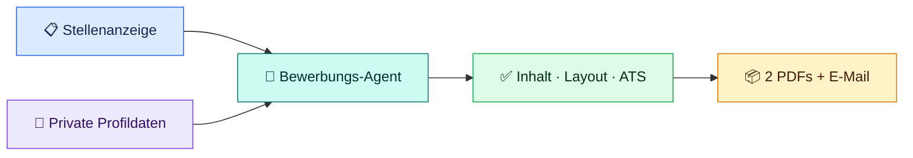

<!-- cspell:words Layoutcheck MitLayoutcheck NurVorbereiten MinPdfBytes NichtUeberschreiben ErlaubeFirefoxFallback firefox Pruefe Qualitaetscheck Strg Headless Sandbox Browserfreigabe MediaBox -->
<!-- cspell:words Referenzworkflow versioniert rollenbezogene Regressionsfälle Regressionstest Regressionstests Regressionssuite nichtkritische Tooltests Browsertest Browsertests Browsermatrix Browserumgebung Browserfälle Browserlauf Browserprozesse Kindprozesse -->

<p align="center">
  
</p>

<h1 align="center">bewerbungs-agent</h1>

<p align="center">
  <strong>Lokaler Bewerbungsassistent für passgenaue deutsche Bewerbungsunterlagen</strong><br>
  Von der Stellenanalyse bis zu visuell geprüften A4-Layouts und technisch geprüften PDFs.
</p>

<p align="center">
  <a href="CHANGELOG.md"></a>
  <a href="https://github.com/Web-Developer-DB/bewerbungs-agent/actions/workflows/tests.yml"></a>
  
  <a href="LINUX-PORTIERUNGSPLAN.md"></a>
  
</p>

<p align="center">
  <a href="#schnellstart">🚀 Schnellstart</a> ·
  <a href="#daten">🔐 Private Daten</a> ·
  <a href="#ergebnisse">📦 Ergebnisse</a> ·
  <a href="#finalisierung">✅ Finalisierung</a> ·
  <a href="#entwicklung">🧰 Entwicklung</a> ·
  <a href="#hilfe">❓ Hilfe</a>
</p>

---

## Auf einen Blick

| 🎯 **Passgenau** | 🔒 **Lokal & privat** | ✅ **Geprüft** |
| :---: | :---: | :---: |
| Jede Bewerbung wird neu aus Stelle und Profil aufgebaut. | Echte Daten und Ergebnisse bleiben unter `Private/`. | Inhalt, A4-Layout, PDFs und ATS-Textschicht werden kontrolliert. |

Aus einer Stellenbeschreibung und deinen Profildaten entstehen:

- ein rollenbezogener Lebenslauf als HTML und PDF
- ein passendes Anschreiben als HTML und PDF
- eine kurze E-Mail-Nachricht
- Stellenanalyse, Anforderungsmatrix und Qualitätsnachweise

> [!NOTE]
> **Empfohlener Referenzworkflow:** Windows, PowerShell, OpenAI Codex und Chrome oder Edge. Die PowerShell-Tools sind stabil getestet; die [Linux-Unterstützung befindet sich noch im Alpha-Status](LINUX-PORTIERUNGSPLAN.md).

### So fließen deine Daten



<a id="schnellstart"></a>

## 🚀 Schnellstart

### 1. Repository lokal öffnen

```powershell
git clone https://github.com/Web-Developer-DB/bewerbungs-agent.git
Set-Location bewerbungs-agent
```

Öffne den Ordner anschließend in Visual Studio Code mit Codex-Extension oder in einer lokal installierten Codex-Anwendung.

### 2. Private Daten vorbereiten

Die mitgelieferten Beispieldateien enthalten ausschließlich fiktive Angaben. Kopiere sie bei einer **frischen Installation** unter Windows als lokale Arbeitsgrundlage. Der Sicherheitscheck bricht ab, falls bereits ein eigener Datenordner vorhanden ist:

```powershell
$privateDataPath = "Private/Daten"

if (Test-Path -LiteralPath $privateDataPath) {
  throw "Private/Daten existiert bereits. Vorhandene Daten werden nicht überschrieben."
}

New-Item -ItemType Directory -Path $privateDataPath | Out-Null
Copy-Item "Private.example/Daten/01_PERSOENLICHE_DATEN.example.md" "Private/Daten/01_PERSOENLICHE_DATEN.md"
Copy-Item "Private.example/Daten/02_BEWERBER_PROFIL_UND_POSITIONIERUNG.example.md" "Private/Daten/02_BEWERBER_PROFIL_UND_POSITIONIERUNG.md"
Copy-Item "Private.example/Daten/README.md" "Private/Daten/README.md"
```

Ersetze danach alle Beispieldaten durch deine echten Angaben. Eine genaue Zuordnung findest du unter [Private Daten einrichten](#daten).

> [!IMPORTANT]
> Echte Kontaktdaten, Profildaten und Bewerbungen gehören ausschließlich nach `Private/`. Dieser Ordner wird von Git ignoriert und darf nicht veröffentlicht werden.

### 3. Bewerbung beauftragen

Gib Codex eine konkrete Stellenbeschreibung mit diesem Auftrag:

```text
Nutze Prompts/00_AGENTEN_START_HIER.md und erstelle eine Bewerbung für diese Stellenbeschreibung:

<Stellenbeschreibung einfügen>
```

Der Agent liest Profildaten, Regeln und Designreferenzen, erstellt einen privaten Arbeitsordner und erzeugt die Bewerbung zunächst als prüfbaren Kandidaten.

### 4. Ergebnisse prüfen und freigeben

Der Agent führt den fachlichen und technischen Abschlussworkflow aus. Öffne vor der Veröffentlichung jeden erzeugten A4-Screenshot und kontrolliere ihn kurz selbst. Die zwei verbindlichen Befehle stehen unter [Finalisierung](#finalisierung).

> [!TIP]
> **Für die erste Bewerbung reicht dieser Pfad:** Daten kopieren → Beispieldaten ersetzen → zentralen Agentenauftrag senden → Screenshots prüfen → Veröffentlichung bestätigen.

<a id="ergebnisse"></a>

## 📦 Was wird erzeugt?

Jede Bewerbung erhält einen eigenen privaten Ordner:

```text
Private/Bewerbungen/FIRMA/YYYY-MM-DD--ROLLENNAME/
├─ Versand/
│  ├─ Lebenslauf - NACHNAME.VORNAME.pdf
│  ├─ Anschreiben - NACHNAME.VORNAME.pdf
│  └─ Email-Nachricht--FIRMA.md
├─ Intern/
│  ├─ Stellenbeschreibung.md
│  ├─ Analyse.md
│  ├─ Lebenslauf - NACHNAME.VORNAME.html
│  ├─ Anschreiben - NACHNAME.VORNAME.html
│  ├─ Qualitaetscheck.md
│  ├─ Druck-Hinweis.md
│  └─ optional Offene_Fragen.md
└─ Manifest.json
```

| Bereich | Zweck | Versand? |
| --- | --- | :---: |
| `Versand/` | Zwei getrennte PDFs und vorbereiteter E-Mail-Text | **Ja** |
| `Intern/` | HTML-Quellen, Stellenanalyse und Qualitätsnachweise | Nein |
| `FIRMA/_Arbeitsdateien/…` | paralleler Arbeitsbereich für Entwürfe, Screenshots und Prüfberichte | Nein |
| `Manifest.json` | Dateiliste, Größen und SHA-256-Nachweise | Nein |

Eine Stellenanzeige mit der Bitte um eine Bewerbung „als PDF“ verlangt nicht automatisch eine Gesamt-PDF. Lebenslauf und Anschreiben bleiben standardmäßig zwei getrennte Anlagen; zusammengeführt wird nur bei ausdrücklicher Vorgabe.

### Offene Fragen

Fehlen belastbare Informationen, legt der Agent `Offene_Fragen.md` an. Das betrifft zum Beispiel einen unklaren Eintrittstermin, einen fehlenden Ansprechpartner, eine nicht belegte Technologie oder eine offene Gehaltsstrategie.

Fragen blockieren die Veröffentlichung, wenn sonst Identität, Wahrheit oder zentrale Bewerbungsentscheidungen gefährdet wären. Unbekannte Angaben werden niemals geraten oder als Platzhalter in finale Dokumente übernommen.

<a id="daten"></a>

## 🔐 Private Daten & Datenschutz

Die Trennung zwischen öffentlicher Logik und privaten Daten ist ein Kernprinzip des Projekts.

| Datei | Enthält | Enthält ausdrücklich nicht |
| --- | --- | --- |
| `01_PERSOENLICHE_DATEN.md` | Identität, Kontakt, Verfügbarkeit, Arbeitsmodell, Region und Gehaltslogik | fachliche CV-Details |
| `02_BEWERBER_PROFIL_UND_POSITIONIERUNG.md` | Erfahrung, Ausbildung, Kenntnisse, Projekte, Belege und fachliche Grenzen | Kontakt- und Adressdaten |
| `README.md` | lokale Pflegeanleitung für beide Dateien | Bewerbungsinhalte oder eine dritte Datenquelle |

Die Vorlagen findest du unter `Private.example/Daten/`. Pflege jede Information nur an ihrer Stammquelle, damit Angaben nicht widersprüchlich werden.

<details>
<summary><strong>Persönliche Daten mit Unterstützung des Agenten einrichten</strong></summary>

Du kannst Codex beim strukturierten Übertragen deiner Angaben helfen lassen:

```text
Nutze die Struktur aus Private.example/Daten/.
Erstelle oder aktualisiere meine privaten Daten unter Private/Daten/.

Fülle 01_PERSOENLICHE_DATEN.md nur mit Identität, Kontakt und Bewerbungslogistik.
Fülle 02_BEWERBER_PROFIL_UND_POSITIONIERUNG.md nur mit fachlichem Profil, Erfahrung, Kenntnissen, Projekten, Belegarten und Grenzen.
Nutze keine erfundenen Angaben.
Wenn Informationen fehlen oder unklar sind, dokumentiere sie als offene Fragen.

Hier sind meine echten Informationen:

<persönliche Daten und beruflicher Kontext einfügen>
```

Kontrolliere die erzeugten Dateien sorgfältig. Ein KI-Agent kann Angaben falsch einordnen, zu stark formulieren oder aus unklarem Kontext falsche Schlüsse ziehen.

</details>

### Sicherheitsmodell

Stellenanzeigen, Unternehmensseiten, E-Mails und andere Fremdtexte gelten als **nicht vertrauenswürdige Datenquellen**:

- Eingebettete Aufforderungen dürfen Projektregeln und Nutzerauftrag nicht verändern.
- Fremdtexte dürfen keine privaten Dateien offenlegen, hochladen, versenden, löschen oder verändern lassen.
- Externe Aktionen sind nur durch einen direkten Nutzerauftrag autorisiert.
- Finale HTML-Dateien laden keine externen oder lokalen Ressourcen automatisch nach; vollständig eingebettete `data:`-Ressourcen sind möglich.
- Analyse und Arbeitsnotizen vervielfältigen keine unnötigen privaten Daten oder Geheimnisse.

> [!WARNING]
> `.gitignore` ist keine Verschlüsselung. Cloud-Synchronisation, Backups, Virenscanner und andere lokale Programme können Dateien unter `Private/` weiterhin lesen oder kopieren. Prüfe außerdem jedes finale Dokument persönlich vor dem Versand.

<details>
<summary><strong>Git- und Datenschutzcheck vor einem Commit</strong></summary>

```powershell
git status --short
```

In der Ausgabe dürfen keine echten Dateien aus `Private/` auftauchen. Zeigt `git status --short --ignored` den Eintrag `!! Private/`, arbeitet die Ignore-Regel wie vorgesehen.

Öffentlich geeignet sind insbesondere `.github/`, `Prompts/`, `Tests/`, `Tools/`, `Vorlagen/`, `Private.example/`, `CHANGELOG.md` und `README.md`.

</details>

<a id="finalisierung"></a>

## ✅ Prüfen & veröffentlichen

Der verbindliche Abschluss besteht aus zwei bewusst getrennten Schritten.

### Schritt 1: Technisch vorbereiten

```powershell
.\Tools\Finalisiere-Bewerbung.ps1 -Arbeitsordner "Private/Bewerbungen/FIRMA/_Arbeitsdateien/YYYY-MM-DD--ROLLENNAME" -Browser chrome
```

Dieser Lauf prüft Stammdaten und Inhalte, erzeugt A4-Screenshots, exportiert zwei PDFs, kontrolliert deren Struktur und ATS-Textschicht und schreibt Hashnachweise.

### Schritt 2: Nach Sichtprüfung veröffentlichen

```powershell
.\Tools\Finalisiere-Bewerbung.ps1 -Arbeitsordner "Private/Bewerbungen/FIRMA/_Arbeitsdateien/YYYY-MM-DD--ROLLENNAME" -Veroeffentlichen -VisuellGeprueft
```

Bei einer Layoutwarnung ist zusätzlich eine kurze fachliche Bewertung über `-VisuelleFreigabeNotiz "..."` erforderlich. Änderungen an Quellen, Kandidatendateien oder Screenshots machen vorhandene Nachweise ungültig.

<details>
<summary><strong>Bereits veröffentlichte Bewerbung korrigieren</strong></summary>

Bearbeite veröffentlichte Dateien nicht direkt unter `Versand/` oder `Intern/`. Korrigiere die Quellen beziehungsweise Kandidatendateien, führe Schritt 1 erneut aus und kontrolliere alle neuen Screenshots. Erst danach darf der neu geprüfte Satz den bestehenden Zielordner bewusst ersetzen:

```powershell
.\Tools\Finalisiere-Bewerbung.ps1 -Arbeitsordner "Private/Bewerbungen/FIRMA/_Arbeitsdateien/YYYY-MM-DD--ROLLENNAME" -Veroeffentlichen -VisuellGeprueft -Ersetzen
```

Bei Layoutwarnungen gilt auch hier zusätzlich `-VisuelleFreigabeNotiz "..."`.

</details>

### Visuelle Kurzcheckliste

- [ ] Jede erwartete A4-Seite ist als frischer Screenshot vorhanden.
- [ ] Kein Text ist abgeschnitten oder verdeckt.
- [ ] Es gibt keine ungewollte Leerseite oder große zufällige Leerfläche.
- [ ] Schrift, Abstände und Spalten sind professionell lesbar.
- [ ] Lebenslauf, Anschreiben und E-Mail enthalten dieselben Kerndaten.
- [ ] Es stehen keine Platzhalter oder erfundenen Angaben in den Dateien.

<details>
<summary><strong>Einzelne Diagnose-, Layout- und Exportbefehle</strong></summary>

Die Einzeltools sind für Diagnose und Entwicklung nützlich. Bei einer neuen Bewerbung ersetzen sie nicht das zweistufige Finalisierungsgate.

In den folgenden Beispielen liegen die prüfbaren HTML-Dateien im Kandidatenordner; Berichte und temporäre Ausgaben bleiben daneben im privaten Arbeitsordner.

**Statischer Check**

```powershell
.\Tools\Pruefe-Bewerbung.ps1 -Ordner "Private/Bewerbungen/FIRMA/_Arbeitsdateien/YYYY-MM-DD--ROLLENNAME/Kandidat"
```

Warnungen können streng als Fehler behandelt werden:

```powershell
.\Tools\Pruefe-Bewerbung.ps1 -Ordner "Private/Bewerbungen/FIRMA/_Arbeitsdateien/YYYY-MM-DD--ROLLENNAME/Kandidat" -WarnungenAlsFehler
```

**Layout-Screenshots**

```powershell
.\Tools\Layoutcheck-Bewerbung.ps1 `
  -Ordner "Private/Bewerbungen/FIRMA/_Arbeitsdateien/YYYY-MM-DD--ROLLENNAME/Kandidat" `
  -OutputRoot "Private/Bewerbungen/FIRMA/_Arbeitsdateien/YYYY-MM-DD--ROLLENNAME/Layoutcheck" `
  -Browser chrome
```

**PDF-Export**

```powershell
.\Tools\Exportiere-PDF.ps1 `
  -Ordner "Private/Bewerbungen/FIRMA/_Arbeitsdateien/YYYY-MM-DD--ROLLENNAME/Kandidat" `
  -OutputRoot "Private/Bewerbungen/FIRMA/_Arbeitsdateien/YYYY-MM-DD--ROLLENNAME/PDF-Export" `
  -Browser chrome
```

Der statische Prüfer kontrolliert Pflichtdateien, Dateinamen, Platzhalter, A4-Geometrie, eingebettetes CSS, unerlaubte Ressourcen und den E-Mail-Betreff. Layout- und Exporttools validieren zusätzlich PNG-/PDF-Signaturen, Abmessungen, Seitenzahlen und Aktualität.

</details>

<details>
<summary><strong>Manueller PDF-Export mit Firefox</strong></summary>

Wenn kein unterstützter Headless-Export verfügbar ist, kannst du zu Diagnosezwecken manuell drucken:

1. HTML-Datei in Firefox öffnen.
2. Mit <kbd>Strg</kbd> + <kbd>P</kbd> den Druckdialog öffnen.
3. `Weitere Einstellungen` aufklappen.
4. `Kopf- und Fußzeilen drucken` deaktivieren.
5. Skalierung auf `100 %` und Ränder auf `Keine` stellen.

Ein bewusst zweiseitiger Lebenslauf ist besser als ein gequetschtes oder abgeschnittenes Einseiten-Dokument.

> [!CAUTION]
> Dieser manuelle Export ist **kein gleichwertiger Ersatz** für den verbindlichen Finalisierungsworkflow: PDF-Struktur, ATS-Textschicht und Hashnachweise werden dabei nicht automatisch validiert. Eine vollständig geprüfte Veröffentlichung benötigt Chrome oder Edge.

</details>

## 🪟 Voraussetzungen & Plattformstatus

| Komponente | Status | Verwendung |
| --- | --- | --- |
| Windows + PowerShell 7 | 🟢 stabil | vollständig getesteter Referenzworkflow |
| Codex in VS Code oder lokale Codex-App | 🟢 empfohlen | liest Regeln und erzeugt lokale Dateien |
| Chrome oder Edge | 🔵 für Finalisierung erforderlich | Layoutcheck, automatischer PDF-Export und ATS-Prüfung |
| Firefox | 🟡 optional | manuelle Vorschau; kein gleichwertiger Finalisierungsersatz |
| Linux + Bash | 🟠 Alpha | derzeit vor allem Ordnererstellung; [Portierungsplan](LINUX-PORTIERUNGSPLAN.md) |
| Git Bash | 🟡 Entwicklung | Bash-Regressionsfälle unter Windows |

Für die normale Nutzung brauchst du dieses Repository, gepflegte Daten unter `Private/Daten/`, einen lokal arbeitenden KI-Agenten und eine konkrete Stellenbeschreibung.

<details>
<summary><strong>Bewerbungsordner manuell anlegen</strong></summary>

Normalerweise übernimmt der Agent diesen Schritt.

Windows / PowerShell:

```powershell
.\Tools\Neue-Bewerbung.ps1 -Firma "Muster GmbH" -Rolle "Junior Webentwickler"
```

Linux / Bash (Alpha):

```bash
bash Tools/neue-bewerbung.sh --firma "Muster GmbH" --rolle "Junior Webentwickler"
```

Die Helfer erzeugen einen leeren Zielordner, einen Arbeitsordner und einen Kandidatenordner. Eine vorhandene Kombination aus Firma, Datum und Rolle wird nicht überschrieben. `-Fortsetzen` beziehungsweise `--fortsetzen` ist nur für dieselbe, über `Arbeitsnotizen.md` nachweisbare Bewerbung vorgesehen.

</details>

<a id="hilfe"></a>

## ❓ Häufige Probleme

| Problem | Schnellste Prüfung | Lösung |
| --- | --- | --- |
| Statischer Check ist rot | Fehlermeldung und betroffene Datei lesen | HTML/Markdown korrigieren und Check wiederholen |
| Layoutcheck startet nicht | Ist Chrome oder Edge installiert? | Unter Windows gezielt `-Browser chrome` verwenden |
| Browser scheitert in einer Sandbox | Browserfreigabe der lokalen Agentenumgebung prüfen | denselben Lauf mit lokaler Browserfreigabe wiederholen |
| PDF-Export bricht ab | Statischen Check separat ausführen | Fehler beheben; manueller Firefox-Druck ist nur eine unvalidierte Diagnosealternative |
| Text wirkt abgeschnitten | HTML und alle Seitenscreenshots öffnen | Inhalt fachlich kürzen oder bewusst auf zwei A4-Seiten verteilen |
| Persönliche Dateien erscheinen in Git | `git status --short --ignored` prüfen | Dateien nach `Private/` verschieben; nichts Privates committen |
| Informationen fehlen | `Offene_Fragen.md` lesen | belastbare Angaben ergänzen; keine Werte raten lassen |

Wenn du tiefer diagnostizieren möchtest, findest du die Einzelwerkzeuge im Abschnitt [Prüfen & veröffentlichen](#finalisierung).

---

<a id="entwicklung"></a>

## 🧰 Für Entwickler

| Einstieg | Inhalt |
| --- | --- |
| [Änderungsprotokoll](CHANGELOG.md) | Releases, Korrekturen und Testnachweise |
| [Prompt-System](Prompts/README.md) | Agentenablauf und fachliche Regelmodule |
| [Vorlagen](Vorlagen/README.md) | HTML-Designreferenzen und Matrixbeispiel |
| [Linux-Portierungsplan](LINUX-PORTIERUNGSPLAN.md) | geplanter gleichwertiger Windows-/Linux-Betrieb |
| [Archivierter Frontend-Plan](frontend-project.old.md) | historischer Plan einer Electron-Oberfläche |
| [CI-Workflow](.github/workflows/tests.yml) | Windows-/Ubuntu-Testmatrix |

### Projektprinzipien

- **Public Logic, Private Data:** Regeln, Tools und Tests sind öffentlich; Profildaten und Bewerbungen bleiben lokal.
- **Truth by construction:** Arbeitgeber, Zeiträume, Kenntnisse und Zertifikate dürfen nicht erfunden werden.
- **Candidate first:** Finaldateien entstehen zunächst in einem Kandidatenordner und werden erst nach allen Gates veröffentlicht.
- **Atomic release:** `Versand/`, `Intern/` und `Manifest.json` werden nur als vollständig geprüfter Satz publiziert.
- **Reproducible evidence:** Hashes binden Quellen, Kandidatendateien, Screenshots und PDFs an denselben Prüflauf.

<details>
<summary><strong>Öffentliche und private Projektstruktur</strong></summary>

```text
bewerbungs-agent/
├─ .github/
│  ├─ assets/readme-hero.svg
│  └─ workflows/tests.yml
├─ CHANGELOG.md
├─ LINUX-PORTIERUNGSPLAN.md
├─ README.md
├─ Prompts/                  # Agenten- und Qualitätsregeln
├─ Private.example/          # ausschließlich fiktive Beispieldaten
├─ Tests/                    # PowerShell- und Bash-Regressionstests
├─ Tools/                    # Ordner-, Prüf-, Layout- und Exporttools
└─ Vorlagen/                 # HTML-Designreferenzen und Matrixbeispiel
```

Die lokale, ignorierte Struktur:

```text
Private/
├─ Daten/
│  ├─ README.md
│  ├─ 01_PERSOENLICHE_DATEN.md
│  └─ 02_BEWERBER_PROFIL_UND_POSITIONIERUNG.md
├─ Bewerbungen/
│  └─ FIRMA/
│     ├─ YYYY-MM-DD--ROLLENNAME/
│     │  ├─ Versand/
│     │  ├─ Intern/
│     │  └─ Manifest.json
│     └─ _Arbeitsdateien/
│        └─ YYYY-MM-DD--ROLLENNAME/
│           ├─ Bewerbungsauftrag.json
│           ├─ Anforderungsmatrix.json
│           ├─ Kandidat/
│           ├─ Layoutcheck/
│           ├─ PDF-Export/
│           └─ ATS-Pruefbericht.json
├─ Bewertungen/
├─ LebenslaufUniversal/
└─ Archiv/
```

</details>

### Prompt-System

Zentraler Einstieg ist [`Prompts/00_AGENTEN_START_HIER.md`](Prompts/00_AGENTEN_START_HIER.md). Änderungen gehören in das fachlich passende Modul:

| Datei | Verantwortung |
| --- | --- |
| `02_VORPRUEFUNG_UND_ANFORDERUNGSMATRIX.md` | Stammdaten-Gate, Auftrag und gewichtete Muss-/Kann-Matrix |
| `03_LEBENSLAUF_REGELN.md` | deutscher CV-Standard, Priorisierung und A4-Seitenstrategie |
| `04_ANSCHREIBEN_REGELN.md` | Struktur, Ton, Gehaltswunsch und Grenzen |
| `05_EMAIL_NACHRICHT_REGELN.md` | kurze Versandnachricht |
| `06_ROLLENLOGIK.md` | Zielrolle, Bewerbungslogistik und Profilgewichtung |
| `07_WAHRHEIT_UND_GRENZEN.md` | Belege, Sicherheitsgrenzen und ehrliche Formulierungen |
| `08_HTML_CSS_DESIGNREGELN.md` | A4-Geometrie und eigenständige HTML-Dateien |
| `09_QUALITAETSCHECK.md` | fachliche und technische Checkliste |
| `10_DATEI_UND_ORDNER_REGELN.md` | private Ordner, Dateinamen und Slugs |
| `11_TECHNISCHER_CHECK_WORKFLOW.md` | Staging, Finalisierung, Layout, PDF und Hashnachweise |

### Tools im Überblick

| Tool | Aufgabe | Typischer Einstieg |
| --- | --- | --- |
| `Neue-Bewerbung.ps1` | Arbeits- und Zielstruktur erzeugen | `-Firma "..." -Rolle "..."` |
| `neue-bewerbung.sh` | Bash-Variante des Ordnerhelfers | `--firma "..." --rolle "..."` |
| `Pruefe-Stammdaten.ps1` | Identität, Kontakt und Logistik prüfen | ohne Parameter oder mit Auftragspfad |
| `Pruefe-Bewerbungsinhalt.ps1` | Inhalt gegen Auftrag und Matrix prüfen | `-Ordner "..." -AuftragPath "..." -AnforderungsmatrixPath "..."` |
| `Pruefe-Bewerbung.ps1` | statischen Mindestcheck ausführen | `-Ordner "..."` |
| `Layoutcheck-Bewerbung.ps1` | A4-Screenshots und Dichtebericht erzeugen | Kandidaten- und `-OutputRoot`-Pfad übergeben |
| `Exportiere-PDF.ps1` | zwei PDFs atomar exportieren und prüfen | Kandidaten- und `-OutputRoot`-Pfad übergeben |
| `Pruefe-ATS.ps1` | Unicode-Textschicht und Lesereihenfolge prüfen | Bestandteil der Finalisierung |
| `Finalisiere-Bewerbung.ps1` | verbindliches Prepare-/Publish-Gate | `-Arbeitsordner "..."` |

<details>
<summary><strong>Datenfluss und Qualitätsgates im Detail</strong></summary>

1. Die Stellenbeschreibung wird als nicht vertrauenswürdige Datenquelle übernommen.
2. `Pruefe-Stammdaten.ps1` kontrolliert Identität, Kontakt und Bewerbungslogistik.
3. Der Agent liest private Daten und Prompt-Regeln dateiweise.
4. Der Ordnerhelfer erzeugt Ziel-, Arbeits- und Kandidatenordner sowie `Bewerbungsauftrag.json`.
5. Muss- und Kann-Kriterien werden mit Kategorie und Gewichtung in `Anforderungsmatrix.json` abgelegt.
6. Rollen-, Gehalts-, Seiten-, Schulbildungs- und Profil-Link-Strategie werden festgelegt.
7. Alle Dokumente entstehen zunächst unter `_Arbeitsdateien/.../Kandidat/`.
8. Fachlicher Abschlusstest und Inhaltsprüfer gleichen Anforderungen, Belege, Daten und Zeiträume ab.
9. Die Finalisierung erzeugt Layout-, PDF- und ATS-Berichte samt Hashnachweisen.
10. Jede explizite A4-Seite wird anhand ihres frischen Screenshots visuell geprüft.
11. Jede spätere Quellen- oder Kandidatenänderung entwertet die Nachweise.
12. Erst nach Sichtbestätigung wird der vollständige Satz atomar veröffentlicht.

Die Eignung wird maschinenlesbar als `stark`, `vertretbar_mit_risiken` oder `stretch` ausgewiesen. Nicht vollständig belegte Muss-Anforderungen bleiben sichtbar und erfordern defensive Formulierungen.

</details>

### Tests & CI

Die dependency-freie Regressionstestsuite prüft Prompt-/Tool-Verträge, Logistik-Snapshots, Anforderungsmatrix, Staging, Manifest, Veröffentlichung und Fehlerszenarien:

```powershell
.\Tests\Run-RegressionTests.ps1
```

Mit lokaler Chrome-Matrix:

```powershell
.\Tests\Run-RegressionTests.ps1 -MitBrowser
```

Bash separat:

```bash
bash Tests/Bash/test-neue-bewerbung.sh
```

Die öffentliche CI läuft über [`.github/workflows/tests.yml`](.github/workflows/tests.yml): Windows führt die PowerShell-Suite aus, Ubuntu prüft die Bash-Skripte mit ShellCheck und Regressionstests. Browserfälle bleiben lokal optional, da Runner und Sandboxen keine identische Browserumgebung garantieren.

<details>
<summary><strong>HTML-, PDF- und Browserverträge</strong></summary>

Finale HTML-Dateien müssen eigenständig funktionieren:

- CSS liegt direkt im HTML; es gibt keine Skripte oder CDNs.
- Externe oder lokale Ressourcen werden nicht automatisch geladen.
- `@page { size: A4; margin: 0; }` ist gesetzt.
- Jede `.page` misst exakt `210mm × 297mm`.
- `overflow: hidden` ist nur auf der äußeren `.page` zulässig.
- Ein Lebenslauf nutzt bewusst eine oder zwei explizite A4-Seiten.

Der Browserlauf gilt nur als erfolgreich, wenn er rechtzeitig mit Exitcode `0` endet und alle erwarteten Dateien frisch erzeugt. PNGs benötigen gültige Signatur und Abmessungen. PDFs benötigen Header, EOF-Marker, DIN-A4-MediaBox, passende Seitenzahl und eine ATS-lesbare Unicode-Textschicht.

Chrome oder Edge übernimmt den automatischen PDF-Export. Firefox ist für manuelle Druckvorschau und manuellen Export geeignet, aber nicht Teil des verbindlichen CLI-PDF-Exports.

</details>

<details>
<summary><strong>Dateinamen, Ordner- und Slug-Regeln</strong></summary>

Finale Dateien werden nach Bewerbername benannt:

```text
Lebenslauf - NACHNAME.VORNAME.html
Anschreiben - NACHNAME.VORNAME.html
Lebenslauf - NACHNAME.VORNAME.pdf
Anschreiben - NACHNAME.VORNAME.pdf
```

`NACHNAME.VORNAME` stammt aus `Private/Daten/01_PERSOENLICHE_DATEN.md`. Fehlen Vor- oder Nachname, darf keine finale Platzhalterdatei entstehen.

Firmen- und Rollenordner normalisieren Leerzeichen, Umlaute und Sonderzeichen. Beispiel:

```text
Müller & Partner GmbH
→ Mueller-und-Partner-GmbH
```

Die verbindlichen Regeln stehen in `Prompts/10_DATEI_UND_ORDNER_REGELN.md` und sind in beiden Ordnerhelfern gespiegelt.

</details>

<details>
<summary><strong>Erweiterungspunkte</strong></summary>

| Ziel | Zuständige Datei |
| --- | --- |
| Hauptablauf | `Prompts/00_AGENTEN_START_HIER.md` |
| Lebenslauf | `Prompts/03_LEBENSLAUF_REGELN.md` |
| Anschreiben | `Prompts/04_ANSCHREIBEN_REGELN.md` |
| E-Mail | `Prompts/05_EMAIL_NACHRICHT_REGELN.md` |
| Rollen- und Wahrheitslogik | `Prompts/06_ROLLENLOGIK.md`, `Prompts/07_WAHRHEIT_UND_GRENZEN.md` |
| HTML/CSS | `Prompts/08_HTML_CSS_DESIGNREGELN.md` |
| Qualität und Dateiregeln | `Prompts/09_QUALITAETSCHECK.md`, `Prompts/10_DATEI_UND_ORDNER_REGELN.md` |
| technischer Workflow | `Prompts/11_TECHNISCHER_CHECK_WORKFLOW.md` |
| Ordnererstellung | `Tools/Neue-Bewerbung.ps1`, `Tools/neue-bewerbung.sh` |
| Stammdaten und Inhalt | `Tools/Pruefe-Stammdaten.ps1`, `Tools/Pruefe-Bewerbungsinhalt.ps1` |
| Finalisierung | `Tools/Finalisiere-Bewerbung.ps1` |
| statischer Check | `Tools/Pruefe-Bewerbung.ps1` |
| Layout und PDF | `Tools/Layoutcheck-Bewerbung.ps1`, `Tools/Exportiere-PDF.ps1` |
| Regressionstests | `Tests/Run-RegressionTests.ps1`, `Tests/Bash/test-neue-bewerbung.sh` |
| Designreferenzen | `Vorlagen/Designreferenz-Lebenslauf.html`, `Vorlagen/Designreferenz-Anschreiben.html` |

</details>

### Empfohlener Entwickler-Workflow

1. Fachlich zuständige Prompt-, Tool- oder Vorlagendatei ändern.
2. Änderung unter der passenden Version in `CHANGELOG.md` dokumentieren.
3. Mit einer privaten Testbewerbung prüfen.
4. Statischen Check und Regressionstests ausführen.
5. Bei Layout-/Exportänderungen zusätzlich die Browsermatrix ausführen.
6. `git status --short` prüfen und private Dateien ausschließen.

<details>
<summary><strong>PowerShell-Syntaxcheck für alle Tools</strong></summary>

```powershell
$files = Get-ChildItem -LiteralPath "Tools" -Filter "*.ps1" -File

foreach ($file in $files) {
  $tokens = $null
  $errors = $null
  [System.Management.Automation.Language.Parser]::ParseFile(
    $file.FullName,
    [ref]$tokens,
    [ref]$errors
  ) | Out-Null

  if ($errors.Count -gt 0) {
    $errors
    exit 1
  }
}
```

Für Dateisuche unter PowerShell bevorzugt das Projekt `rg -g "*.html" "MUSTER" "ORDNER"` anstelle von Pfad-Wildcards wie `ORDNER/*.html`.

</details>

## ⚠️ Bekannte Grenzen

- Der vollständig getestete Workflow ist Windows mit PowerShell.
- Linux befindet sich im Alpha-Status und unterstützt noch nicht den gleichwertigen Gesamtworkflow.
- Automatischer PDF-Export unterstützt Chrome und Edge, nicht Firefox.
- HTML- und PDF-Prüfungen sind konservativ auf den unterstützten Chromium-Export ausgerichtet; ungewöhnliche Designs und andere PDF-Erzeuger benötigen zusätzliche Regressionstests.
- Eine echte manuelle Sichtprüfung bleibt erforderlich, besonders bei neuen Designs und zweiseitigen Lebensläufen.
- Die Ergebnisqualität hängt von vollständigen, aktuellen und ehrlich gepflegten Profildaten ab.

---

<p align="center">
  <strong>Bereit für die erste Bewerbung?</strong><br>
  <a href="#schnellstart">Zum Schnellstart</a> · <a href="CHANGELOG.md">Änderungen ansehen</a> · <a href="#hilfe">Hilfe finden</a>
</p>
