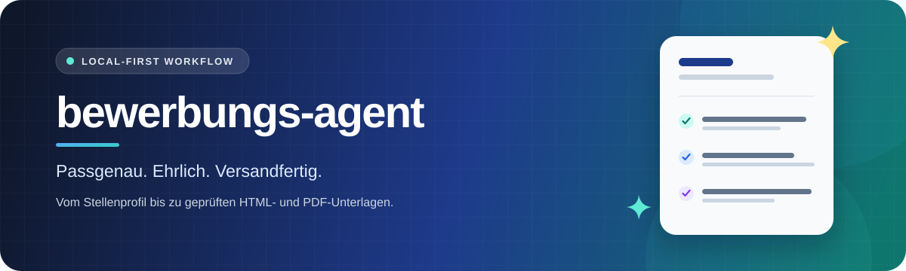
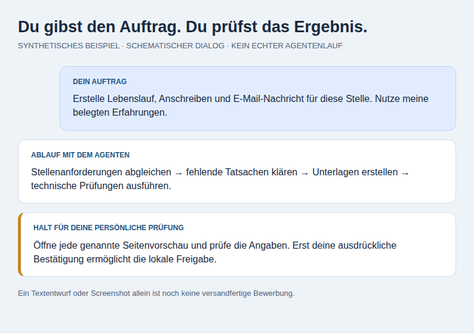
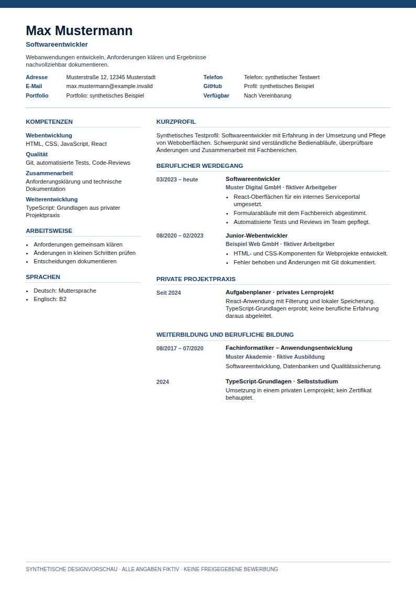
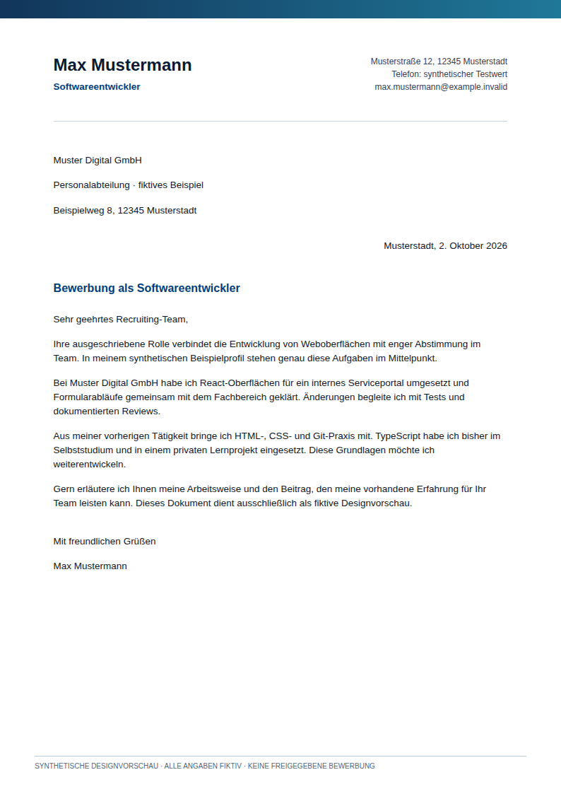
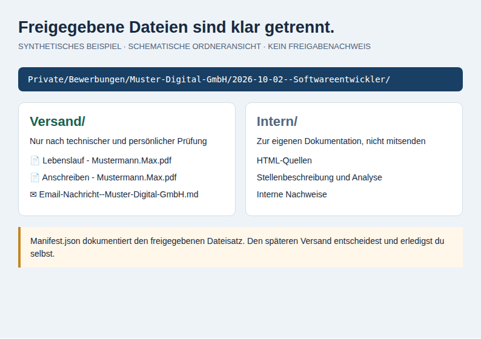
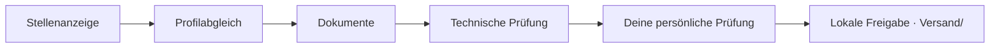

<p align="center">
  
</p>

<h1 align="center">apply-foundry</h1>

<p align="center">
  <strong>Deine Erfahrung. Die passende Stelle. Geprüfte Bewerbungsunterlagen.</strong><br>
  Öffne das Projekt mit deinem Coding-Agenten und gib ihm deinen Bewerbungsauftrag.
</p>

<p align="center">
  <a href="#schnellstart">🚀 Starten</a> ·
  <a href="#beispiele">👀 Beispiele</a> ·
  <a href="#agenten">🤖 Agenten</a> ·
  <a href="#ergebnisse">📦 Ergebnisse</a> ·
  <a href="#private-daten--datenschutz">🔒 Datenschutz</a> ·
  <a href="#entwicklung">🧰 Entwicklung</a>
</p>

<a id="was-ist-apply-foundry"></a>
<a id="nutzung"></a>

## Was bekomme ich?

apply-foundry hilft dir, mit einem Coding-Agenten deutsche Bewerbungsunterlagen für deine eigene Bewerbung zu erstellen: einen stellenbezogenen Lebenslauf, ein Anschreiben und auf Wunsch eine E-Mail-Nachricht. Du bringst deine tatsächliche Erfahrung und die Stellenanzeige mit; der Agent führt dich von der Dateneinrichtung bis zu den freigegebenen Dateien.

- **Passend zur Stelle:** Anforderungen werden mit deinen belegten Erfahrungen abgeglichen und verständlich dargestellt.
- **Mehr als Text:** Inhalt, Seitenlayout, PDF und technische Textauslesbarkeit werden je nach Dokumentumfang geprüft.
- **Unter deiner Kontrolle:** Du prüfst jede Vorschau persönlich. Die Freigabe ist lokal; der Workflow versendet nichts automatisch.

Das Projekt richtet sich an Bewerber, die einen eingerichteten Coding-Agenten verwenden können. Ein einfacher Chat ohne Datei- und Terminalzugriff reicht dafür nicht. Dateien werden lokal gespeichert; ob dein Agent Eingaben in einer Cloud verarbeitet, hängt von seiner Umgebung ab.

<a id="schnellstart"></a>

## 🚀 In wenigen Minuten starten

**Voraussetzung:** Ein eingerichteter Coding-Agent, der Projektdateien lesen und schreiben, Terminalbefehle ausführen und die Regeln aus `AGENTS.md` berücksichtigen kann. Für die Dokumentprüfung braucht er außerdem PNG-Bildauswertung oder die vorgeschriebene persönliche Alternative. Beispiele sind Codex, Claude Code, Gemini CLI und OpenCode; siehe [Agenten und Nachweisstand](#agenten). Du brauchst außerdem deine Unterlagen und den vollständigen Text der Stellenanzeige.

Aktuell vorgesehen sind **Windows, Linux und Intel-Macs auf x64**. Apple Silicon und andere ARM64-Systeme sind nicht freigegeben. Der Agent prüft Python 3.11+, Chrome/Edge/Chromium und die passende Systemschrift. Fehlende Voraussetzungen installiert er nur nach sichtbarem Plan und bestätigter Berechtigung.

### 1. Projekt herunterladen

Mit Git:

```bash
git clone https://github.com/Web-Developer-DB/apply-foundry.git
cd apply-foundry
```

Alternativ: [ZIP herunterladen](https://github.com/Web-Developer-DB/apply-foundry/archive/refs/heads/main.zip) und entpacken.

### 2. Projektordner im Agenten öffnen

Öffne den Ordner, in dem `README.md`, `AGENTS.md`, `Prompts/` und `Tools/` liegen. Starte die Agentensitzung dort und gib deinen Auftrag ein.

### 3. Bewerberdaten einrichten

```text
Hilf mir dabei, meine Bewerberdaten für apply-foundry einzurichten.
```

Der Agent prüft zuerst vorhandene Daten, fragt fehlende Angaben ab und nutzt `Private.example/` nur als Strukturvorlage. Prüfe seine Zusammenfassung; bestätige eine dauerhafte Speicherung ausdrücklich.

### 4. Erste Bewerbung starten

```text
Erstelle Lebenslauf, Anschreiben und E-Mail-Nachricht für folgende Stelle:

[vollständiger Text der Stellenanzeige]
```

Damit ist der Umfang eindeutig. Du kannst genauso „nur ein Anschreiben“ oder „Lebenslauf und Anschreiben ohne E-Mail“ beauftragen.

### 5. Vorschauen prüfen und freigeben

Öffne jede vom Agenten genannte Seitenvorschau und prüfe Inhalt, Namen, Zeiträume, Lesbarkeit und Seitenaufteilung. Bestätige danach ausdrücklich die persönliche Prüfung. Bei einer bestätigten reinen E-Mail prüfst du stattdessen die genannte Textdatei.

**Mehr musst du für den normalen Einstieg zunächst nicht verstehen.** Profilabgleich, Dokumenterstellung und technische Prüfungen führt der Agent mit den Projektwerkzeugen aus. Für HTML-Unterlagen gehören Layout-, PDF- und ATS-Prüfung dazu. Du musst keine einzelnen Tools manuell bedienen und keine interne Architektur kennen.

„In wenigen Minuten“ beschreibt den Einstieg: Dateneinrichtung, Rückfragen, fehlende Voraussetzungen und persönliche Prüfung können zusätzliche Zeit benötigen.

<a id="beispiele"></a>

## 👀 So sieht der Workflow aus

Alle folgenden Abbildungen verwenden ausschließlich **synthetische Testdaten**. Der Dialog und die Ordneransicht sind schematische Darstellungen; die Dokumente sind Designvorschauen aus den vorhandenen Vorlagen. Sie dokumentieren keinen echten Agentenlauf und keine freigegebene Bewerbung.

**Auftrag geben und bei der persönlichen Prüfung anhalten**



| Lebenslauf: eine A4-Seite | Anschreiben: eine A4-Seite |
| --- | --- |
|  |  |

**Fertige Dateien und interne Nachweise bleiben getrennt**



[Quellen und reproduzierbare Bilderzeugung](Tests/Fixtures/Readme/README.md)

## Warum mehr als ein einzelner KI-Prompt?

Ein Textentwurf allein prüft weder seine fachliche Grundlage noch die spätere Datei. apply-foundry verbindet die Erstellung mit einem kontrollierten Arbeitsablauf.

| Ein einzelner Textentwurf | apply-foundry |
| --- | --- |
| liefert Formulierungen | gleicht Stellenanforderungen und belegte Erfahrung ab |
| macht die Herkunft von Aussagen nicht automatisch sichtbar | dokumentiert Belege, Lücken und offene Fragen |
| enthält keine automatische Dokumentprüfung | prüft Inhalt, A4-Layout, PDF und auslesbaren Text je nach Umfang |
| sagt nichts über spätere Änderungen aus | bindet die Freigabe an genau den geprüften Dateistand |
| ist zunächst ein Entwurf | trennt Arbeitsstände von persönlich freigegebenen Versanddateien |

Die ATS-Prüfung kontrolliert die technische Textauslesbarkeit der erzeugten PDFs. Sie garantiert keine Kompatibilität mit jedem Bewerbermanagementsystem, Einladung oder Einstellung.

<a id="prozess"></a>

## So funktioniert der Ablauf


```mermaid
flowchart LR
    A["Stellenanzeige"] --> B["Profilabgleich"]
    B --> C["Dokumente"]
    C --> D["Technische Prüfung"]
    D --> E["Deine persönliche Prüfung"]
    E --> F["Lokale Freigabe · Versand/"]
```

Offene Tatsachen werden geklärt; sie dürfen nicht durch plausible Behauptungen ersetzt werden. Änderungen nach einer Prüfung erfordern neue Nachweise und eine neue persönliche Bestätigung.

<a id="agenten"></a>

## Welche Agenten kann ich verwenden?

Entscheidend sind die Fähigkeiten im geöffneten Projekt: Dateien lesen und schreiben, Terminalbefehle ausführen und Projektregeln beachten. Für HTML-Prüfungen muss der Agent PNGs tatsächlich auswerten können. Fehlt diese Fähigkeit, muss er jede Vorschau benennen und deine persönliche Prüfung verlangen; andere fehlende Fähigkeiten können den Ablauf blockieren.

| Umgebung | Projekteinstieg | Im Repository für Promptregression vorgesehen | Nachweisstand |
| --- | --- | --- | --- |
| OpenAI Codex | `AGENTS.md` | ja | kein gespeicherter vollständiger Modelltestnachweis |
| Claude Code | `CLAUDE.md` verweist auf `AGENTS.md` | ja | kein gespeicherter vollständiger Modelltestnachweis |
| Gemini CLI | `GEMINI.md` bindet `AGENTS.md` ein | ja | kein gespeicherter vollständiger Modelltestnachweis |
| OpenCode | gemeinsame Regeln in `AGENTS.md`; `opencode.json` deaktiviert das Teilen | ja | kein gespeicherter vollständiger Modelltestnachweis |

Diese Einstiege führen in denselben Workflow. Adapter und Testkonfigurationen sind keine Garantie für jede Agenten- oder Modellversion. Andere Agenten sind prinzipiell geeignet, wenn sie die genannten Fähigkeiten und Regeln tatsächlich unterstützen. Agent, Modellzugang, mögliche Abonnements und API-Zugänge richtest du separat ein.

Die automatisierten Python-Vertragstests prüfen die Projektwerkzeuge und Schutzgrenzen; sie sind keine echten Modellsitzungen. [Details zu Architektur und Agenteneinstieg](docs/architecture.md)

<a id="interaktiver-dialog"></a>

## Daten einrichten und Bewerbungen erstellen

Persönliche und fachliche Angaben liegen getrennt unter `Private/Daten/`: Kontaktdaten und Bewerbungslogistik einerseits, Erfahrung, Ausbildung, Kenntnisse und Belege andererseits. Der Agent führt dich durch diese Einrichtung. Kontrolliere insbesondere Zeiträume, Arbeitgeber und die Trennung zwischen Berufserfahrung, Weiterbildung und privater Praxis.

Neue Angaben gelten zunächst nur für den aktuellen Auftrag. Eine dauerhafte Änderung deines Profils braucht einen transparenten Formulierungsvorschlag und deine eindeutige Zustimmung.

### Welche Unterlagen möchtest du?

| Auswahl | Ergebnis |
| --- | --- |
| **A – Komplette Bewerbung** | individueller Lebenslauf, Anschreiben und E-Mail-Nachricht |
| **B – Mit Universal-Lebenslauf** | bereits freigegebener Universal-Lebenslauf unverändert, neues Anschreiben und neue E-Mail-Nachricht |
| **C – Individueller Lebenslauf** | nur ein stellenbezogener Lebenslauf |
| **D – Nur Anschreiben** | nur ein Anschreiben |
| **E – Eigene Zusammenstellung** | ausdrücklich gewählte Kombination |

Du musst keinen Auswahlbuchstaben kennen: Ein eindeutiger Wunsch wird direkt übernommen. Bei einer Stellenanzeige ohne Dokumentwunsch fragt der Agent nach; er ergänzt keine Unterlagen ungefragt. Eine reine E-Mail ohne Anlagen braucht eine gesonderte Bestätigung.

### Andere Einstiege

- **Universal-Lebenslauf:** „Erstelle oder aktualisiere meinen universellen Lebenslauf.“ Dafür gibt es einen eigenen stellenunabhängigen Prozess.
- **Fortsetzen:** „Setze meine Bewerbung bei [Firma] für [Rolle] fort.“ Der Agent rekonstruiert den Stand aus den Dateien.
- **Daten prüfen:** „Prüfe meine bestehenden Bewerberdaten.“ Vorhandene private Dateien werden nicht ungefragt überschrieben.

<a id="pruefen-und-lokal-freigeben"></a>

## Vorschauen prüfen und lokal freigeben

Der Agent nennt dir die zu prüfenden PNG-Dateien pro A4-Seite. Öffne jede davon und kontrolliere auch fachliche Aussagen: Sind Erfahrungen richtig eingeordnet? Sind alle Angaben wahr? Gibt es abgeschnittene Inhalte oder schlecht lesbare Seiten?

Der Ablauf hält bei `bereit_zur_sichtpruefung`. Erst deine neue eindeutige Bestätigung erlaubt die lokale Freigabe. Eine spätere Änderung entwertet die alte Bestätigung. Auch ein zweiseitiger Lebenslauf muss auf beiden Seiten sinnvoll aufgebaut sein; der Agent behandelt Layoutprobleme vor der Freigabe.

[Technische Freigabeschritte und Layoutregeln](docs/technical-workflow.md)

<a id="ergebnisse"></a>

## Wo liegen die fertigen Dateien?

Nach der persönlichen Prüfung und lokalen Freigabe liegen die ausgewählten Dateien hier:

```text
Private/Bewerbungen/FIRMA/YYYY-MM-DD--ROLLE/
├── Versand/       ← ausgewählte PDFs und gegebenenfalls E-Mail-Text
├── Intern/        ← Quellen und interne Nachweise
└── Manifest.json  ← Nachweis des freigegebenen Dateisatzes
```

**Verwende ausschließlich die Dateien aus `Versand/` für deine Bewerbung.** Der Workflow versendet oder lädt sie nicht hoch; das entscheidest und erledigst du selbst. Screenshots, Prüfberichte, HTML-Quellen und `Tokenverbrauch.json` sind keine Versanddateien.

[Interne Arbeitsordner, Dateinamen und Nachweise](docs/technical-workflow.md#arbeitsordner-und-ergebnisse)

<a id="private-daten--datenschutz"></a>

## 🔒 Kann ich dem Projekt meine Daten anvertrauen?

- **Getrennte Dateien:** Echte Angaben und Arbeitsergebnisse gehören nur nach `Private/`. `Private.example/` ist eine Strukturvorlage; fiktive Beispielwerte werden nie als deine Daten übernommen.
- **Kein automatischer Versand:** Der Workflow kontaktiert keine Arbeitgeber und lädt keine Unterlagen hoch.
- **Keine privaten Testdaten:** Öffentliche Beispiele und Tests verwenden ausschließlich synthetische Angaben.
- **Git-Schutz mit Grenzen:** `Private/` wird von Git ignoriert. `.gitignore` ist keine Verschlüsselung und schützt weder vor anderen lokalen Programmen noch vor einem bewussten Upload.
- **Agentenumgebung prüfen:** Lokale Dateien bedeuten kein zwingend lokales KI-Modell. Cloudverarbeitung, Aufbewahrung und Nutzung deiner Eingaben hängen vom Agenten und seinen Datenschutz- und Nutzungsbedingungen ab.

Gib keine Passwörter, Bankdaten, Ausweisnummern oder andere unnötige Geheimnisse ein. Prüfe die Kontoeinstellungen deiner Agentenumgebung, bevor du persönliche Daten bereitstellst.

<a id="plattformstatus"></a>

## Plattformen und Voraussetzungen

Der aktuelle Entwicklungsstand unterstützt **Windows x64, Linux x64 und macOS auf Intel x64**. **ARM64 einschließlich Apple Silicon ist derzeit nicht freigegeben.** Vollständige Browserstabilität bleibt Vorschau, bis je Zielprofil drei dokumentierte grüne Läufe vorliegen.

Für HTML-Unterlagen benötigt der Workflow Python 3.11+, Chrome/Edge/Chromium sowie Arial auf Windows, Liberation Sans auf Linux oder eine dieser beiden Schriften auf macOS. Der Agent prüft die Voraussetzungen vor dem Start; du brauchst die einzelnen Werkzeuge im normalen Dialog nicht selbst aufzurufen.

Der historische Release v2.0 hatte einen breiteren Architekturvertrag. Seit dem 28. August 2026 gilt für den aktuellen Stand ausschließlich x64. [Plattformdetails, Setup und Releasehistorie](docs/platform-support.md)

<a id="hilfe"></a>

## Häufige Probleme

| Frage oder Problem | Nächster Schritt |
| --- | --- |
| Muss ich die technischen Kommandos kennen? | Öffne den Projektstamm im eingerichteten Agenten und gib deinen Auftrag; der Agent bedient die Werkzeuge. |
| Python, Browser oder Schrift fehlen | Der Agent zeigt den Setupplan und nennt Voraussetzungen. Installationen brauchen bestätigte Berechtigung. |
| Ich verwende einen Apple-Silicon-Mac oder ARM64-Rechner | Dieser aktuelle Stand ist dafür nicht freigegeben; siehe Plattformdetails. |
| Agent oder Browser kann nicht auf Dateien zugreifen | Lass die fehlende Fähigkeit konkret benennen; ohne erforderliche Nachweise kann keine Freigabe erfolgen. |
| Screenshots sind vorhanden, aber noch keine fertigen Dateien | Prüfe alle genannten Seiten persönlich und bestätige die Prüfung ausdrücklich. |
| Ein Layoutproblem blockiert den Ablauf | Der Agent überarbeitet belegte Inhalte und Seitenaufteilung; danach prüfst du neue Vorschauen. |
| Erfahrung, Zeitraum oder Zertifikat ist unklar | Angabe klären oder als offene Frage dokumentieren; nichts erfinden. |
| Nach einer Änderung fehlt die Freigabe | Erwartetes Verhalten: neuer Prüflauf und neue persönliche Bestätigung. |

<a id="verantwortung"></a>

## Verantwortungsvolle Nutzung

Strategische Positionierung bedeutet, wahre und belegbare Erfahrungen auszuwählen, zu gewichten und stellenrelevant zu formulieren. Ziel ist ein zutreffendes und ausgewogenes Bild für den Recruiter. Erfundene Identitäten, Arbeitgeber, Tätigkeiten, Projekte, Abschlüsse, Zertifikate, Kenntnisse oder Zeiträume sind unzulässig. Ebenso unzulässig sind irreführende Umdeutungen oder bewusst täuschende Auslassungen.

Das Projekt unterstützt die eigene Bewerbung. Es ist nicht für Arbeitgeberbewertung, Ranking, Filterung oder Auswahl von Bewerbern vorgesehen. Technische Prüfung und KI-Unterstützung garantieren weder fachliche Wahrheit oder Vollständigkeit noch eine Einladung oder Einstellung. Du prüfst und verantwortest die Unterlagen vor ihrer Verwendung.

<a id="eu-ai-act"></a>

### EU AI Act

Die ausführliche [EU-AI-Act-Einordnung](docs/legal/eu-ai-act.md) beschreibt Zweckgrenzen, Rollen, Transparenzpflichten und rechtliche Grenzen mit Quellen und Datumsstand. Sie ist keine Rechtsberatung, Konformitätserklärung oder Zertifizierung.

<a id="entwicklung"></a>

## 🧰 Für Entwickler und technisch Interessierte

Der Produktivkern verwendet Python 3.11+ und die Standardbibliothek. Der verbindliche Agenteneinstieg ist [AGENTS.md](AGENTS.md); der kanonische Bewerbungsworkflow steht in [Prompts/00_AGENTEN_START_HIER.md](Prompts/00_AGENTEN_START_HIER.md).

| Vertiefung | Inhalt |
| --- | --- |
| [Architektur und Entwicklung](docs/architecture.md) | Agenteneinstieg, Promptmodule, Python-Kern, Tests und CI |
| [Technischer Workflow](docs/technical-workflow.md) | Dateiverträge, Prüfungen, Hashbindung, Freigabe und Layout-Gates |
| [Plattformunterstützung](docs/platform-support.md) | aktuelle Grenzen, Paketwege, Setup und historische Einordnung |
| [Console-App-Roadmap](docs/console-app.md) | Konzept einer optionalen Terminaloberfläche, nicht implementiert |

Browserfreie Prüfung, nach dem read-only Setupplan:

```bash
python3 Tools/setup.py --all --dry-run --format json
python3 -m unittest discover -s Tests/Python -p 'test_*.py'
python3 Tools/bewerbung.py tests --suite vollstaendig
```

[CHANGELOG.md](CHANGELOG.md) dokumentiert Änderungen. Für technische Arbeit gelten weiterhin alle privaten Pfadgrenzen und persönlichen Freigabegates.

<a id="lizenz"></a>

## Lizenz

apply-foundry steht unter der [MIT-Lizenz](LICENSE).
